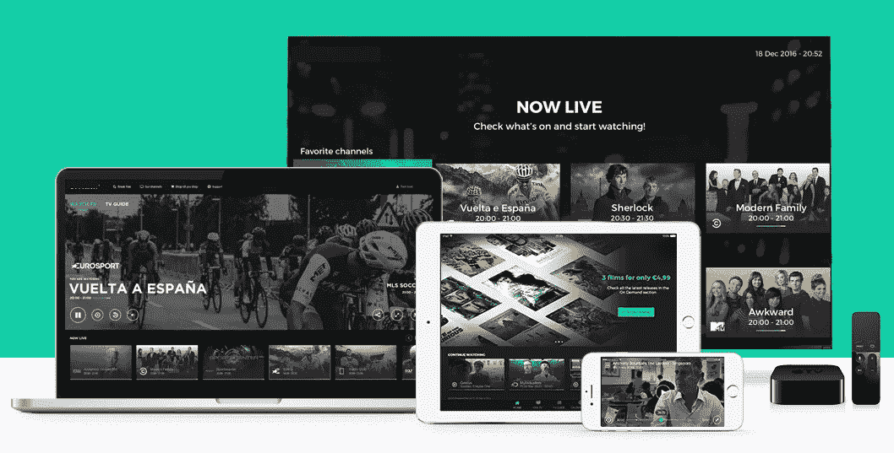
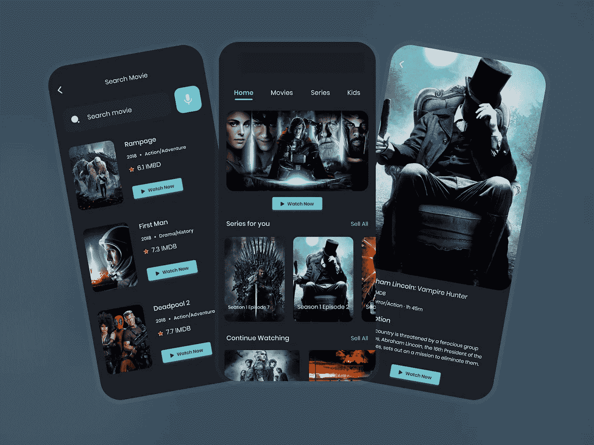

# 白标 OTT 平台——范围和机会以及优势

> 原文：<https://medium.com/geekculture/white-label-ott-platform-scope-opportunities-alongside-benefits-cac474aba9c7?source=collection_archive---------9----------------------->

随着整个世界被打乱，新冠肺炎疫情引起了剧烈的转变。然而，人们被迫呆在室内，并开始适应“在家工作”的新常态，以防止传播。这是当他们一整天都呆在家里，期待着娱乐的时候。

OTT 平台对他们来说其实是摇头丸。相当大的，它的需求逐渐飙升。尽管疫情得到控制，限制也有所放松，但对网飞、亚马逊 Prime Video 和迪士尼+ Hotstar 等 OTT 应用的需求不会下降。抓住当前的机会将是一个商业想法。有兴趣涉足 OTT 领域的人可以利用白标 OTT 平台。

## **什么是白标 OTT 平台？**

对于任何希望立即进入 OTT 领域的人来说，这将是一个完美的选择。白标 OTT 平台是一种预制的解决方案，一经定制即可投入使用。该解决方案配备了广泛的令人惊叹的功能，并使用最新的技术堆栈制作。最重要的是，该解决方案是根据不同的业务需求定制的。随着可识别功能的加入，白牌流媒体平台将在竞争中脱颖而出。

## **范围&OTT 行业机会—统计**

到目前为止，我们已经看到了目前对 OTT 应用的需求。让我们洞察未来的范围和机会。以下统计数据和事实将确保进入 OTT 领域永远不会是一个错误的选择。看看这些。

*   2019 年全球 OTT 行业的净值为 1216.1 亿美元，到 2027 年第四季度将达到 10390.3 亿美元，2020 年至 2027 年的复合年增长率为 29.4%。
*   另一份报告显示，到 2026 年，全球 OTT 市场规模将超过 4385 亿美元，2019 年至 2026 年的增长率为 19.1%。
*   根据《财富商业洞察》的数据，2020 年全球 OTT 领域的价值为 387.7 亿美元。在新冠肺炎疫情，这一部门产生了积极的影响，并正在经历可观的增长。
*   此外，这一市场规模将从 2021 年的 445.4 亿美元跃升至 2028 年的 1390 亿美元，CAGR 为 17.7%。
*   根据 Statista 的数据，到 2025 年，全球 OTT 细分市场的收入将达到 2755.30 亿美元，增幅高达 11.54%。

## **2022 年如何跃入 OTT 领域？**

毫无疑问，OTT 平台将会改变游戏规则。尽管市场上有大量的 OTT 应用程序，但随着新兴应用程序的需求不断飙升，这些应用程序仍然有一个开放的空间。

如果前面提到的统计数据激励你进入 OTT 领域，那么选择白牌视频流媒体平台将是一个很好的选择。让我们知道你如何在 2022 年进入这个高收入行业。推出白标流媒体服务并不乏味。

**通常的方式**是从零开始开发视频流应用。这似乎是一个耗时的过程，因此需要你做出相当大的贡献。另一方面，你应该考虑更喜欢**现成的 OTT 应用**，这是一个口袋友好的解决方案，可以在短时间内推出。

## **白牌视频流媒体平台的优势**

在你进入这个欣欣向荣的领域之前，先了解一下选择白标视频流媒体平台的好处。现在，让我们在这一部分深入探讨一下。

*   **定制解决方案**

白标解决方案的主要优势是定制和可伸缩性。有了这些元素，通过包含相关的功能和服务，应用程序将很容易根据业务需求进行修改。

*   **多种创收方式**

首先，要清楚视频流媒体服务应用产生收入的可能途径。但是，根据业务模式决定相关的货币化策略。无论如何，该平台可以通过纳入多种收入来源为赚钱铺平道路。将带来稳定收入流的两个常见流是订阅费和广告费。

*   **提升业务的机会**

当选择白标视频点播平台时，你的应用很有可能足够灵活，可以做出改变。管理面板中的商业分析将让平台所有者了解应用程序的活动以及用户如何使用它。有了这种分析和不断变化的趋势，应该有新的战略，将导致有效的方式来升级您的业务。

*   **兼容多种设备**

视频质量是需要给予最大重视的首要问题。确保白牌流媒体服务可以在不同平台上访问，而没有任何质量滞后。即使用户的设备没有连接到稳定的互联网，也让他们调整自己的质量。

*   **扣留您的品牌**

如上所述，白标 OTT 平台配备的是通用的东西。定制后，它将是最适合您的企业。然而，该应用程序带有品牌标志、颜色、名称等元素。UI/UX 设计也可以根据您的业务来决定。为了保持你的品牌并在全球众多用户中获得知名度，这些都是必须要做的。

## **发布 OTT 平台时需要牢记的要点**

为了启动一个成功的 OTT 平台，必须考虑一些关键点。让我们在本节中浏览一下。

*   **专注于整合吸引人的功能**

最重要的是决定特性，因为这些特性将决定 OTT 平台的功能。了解市场趋势和竞争对手将有助于选择最合适的功能。下面列出了一些您不应该忽略的值得注意的特性。

➜多语言内容

➜下载选项

➜搜索过滤器

➜即时通知

*   **广告免费内容**

播放视频时被打断太烦人了。因此，为那些已经订阅了额外收费计划的人移除广告将是示范性的。确保为他们提供保费计划的多项选择，以便他们选择适合自己需求的计划。它可能包括按月订阅、按季度订阅或按年订阅。

*   **独特&原创内容**

除了包括第三方内容之外，强烈建议考虑内部内容。内容的独特性是影响全球用户群的主要因素。然而，广泛的内容可用性是必不可少的。

*   **基于算法的视频推荐**

视频推荐在社交媒体应用和 OTT 应用中发挥着重要作用。需要实现这样的算法。通过这样，用户将能够得到与他们喜欢观看的视频相关的建议。这将允许用户继续观看他们喜欢的视频，而不会离开应用程序。

## **接下来是什么？**

您现在是否正在寻找进入 OTT 领域的解决方案？如何选择最好的公司？可以考虑选择继续使用白标 OTT 平台。要做到这一点，你应该找一家合适的应用开发公司，专门提供定制的 OTT 平台。检查他们的投资组合，看看迄今为止的作品，因为这将为你选择正确的公司提供一个清晰的画面。

## **简单地说，**

OTT 市场充斥着几个 OTT 平台。然而，在激烈的竞争中，让你的应用与众不同是不可或缺的。一个白标 OTT 平台能够在几天之内将你的企业推向全球受众。