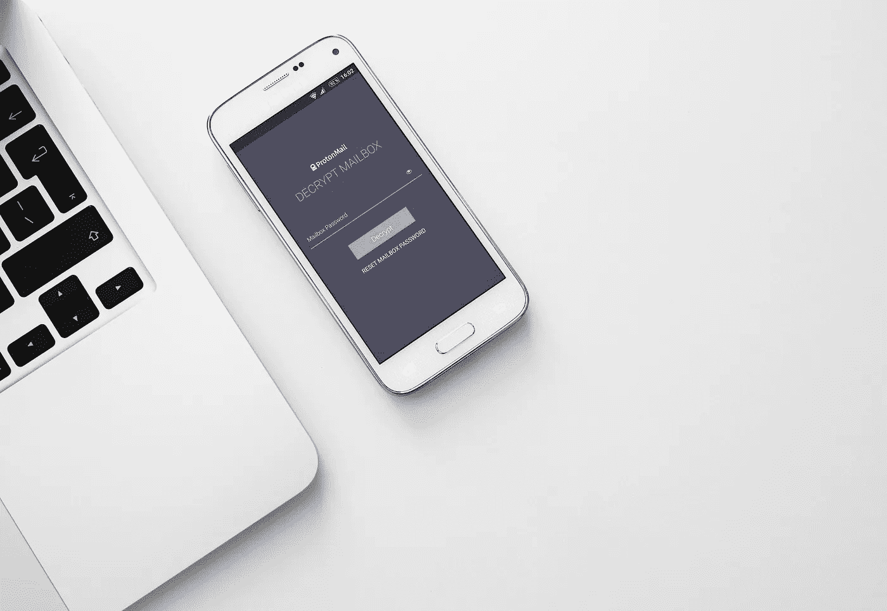

# 谁会犯错？

> 原文：<https://medium.com/geekculture/who-gets-to-make-mistakes-6a804bcf0664?source=collection_archive---------12----------------------->

Pawel Czerwinski

我们都习惯于听到谷歌、亚马逊、苹果和许多其他大公司的新丑闻。在大多数情况下，他们最终只是被罚款，一些批评性的报道，并没有其他什么。这些已经成为行业领导者的科技巨头可以大捞一笔。但今天我不是在说让他们逍遥法外。相反，我想谈谈我们对公司的不平等标准，以及我们在批评一家让我们一次又一次失望的公司(如脸书)和一家让我们失望一次的善意公司(如 Signal)时的差异。今天我想问——谁会犯错？

# 你只有一次机会

[ProtonMail](http://protonmail.com)

九月始于一桩隐私丑闻——proton mail，一家为大众提供端到端加密的电子邮件服务，由于瑞士当局的命令，被迫泄露一个用户的 IP 地址。该命令的现实有些复杂，因为用户是法国公民，而且该案件最初是由法国当局提起的。一段时间后，欧洲刑警组织介入此事，并让瑞士警方介入，瑞士警方要求这家总部位于瑞士的公司提供 IP 地址。这个案件当然是一个特例，因为它需要三个独立司法管辖区的合作，而且只是因为这个问题中的活动家卷入了一个[的高调案件](https://www.lemonde.fr/police-justice/article/2021/01/02/a-paris-bras-de-fer-entre-le-restaurant-le-petit-cambodge-et-des-squatteurs-contre-la-gentrification_6065035_1653578.html)。

ProtonMail 反应迅速，在[博客上发布了一条更新](https://protonmail.com/blog/climate-activist-arrest/)，详细描述了发生的事情，为什么，以及为什么他们认为这不是违反客户信任的行为。无论你是否同意后者，无可争议的是，当 ProtonMail 面临瑞士当局的直接命令时，它只有两种选择:违反法律保护一个用户，威胁完全关闭服务，或者至少是一场漫长的法律斗争，这肯定不会有助于其财务或法律状况……或者放弃一个用户的 IP 地址这样的小东西。

尽管一个 IP 地址也是一条有价值的信息，但与分享用户的所有元数据甚至他们的电子邮件相比，这算不了什么，而 ProtonMail 做不到这一点。不过，这似乎对最初的反应没什么影响，因为批评的浪潮向公司袭来，人们很快就大叫背叛。尽管 ProtonMail 仍然存在，并且有希望继续做得很好，但在它的目标受众——注重隐私的互联网用户——眼中，它无疑受到了巨大的冲击。

同样，Signal 也经历了一次阻碍其发展的事件，并把围绕 messenger 的对话从完全积极转变为怀疑和末日预言。我在之前已经报道过[，但要点是，Signal 的](https://wantutechier.medium.com/did-signal-shoot-itself-in-the-foot-c86d2dadf89)[首席执行官莫邪马林斯派克，倾向于控制](https://www.theverge.com/2021/10/14/22726556/signal-founder-moxie-marlinspike-nft-whim-change-platform-shit-emoji-fragility)，已经选择在应用程序中实现支付，特别是加密货币支付。马林斯派克没有选择成熟的硬币，而是选择了 Mobilecoin，一种羽翼未丰的新型加密货币，重要的是，这是他共同创造的。这引起了许多关注，包括对[泵和倾倒计划](https://www.stephendiehl.com/blog/signal.html)的指控和来自[专家](https://www.schneier.com/blog/archives/2021/04/wtf-signal-adds-cryptocurrency-support.html)的普遍困惑。MobileCoin 基金会的首席执行官约书亚·戈德巴德(Joshua Goldbard)参加了公共论坛，包括 Signal 的 subreddit，试图安抚用户，并承诺回答所有问题。几个月后，问题仍然存在，几乎每个帖子都以收到关于 MOB 的讽刺评论而告终，并且总体趋势似乎已经转向“如果这种情况继续下去，我们应该转向元素/会话/一些新的消息应用。”

# 砍掉一个头，还会有两个代替它

Adem Ay

无论你个人对这些事件的看法如何，事实是这几乎是两家公司背叛用户期望的第一次大事件。当话题转到他们身上时，他们曾经是绝对的公众宠儿，现在却变得更加负面。与之形成对比的是脸书，它已经失去了用户的所有信任，但是人们仍然坚持使用它，似乎把它的不良行为的新故事当作讨论的素材，从来没有真正对批评采取行动。这就好像企业巨头完全没有期望和标准。当一家注重隐私的公司犯了第一个错误，它就会被送上火葬场。当一家公司成立 500 周年的时候，它被迷上了，被一笑置之，即使夹杂着些许苦涩。

有人可能会说区别在于用户群。那些仍然认为谷歌是一个可以接受的工具的人可能不太关心隐私，所以不会对谷歌给出某人的知识产权大惊小怪。Signal 的情况正好相反，每当马林斯派克分享通过使用 E2EE 挫败另一项法院命令的消息时，用户都会欢呼。因此，当谷歌失败时，那些对它重要的人，那些常客，将会把目光投向别处，而 ProtonMail、Threema 或 Signal 立即被放到显微镜下。

这是迎合挑剔人群的陷阱——你必须坚持比你试图推翻的竞争对手更高的标准。像 DuckDuckGo 这样的公司正在与更富有、更受欢迎和更强大的竞争对手进行一场艰苦的战斗，同时受到他们唯一的支持者的审查。

# 我们应该放松吗？

虽然这会造成伤害，但这种对责任的强烈要求有助于保持我们所需要的服务的诚实。在一个理想的世界里，我们要么对所有公司一视同仁，要么至少在围绕这些错误的讨论中更加文明。不过，就目前而言，尽管这造成了双重标准，但至少有某种形式的问责制是一件好事，我们只需要记住，它需要得到推广。