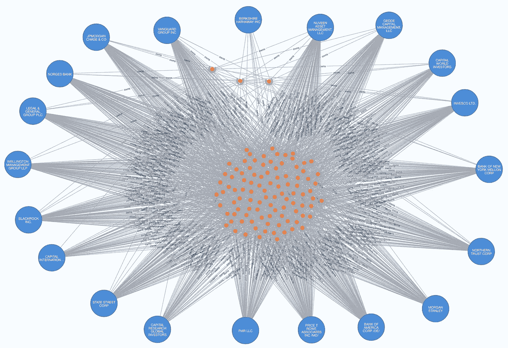

# 谁拥有纳斯达克 99 公司？

> 原文：<https://medium.com/geekculture/who-owns-the-nasdaq-99-companies-f8a646e3501?source=collection_archive---------12----------------------->

## 使用 Neo4j 调查股票市场中的机构持股

作为一个散户投资者，我总是关注“精明的投资者”在买进或卖出什么。“聪明钱”指的是机构投资者——养老基金、共同基金、对冲基金、银行、保险公司和其他大投资者。他们也被称为华尔街的鲸鱼或投资游戏的职业运动员。这些机构管理着数十亿美元，并将它们投资于几乎所有的资产类别——股票、债券和大宗商品。在 r/WallStreetBets 的 GameStop 空头挤压之前，它们在市场上有很大的发言权:它们占纽约证券交易所每日交易量的 85 %- 90%以上，它们的进出可以引发抛售的反弹。

Figure 1\. Photo by [Mathieu Stern](https://unsplash.com/@mathieustern?utm_source=unsplash&utm_medium=referral&utm_content=creditCopyText) on [Unsplash](https://unsplash.com/s/photos/money?utm_source=unsplash&utm_medium=referral&utm_content=creditCopyText)

机构投资所有大型上市公司。一方面，因为他们通常在做出决定之前进行广泛的研究，他们的投资可以被视为对公司的认可。此外，机构长期持有其核心投资。因此，拥有大量机构持股的蓝筹股往往波动性较小，因此受到许多防御性散户投资者的青睐。另一方面，如 [GameStop 做空](https://www.ft.com/content/3f6b47f9-70c7-4839-8bb4-6a62f1bd39e0)所示，机构也可以人为压缩股价。比尔·黄(Bill Hwang)领导下的 Archegos 的案例也表明，一家大型对冲基金的倒闭可能会在整个股市引发冲击波。

出于这些原因，散户投资者可以通过观察精明资金的动向来了解市场。资产超过 1 亿美元的主要机构需要向证券交易委员会(SEC)提交 13F 表格，以披露其股票持有情况。不过有一点需要注意:这些报告会有延迟。它们在日历季度结束后的 45 天内归档，绝大多数更新发生在该季度的第 45 天左右。我们可以梳理这些报告，对这些机构正在做的事情有一个初步的了解。这些信息无疑有助于我们做出更明智的投资决策。

[纳斯达克 100 指数](https://www.nasdaq.com/market-activity/quotes/nasdaq-ndx-index) (NDX)包含在纳斯达克交易的 100 家最大的非金融公司，如苹果、微软和美光。因为福克斯公司和 Alphabet 公司都发行了两只股票，该指数实际上有 102 只股票。在本文中，我将使用 Neo4j 来展示机构投资者如何将资金分配给纳斯达克 100 指数公司。为了了解他们的投资策略，我还增加了所有这些公司的财务细节，如收益、股票价格和短期利益。所有这些数据都是公开的，可以从 SEC 收集[。该项目的数据存放在 Kaggle (CC BY 4.0)的以下位置:](https://sec.report/Form/13F-HR?__cf_chl_jschl_tk__=pmd_cZypfItP6RNLvyE2IIRV4C1E_a_Jgqf_VmD3C777HgM-1635339796-0-gqNtZGzNAlCjcnBszQhl)

 [## 纳斯达克 100 指数-机构

### 纳斯达克 100 指数公司的机构持股和财务状况

www.kaggle.com](https://www.kaggle.com/dgg321982/nasdaq100institutions) 

# 1.数据导入和统计

首先在 Neo4j 浏览器中创建一个名为`Nasdaq`的项目。你需要这个项目的 APOC 插件。从上面的链接下载数据，并将其放入`import`文件夹中(参见 [2)。如果需要帮助，将数据导入 Neo4j](/geekculture/analyzing-genomes-in-a-graph-database-27a45faa0ae8) 。通过在 Neo4j 浏览器中发出以下命令，将数据导入 Neo4j:

我们可以运行一些统计数据来测试我们的导入是否成功。例如，以下查询检索节点数量:

不是 102 只，而是 101 只股票。原因是我删除了 Zoom (ZM ),因为我找不到任何机构持有该股的数据。这 101 只股票属于 99 家公司。该查询还显示，在我们的数据集中有 5070 个机构投资者。这些机构在纳斯达克 99 指数公司中建立了 130，071 个头寸。

# 2.伯克希尔·哈撒韦公司的战略

让我们先来看看最大的鲸鱼。这些机构共同控制着大量资本，它们的动向会在整个市场引发涟漪。以下是在纳斯达克 99 指数公司投资总额排名前 20 位的机构。

Table 1\. The top 20 institutional inverstors and their investments in Nasdaq-99.

Figure 2\. The top 20 institutions and their investments. Image by author.

名单上有许多著名的名字。先锋和贝莱德是最大的。他们是这里仅有的两家管理超过 1 万亿美元纳斯达克 99 指数公司的机构。传奇人物沃伦·巴菲特领导下的伯克希尔·哈撒韦脱颖而出。就纳斯达克 99 指数的投资总额而言，它的 1540 亿美元仅名列第十六位。而且它只投资了其中的八家公司:亚马逊、苹果、Charter、Mondelez、Sirius、T-Mobile、卡夫亨氏和 VeriSign。众所周知，巴菲特只投资自己研究和了解得很好的公司。那么巴菲特是如何投资的呢？

我们可以计算出所有投资组合的一些通用指标。通过比较，我们可以对巴菲特的策略略知一二。以下查询检查每个投资组合的`beta`、`days-to-cover`、`earnings per share (EPS)`和`price to earnings (PE)`的加权平均值。`Beta`衡量股票相对于整体市场的波动性。贝塔系数越高，股票波动越大。一只股票的`days-to-cover`是其被卖空的股票数量与其日均交易量的比率。比率越高，做空股票的力度越大，看跌情绪越强。为了得到`EPS`的值，我们可以简单地将一家公司的税后利润除以其发行在外的股票。价值越高，公司越赚钱。类似地，股价除以每股收益将得到`PE`比率。它显示了投资者愿意为公司每赚一美元支付的溢价。最后，我认为加权平均比简单平均更能反映不同的分配策略。因此，我用市场价值衡量了这些投资。

Table 2\. The top 20 institutional investors and their weighted investment metics in Nasdaq-99.

再次，伯克希尔的指标立即脱颖而出。尽管 Berkshire 投资了纳斯达克 99 家公司中的 8 家(表 2)，但其 86%的资金被苹果公司(AAPL)套牢。因此，伯克希尔的衡量标准在很大程度上由苹果决定。伯克希尔的投资组合的贝塔系数为 1.18，在同行中位居第二。这意味着通过集中投资，Berkshire 承担了比竞争对手略高的风险，但这可能是[获得高回报的秘密。Charter Communications 和 Sirius 是价值相对较高的两只股票，但伯克希尔仅适度投资(表 3)。总体而言，伯克希尔 1.66 的低平均值表明市场非常看好伯克希尔的选择。苹果还将伯克希尔的平均每股收益拉低至 6.2 美元，是所有机构投资者中最低的——所有其他机构投资者的价值都在 15 美元以上。但是`EPS`并不是全部:在这项分析中，伯克希尔公司的`PE`最低，这意味着伯克希尔公司为其公司赚取的每一美元利润支付的费用最少。简而言之，巴菲特廉价买入了这些股票。这呼应了巴菲特的一条规则:](https://finance.yahoo.com/news/the-truth-about-warren-buffetts-investment-track-record-morning-brief-113829049.html?guccounter=1&guce_referrer=aHR0cHM6Ly93d3cuZ29vZ2xlLmNvbS5oay8&guce_referrer_sig=AQAAALKE60k7WbAqu3JreuDXdN202vIHz_0G1LwSW6Oc41K8MCEWDABB1CHdwdq0vGGwYNoSobr16k1jhN7YERYoeg7fudKxjgMX8mAFIuQowRqak_dgPjGt9eDHruZ8MSn5G9eX4bb0AbkZSVPi7XjQkLCvXDIVl-HlNH33Xgn_NRVR)

> “以合理的价格收购一家优秀的公司，远胜于以合理的价格收购一家普通的公司。”

Table 3\. The Nasdaq-99 portfolio of Berkshire Hathaway.

其他 19 家机构的资金分布更加广泛。比如表 1 的前十三家机构投资了全部 101 只股票，而先锋只漏了荷兰[光刻](https://en.wikipedia.org/wiki/Photolithography)供应商 ASML，该供应商也是[极紫外光刻](https://en.wikipedia.org/wiki/Extreme_ultraviolet_lithography) (EUV) [光刻机全球唯一供应商](https://en.wikipedia.org/wiki/ASML_Holding)。其他人投资了至少 55 家公司。资本世界投资者的投资组合平均市盈率很高，因为它在特斯拉(TSLA)有大量股份。

名单上的其他人都有相似的衡量标准。通过分散投资组合，这些机构也分散了风险——他们的平均贝塔值比伯克希尔和资本世界的投资者更接近 1。这意味着他们的投资组合与大盘的波动更加紧密。

# 3.机构动了针吗？

在 101 只纳斯达克股票中的 92 只股票中，机构投资者控制了大部分流通股(> 50%)。DexCom 的机构持股比例甚至高达 98%。另一个极端是网易(NTES，8%)、IDEXX 实验室(IDXX，10%)和天狼星(JD，14%)等股票。我们可以做一个以公司为中心的分析，看看机构运动是否与股票价格有关。下面的查询显示了这些股票的相对成交量、机构投资者的隐含市值变化和[年初至今的回报率](https://www.investopedia.com/terms/y/ytd.asp)。

Table 4\. Movements of the institutional investors and [year-to-date return](https://www.investopedia.com/terms/y/ytd.asp)s of Nasdaq-99 in 2021.

Figure 3\. Year-to-date return versus institutional volume of the Nasdaq-99 companies in 2021\. The solid lines are the regression lines. Image by author.

如表 4 所示，机构投资者的动向和价格行为之间几乎没有明显的模式。例如，在 2021 年的前十个月，Moderna 的涨幅超过了 200%，而这些机构在同一时期仅转移了约 12%的已发行股票。总而言之，他们总共净买入了 4%的股票。另一个例子是中国公司拼多多(PDD)。自 2021 年初以来，这只股票只知道一个方向:下跌。它损失了超过 40%的价值。但与此同时，只有 5%的股票在机构间易手。事实上，精明的投资者在此期间甚至买入了更多的 PDD (0.3%)。

图 3 显示机构交易量并不代表价格趋势:本年迄今回报率相对于绝对机构交易量百分比的 R 平方仅为 0.03，本年迄今回报率相对于净机构交易量百分比的 R 平方为 0.007。甚至平均每日交易量也不是一个好的预测指标。

Table 4\. Shares changed between 2020–12–31 and 2021–09–30

让我们来看一个具体的例子，NAND 和 DRAM 制造商美光(Micron)。自今年年初以来，MU 的价格已经下跌了 4%左右。乍一看，机构投资者难辞其咎。虽然他们在 2020 年底看好美光，但 2021 年见证了资本从美光的外流。在此期间，机构投资者总共净抛售了 250 万股股票，按当前股价计算，总计 1.78 亿美元。但美光的日均交易量为 1700 万。因此，机构投资者在过去 10 个月里卖出的 250 万股股票不到一天的交易量。与美光 770 亿美元的市值相比，1.78 亿美元也相对较小。

# 结论

虽然我们可以估计每个机构投资者的总投资，但我们无法准确计算他们的损益，因为他们没有在 13F 中提交购买日期和价格。如果他们自年初以来没有进行任何交易，我们可以估计他们今年迄今的表现。但如果他们频繁交易，我们的估计就会大相径庭。

令我惊讶的是，机构投资者进出的股票没有给我们任何关于股价走向的暗示。值得注意的是，这里的数据不包含看跌期权和看涨期权以及空头头寸。因此，他们没有揭示所有可能影响价格的机构策略。另外，这些数据强化了我们的印象，即机构投资者通常很少交易。

此外，由于它们的延迟性质，13F 数据对于短期投资者和日内交易者并不那么有用。这些投资者需要实时期权数据、推文流和新闻源。但是，正如我在上文中所展示的，13F 数据可以揭示一些机构投资者的长期策略。因此，它们为长期投资者提供了有关股票市场的有用信息。一般投资者应该利用这些数据，并学会分析它们，以便做出更明智的投资决策。

投资愉快！

 [## 加入媒介与我的介绍链接-黄思兴

### 作为一个媒体会员，你的会员费的一部分会给你阅读的作家，你可以完全接触到每一个故事…

dgg32.medium.com](https://dgg32.medium.com/membership)