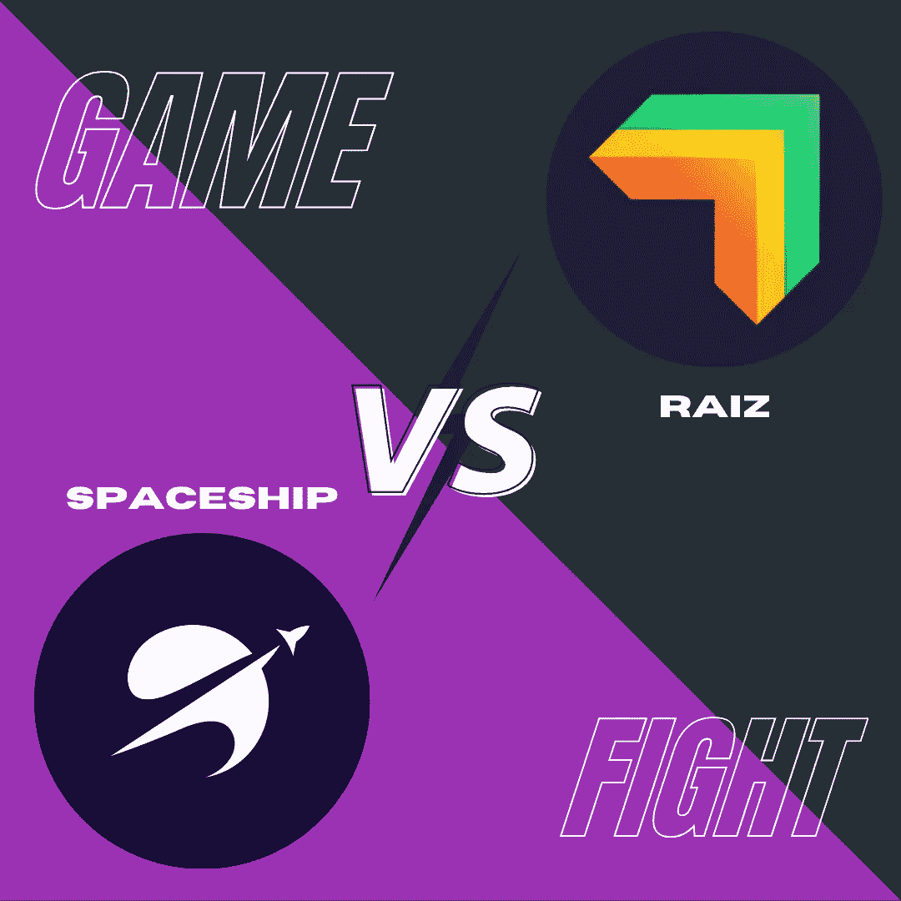
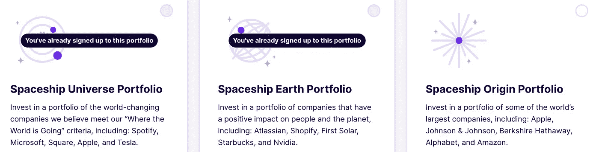

# 谁会让你的钱长得更好？

> 原文：<https://medium.com/geekculture/who-will-make-your-money-grow-better-2c07b0e0ef84?source=collection_archive---------10----------------------->

比较新时代投资产品 Spaceship 和 Raiz

Source: spaceship and raiz websites

**免责声明** : *这篇文章阐述了我个人对两个小额投资平台的体验。它不是由任何一个组织赞助的。这篇文章无意以任何方式提供财务建议。*

千禧一代的收入，尤其是早年可以用 ***不稳定和稀缺*** 来形容。这导致低储蓄和更低的投资(如果有的话)。尽管如此，对第一个一百万的争夺是真实的。在忙于工作、副业、心理健康和社交生活之后，我们没有多少时间来教育自己关于股票市场这个疯狂的事情。？)。披着科技创业公司外衣的金融服务公司前来救援。

市场上的两个这样的公司是[飞船](https://www.spaceship.com.au/)和 [Raiz](https://raizinvest.com.au/) 。两家公司都提供低成本投资、最少的术语、糖衣波西米亚名字的投资组合，以及部分投资。一年来，我每周给他们两人贡献等量的钱(所以你不必这么做)。让我们看看哪个值得你的钱(肯定不是你的银行)。

## **(1)返回**

让我们从一开始就把显而易见的问题解决掉。哪个能让你赚最多的钱是个大问题。

Source: [https://www.buzzfeed.com/jennaguillaume/ive-got-one-word-to-say-to-you](https://www.buzzfeed.com/jennaguillaume/ive-got-one-word-to-say-to-you)

> **宇宙飞船**

请记住，过去的表现并不代表未来的回报。

事实上，这并不完全是黑白分明的，虽然 Raiz 确实提供健康的回报和定期分红，但他们的重点 [*自我承认*](https://raizinvest.com.au/support/) 是让客户能够**节省更多的**而不是*激进的回报*。相反，飞船展示了他们的退货卡(经常)**声称超过 35%的退货**(在撰写本文时)。

**🏆:宇宙飞船**

## (2)投资组合期权

**Raiz** 很好地发挥了这一点，根据**风险概况**提供了 **5 种选择**，从保守到激进，然后是一些。特别提到祖母绿的社会责任感，蓝宝石的加密爱好者，以及一个自定义选项，没有伤害。

Source: Raiz Dashboard

另一方面，飞船不会让你陷入一堆选择的困境，而是一个更保守的选项池，有 **3 个简单的选择(都是高风险)**，基于基金经理对世界及其未来所在的 ***感觉*** 。特别提到对社会负责的投资组合和在一个应用程序中有多个投资组合的能力(我已经在使用)。

Source: Spaceship Dashboard

**🏆:Raiz**

## **(3)股票/行业敞口**

有趣的是，Raiz 并不直接持有任何公司，而是持有一堆 ETF(交易所交易基金)。就像出租一个[分时度假](https://www.investopedia.com/terms/t/timeshare.asp#:~:text=A%20timeshare%20is%20a%20shared,condominiums%2C%20apartments%2C%20and%20campgrounds.)。

在宇宙飞船，你立刻成为苹果公司骄傲的(部分)所有者。它更透明、更华丽、更高科技、更广泛。

**🏆:宇宙飞船**

## (4)用户体验和功能

这个类别非常贴近千禧一代的心。不仅仅是调色板或按钮的风格决定了体验，还有一个**应用给我们的感觉**(谈谈 [**情商**](https://www.helpguide.org/articles/mental-health/emotional-intelligence-eq.htm#:~:text=Emotional%20intelligence%20(otherwise%20known%20as,overcome%20challenges%20and%20defuse%20conflict.&text=Social%20awareness%20%E2%80%93%20You%20have%20empathy.) )。除了相同的界面和功能，如定期投资计划，花式图表等。两家公司都有与众不同的独特之处。

Raiz 的目的是用 [**自动围捕投资**](https://raizinvest.com.au/) 的提议来诱惑你，本质上是从你一天中的每笔交易中偷出多余的零钱并进行投资。这可能会给银行对账单带来一点麻烦，却没有什么好处！

宇宙飞船最近推出了一个功能，可以用同一个账户投资**多个投资组合，并把它们合并成一个。一个真正实用的功能，如果有的话。**

****🏆:宇宙飞船****

**值得注意的是，这两家公司都是小额投资民主化和降低财富积累门槛的旗手。他们在构建可靠、安全、高效的金融科技产品方面的努力值得称赞。虽然在我看来，Spaceship(3/4) 在两者之间更好，但这只是意味着我的投资需求更适合 Spaceship，而 Raiz 可能更适合不同的人群。重要的是**投资**，这样我们所有人*都能在 40 岁前退休，种鳄梨*。**

**鳍。**