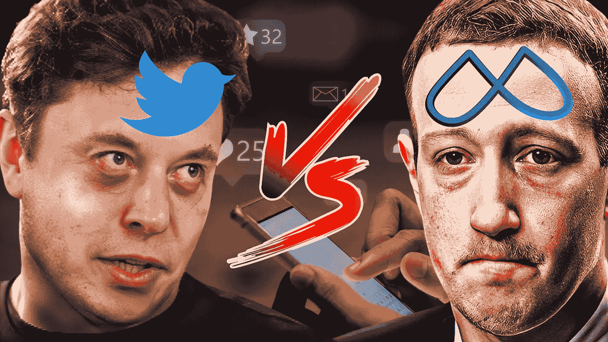

# 谁将赢得 Web3 竞赛——Twitter 还是脸书？

> 原文：<https://medium.com/geekculture/who-will-win-the-web3-race-twitter-or-facebook-meta-2ed2a1ac46a9?source=collection_archive---------9----------------------->

The competition for the leadership in Web3 social media is heating up between Twitter and Meta!

在**社交媒体**的世界里，有两种主要类型的平台:基于 **Web2 技术**的平台和基于 **Web3 技术**的平台。虽然有许多组件组成了这两种不同类型的社交媒体平台，但**的关键区别**在于 **Web 3.0** 平台是**去中心化的**，而 **Web 2.0** 平台是**集中化的**。