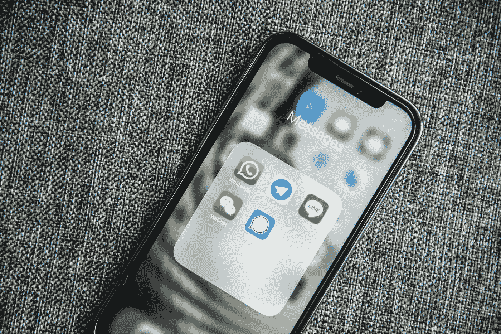
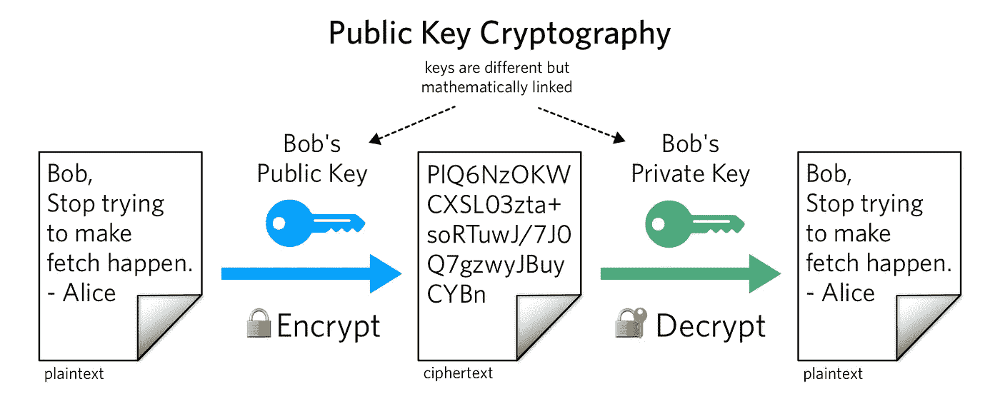
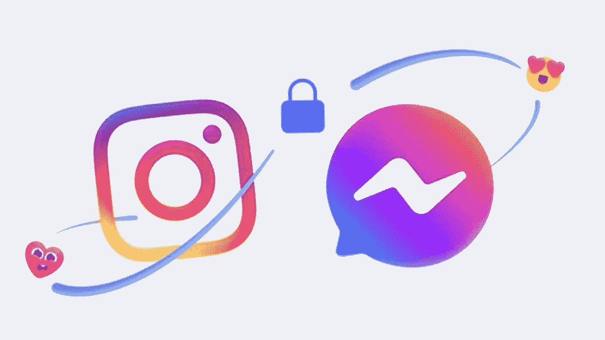
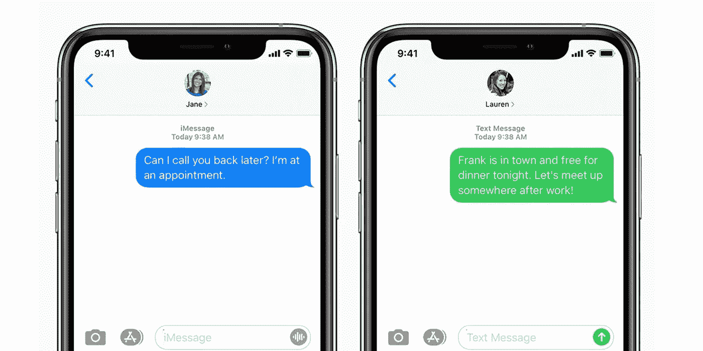
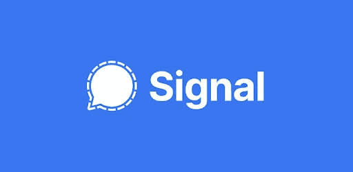
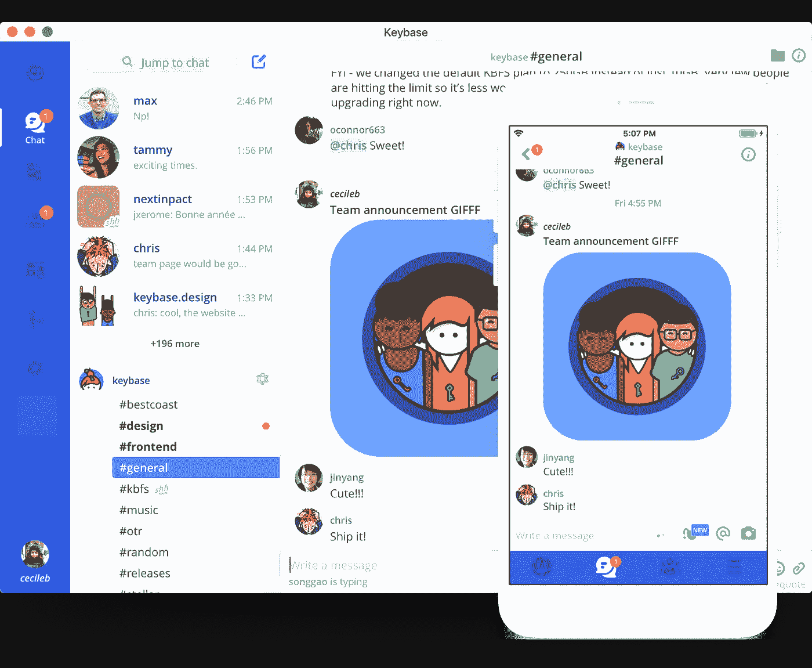

# 谁在偷看你的信息？比较聊天应用程序之间的隐私

> 原文：<https://medium.com/geekculture/whos-spying-on-your-messages-comparing-privacy-between-chat-apps-f65b29a78b75?source=collection_archive---------23----------------------->

我对 Facebook Messenger 一直是又爱又恨。知道扎克可以查看我的私人信息，我总会有一种不安的感觉。然而，似乎每个人都在使用 Messenger。就像被卡在岩石和坚硬的地方之间。要么放弃你的隐私，要么与你的朋友隔绝。

最近，我选择咬紧牙关，关闭 Facebook Messenger。这不是最容易做到的事情，但它给了我以更平和的心态交流的力量。消息应用是日常生活的主要部分。不管你的个人选择如何，我相信做一个知情的用户是很重要的。下面，我们比较了许多流行的信息选项及其对您隐私的影响。事后可以得出自己的结论。

# 一些基本概念

让我们定义一些术语，这样我们就在同一页上了。他们有必要了解不同的消息应用程序如何工作。如果你是工程师，请原谅我的不严谨。我用简单的英语解释这些，这样每个人都能明白。

# 加密

当你用*加密*一条信息时，只有预定的接收者可以阅读这条信息。原始的*明文*信息变成了一团不透明的数据。具有适当凭证的接收者可以*将 blob 解密*成原始消息。

实际上，大多数通过互联网传输的数据都是加密的。[传输层安全](https://tools.ietf.org/html/rfc8446) (TLS)协议对你发送到网站的大部分数据进行加密。因此，你网络上的普通人看不到你写的东西。

# 端到端加密

对于大多数类型的消息传递，您向服务器发送消息。服务器会将邮件发送给您的收件人。虽然 TLS 可以防止随机方读取您的消息，但服务器可以完全控制您的消息。

端到端加密(E2EE)解决了这个问题。你和你的接收者[事先交换加密密钥](https://tools.ietf.org/html/rfc2631)。当任何消息到达服务器时，服务器只能看到加密的 blob。因此，没有人需要信任第三方服务。

# 开放源码

开源软件意味着公众可以查看软件的源代码。这对于运行在远程服务器上的软件尤其重要。公众可以审计服务器是否有任何安全问题，以及它是否按预期工作。对于非开源软件，你需要相信它做了它声称要做的事情。

# 聊天应用程序隐私对比

普通消费者在给别人发信息时有很多选择。并非所有的消息应用程序都是相同的，但幸运的是有些非常相似。我们将研究以下消息选项:

*   [短信](https://andrew.cloud/chat-apps/#sms)
*   [社交应用(如脸书、微信、Snapchat)](https://andrew.cloud/chat-apps/#social-apps)
*   [“增强型短信息”(例如 iMessage 和 RCS)](https://andrew.cloud/chat-apps/#imessage-and-rcs)
*   [电报](https://andrew.cloud/chat-apps/#telegram)
*   [WhatsApp](https://andrew.cloud/chat-apps/#whatsapp)
*   [信号](https://andrew.cloud/chat-apps/#signal)
*   [按键座](https://andrew.cloud/chat-apps/#keybase)

如果你懒得去读细节，这里有一个图表，里面有总的结论。如果你想要我的总体建议，请跳到最后。

这是上图的关键:

*   ✅:支持
*   不支持❌:
*   ⚠️:表示支持，但有所保留

# 短信

SMS 是最初的文本消息协议。在智能手机出现之前，我们仍然可以发送短信，尽管方式更加原始。如果你有电话，你可以使用短信，这是一个非常常见的选择。但这就是好处的终点。短信是安全灾难。短信没有加密。任何截获你信息的人都知道你在发送什么。同样的想法也适用于细胞载体。你的短信会留在他们的服务器上。我建议尽可能使用短信的替代品。

## 赞成的意见

*   方便的
*   几乎每个人都可以使用短信

## 骗局

*   与其他替代方案相比是原始的
*   没有任何加密
*   手机运营商储存你的短信

# 社交应用

随着社交媒体和智能手机的发展，许多应用程序开始支持消息传递。这些应用程序可能有不同的功能，但从安全角度来看它们是相同的。因此，我们把它们都放在同一个桶里。这些应用程序包括:

*   脸书信使
*   微信
*   Snapchat
*   线条
*   松弛的
*   不调和

这比手机短信进步了一步，但也差不了多少。你的信息不是通过手机信号塔，而是通过 TCP/IP。因此，您可以通过 TLS 获得加密的好处。随机的人将无法阅读您的消息。然而，你的短信仍然会存储在某个科技公司的服务器上。你把一个主人换成另一个主人。

这些应用的问题在于，它们要求你信任提供服务的公司。你必须相信一个流氓员工不会看你的信息。你需要相信他们的代码工作正常。如果脸书遭到黑客攻击或收到搜查令，不要指望他们会太尊重你的隐私。

## 赞成的意见

*   流行的
*   良好的用户体验
*   数据是加密的

## 骗局

*   服务器看到你所有的数据
*   代码不是开源的
*   你需要信任这项服务

# iMessage 和 RCS

现代手机制造商已经意识到短信的安全局限性。因此，他们在传统短信的基础上建立了自己的增强功能。

苹果为 iPhone 用户创建 iMessage。iMessage 的用户可以在所有苹果设备上同步短信。所有消息都是端到端加密的，所以苹果看不到你发的内容。然而，只有当两个用户都使用 iPhones 时，加密才会发生。此外，在 iMessages 上启用 iCloud 备份会为 Apple 提供您的加密密钥。因此，启用备份会禁用端到端加密。

iMessage falls back to normal SMS when messaging Android phones.

谷歌正在谷歌制造的手机上开发对 [RCS](https://www.gsma.com/futurenetworks/wp-content/uploads/2018/05/Universal-Profile-RCC.71-v2.2.pdf) 协议的支持。三星正在为他们手机上的默认短信应用做类似的事情。使用 RCS 的手机最终将拥有端到端加密，但目前支持有限。RCS 的隐私优势看起来很有希望，但是它目前的状态还有待改进。

## 赞成的意见

*   比短信更好的用户体验
*   如有必要，可以使用短信
*   端到端加密(如果两个用户使用同一个应用程序)

## 骗局

*   代码不是开源的
*   RCS 仍在开发中
*   生态系统锁(iMessage 需要 iPhone，RCS 需要精选应用)

# 电报

Telegram 已经成为一个受群体欢迎的信息应用。它支持端到端加密选项，因此 Telegram 无法读取您的信息。另一方面，也不是默认。您必须手动启用端到端加密。电报客户端是开源的，允许人们审计代码。但是，它的服务器不是开源的。用户还是需要在一定程度上信任 Telegram。Telegram 高于平均水平，但我们仍然可以做得更好。

## 赞成的意见

*   支持端到端加密
*   客户端是开源的

## 骗局

*   端到端加密不是默认设置
*   服务器不是开源的
*   加密方案曾经有过[的安全顾虑](https://eprint.iacr.org/2015/1177.pdf)

# WhatsApp

WhatsApp 相当受欢迎，已经成为各种默认的“国际”聊天应用。从隐私的角度来说，还是挺好的。与 Telegram 不同，所有消息始终是端到端加密的。它曾经是理想的消息应用。

不幸的是，2014 年，脸书收购了 WhatsApp。该应用的服务条款发生了变化，现在脸书将可以访问您的元数据。例如，他们会知道你和谁说话，你什么时候和他们说话。我可以看到这些数据被用来分析用户。最终，它可能足以用于广告定位。WhatsApp 还声称不会将你的信息存储在他们的服务器上。不幸的是，由于他们的代码不是开源的，所以没有办法证明这种说法。

## 赞成的意见

*   受欢迎的，尤其是在国际上
*   所有消息都是端到端加密的

## 骗局

*   不开源
*   脸书可以访问您的元数据；可疑的激励措施
*   您需要一个有效的电话号码

# 信号

收购 WhatsApp 后，联合创始人之一创办了 Signal Foundation。Signal 是在考虑隐私的情况下开发的，它在所有其他消息应用程序中具有最好的优势。除了端到端加密，Signal 还加密所有元数据。因此，服务器无法确定使用该服务的人的任何信息。

Signal 的所有代码(包括服务器)都是开源的，所以一切都可以被审计。还有一些很好的安全特性，比如消息爆炸。如果你的手机在未来受到威胁，攻击者将无法找到你的信息。我是 Signal 的粉丝。它的隐私保证是最棒的。

## 赞成的意见

*   一切都是端到端加密的，包括所有元数据
*   一切都是开源的(包括服务器代码)
*   可以回退到短信

## 骗局

*   不如其他应用程序受欢迎
*   您需要一个有效的电话号码

# 键盘

Keybase 是一个万能的加密应用程序，支持端到端的加密消息。和 Signal 一样，它也支持消息爆炸。Keybase 还支持与消息传递无关的功能，如文件加密和身份验证。

对 Keybase 的主要担忧与 WhatsApp 有类似的故事。2020 年，Zoom 收购了 Keybase。因此，Keybase 的动机和未来仍不明朗。Keybase 服务器也不是开源的，这意味着公众不能审计代码。这也意味着，如果 Zoom 真的关闭了 Keybase，没有人能够更换 Keybase。

## 赞成的意见

*   端到端加密
*   客户端是开源的
*   加密存储和加密钱包等其他优势

## 骗局

*   归 Zoom 所有；可疑的激励措施
*   不受欢迎(仅限于安全书呆子)
*   服务器不是开源的

# 制造一个开关

很好，所以你已经读到了比你想看到的更多的消息应用。现在怎么办？

如果你对你正在使用的东西感到满意或者不在乎，继续做你正在做的事情。没必要改变什么。隐私是个人决定，我不打算灌输给你。

如果你真的有兴趣做出改变，你会想要一个计划。从地球上消失对任何人都没有好处。当你进行转换时，记住这三个原则。

1.  增量迁移。
2.  偏爱某些应用，但继续支持所有应用。
3.  保持务实。

## 增量迁移

你可能会忍不住立即放弃当前所有的消息应用。实际上，这只会让你发信息的人感到困惑，造成混乱。

取而代之的是，逐渐放弃你的旧聊天应用。例如，首先告诉你最亲密的朋友，你正在退出旧应用程序。然后在新的应用程序上与他们进行未来的对话。直接消息更容易迁移，所以从群聊之前的消息开始。

## 偏爱一些，支持全部

完全切断消息传递渠道可能是不可行的。有些人可能拒绝使用不同的应用程序，或者他们可能懒得切换。我不建议因为那个而放弃交流。继续支持您的旧消息应用程序。你不必那么有求必应，只要你对隐私不抱任何期望，应该没问题。

总的来说，这是我对消息应用的偏好。这是基于我的历史使用和隐私利益。

1.  信号
2.  WhatsApp
3.  其他一切

如果有朋友用 Signal 或者 WhatsApp，那就很理想了。如果没有，我鼓励他们下载 Signal，但如果他们拒绝切换，我不会改变我的行为。

## 保持务实

最重要的是，保持务实。当你试图获得更多隐私时，总会有所取舍。有时使用一个不期望隐私的工具会更好。例如，拒绝在工作中使用 Slack 可能是个坏主意。你的游戏体验可能会变得更糟。不和刚在推特上认识的人说话会很奇怪。

归根结底，重要的是您在成为一名知情用户的同时，使用正确的工具来完成工作。短信快乐！

*如果你喜欢这篇博文，请在* [*Twitter*](https://twitter.com/liuandrewk) *上关注我，并给我发送一条未加密的 DM。🐦*