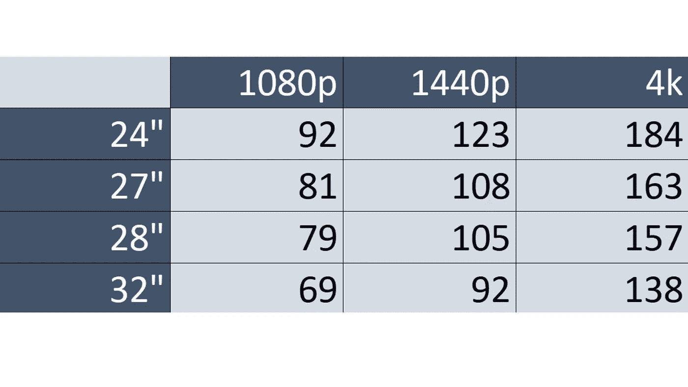

# 为什么 4k 没有 1080p 好

> 原文：<https://medium.com/geekculture/why-4k-isnt-better-than-1080p-ce3b003f1ee6?source=collection_archive---------2----------------------->

1080p 显示器相比 1440p 甚至 4k 都被认为是劣等的。但你可能会惊讶地听到，1080p 可能比 4k 更好，这取决于几个因素，包括显示器尺寸、分辨率和 PPI。在这篇文章中，我将解释什么是 PPI 或像素密度，以及为什么它很重要。然后，我将根据分辨率和尺寸提供一个有用的显示器 PPI 图表。

## 什么是 PPI？

PPI 是每平方英寸的像素。PPI 越高，图像越清晰。PPI 由显示器的**分辨率**和**尺寸**决定。在日常生活中，你想要一个高的 PPI，因为它对你最有用。

在一些特殊情况下，高 PPI 可能是一个更大的负担，而不是一个好处。例如，在游戏中，长度或宽度由像素的*数量*决定。因此，低 PPI 显示器上的 100 像素线将比高 PPI 显示器上的 100 像素线长。在这种情况下，最好买一台平均 PPI 在 100 PPI 左右的显示器。

如果你想知道你的显示器的 PPI，搜索你的显示器的尺寸，分辨率和 PPI。例如，如果我有一台 1080p 24 英寸的显示器，我会搜索“1080p 24 英寸显示器的 PPI”。在本文的后面，我提供了一个典型显示器尺寸和分辨率的像素密度图表。

**PPI 为什么重要？**

正如我前面所说，PPI 越高，图像越清晰。你当然不希望 PPI 太高，否则文本会太小，不可读。PPI 很重要，因为它为我们提供了一种对显示器进行分类的方式。我们可以根据 PPI 对显示器进行分类，而不是根据尺寸和分辨率进行分类，100 到 150 PPI 之间的任何值都是理想的。这使我们能够真正看到显示器的本来面目，而不是屏幕大小或分辨率。

我给你举个例子。我会给你一个不同显示器的 PPI 列表。然后基于此我想让你告诉我哪个显示器是 4k 的。

*   138 PPI
*   92 PPI
*   108 PPI

你可能猜到了 138 PPI 的那个，因为它是最高的。你是对的。但这个练习的重点并不是要表明 4k 显示器具有高 PPI。这是为了告诉你，在挑选显示器时，我们会有偏见。我们看到一台 1080p 的 32 英寸显示器，心想:“对于一个大屏幕来说，这是一个不错的价格。”不，如果你试图以这种方式为自己寻找一台显示器，你会被大屏幕但低 PPI 的东西所困，所以图像不清晰。相反，如果你根据 PPI 来看显示器，你会对显示器的价值有一个公正的看法。之前我给了你那些 PPI。下面是它们的显示器尺寸和相应 PPI 的分辨率。

*   4k 32 英寸
*   1080p，24 英寸
*   1440 英寸，27 英寸

既然您已经看到了显示器，我敢肯定您现在会认为其他显示器更好。这就是 PPI 有用的原因。它让我们对显示器的价值有一个公正的看法。

## 显示器的 PPI 图表

Pixel Density Chart

以上是正常显示器尺寸和分辨率的像素密度图表。90 PPI 及以上比较理想。你不想去太高，所以我会建议不要去高于 150 PPI。

## 结论

PPI 或像素密度由显示器的尺寸和分辨率决定。高像素密度是有益的，但是过高的像素密度将是一种负担。PPI 有助于对显示器进行分类。它让我们对显示器的价值有一个公正的看法。当然，在选择完美的显示器时，许多其他因素也会发挥作用，但如果你不在乎 HDR、色彩准确度或面板类型，那么 PPI 对显示器的分类方式非常适合你。HDR、色彩准确度和面板类型都很重要，但没有 PPI 重要。如果你的屏幕是像素化的，那么拥有一个可以显示数十亿种颜色的惊人面板是没有意义的。所以在你买下一台显示器之前，检查一下它的 PPI，确保它符合标准。

## 即将发布的帖子

我的下一篇文章是关于 CPU 的。我计划在下周六之前发布它，但我不能保证什么。

关于我下一步该写什么，我愿意听取建议。

请在下面注明您的显示器的分辨率、尺寸和 PPI。

已签名，

萨姆·米申

我所用文章的链接:

*   [https://www . benq . com/en-us/knowledge-center/knowledge/why-32 英寸 4k 显示器是您的最佳控制台选择-](https://www.benq.com/en-us/knowledge-center/knowledge/why-32-inch-4k-monitor-is-your-best-choice-for-console-gaming.html)