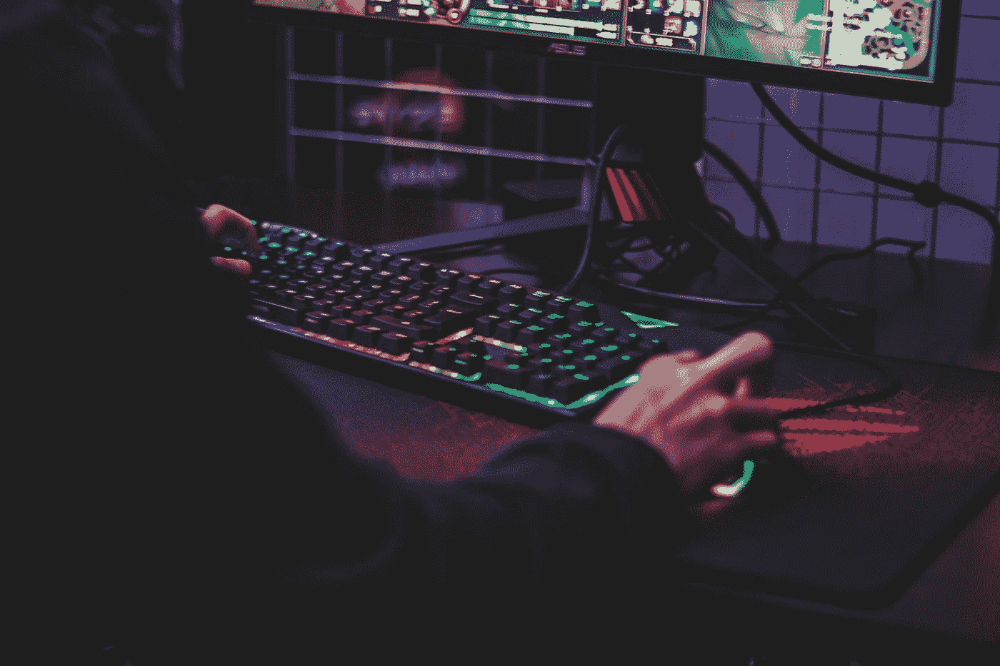
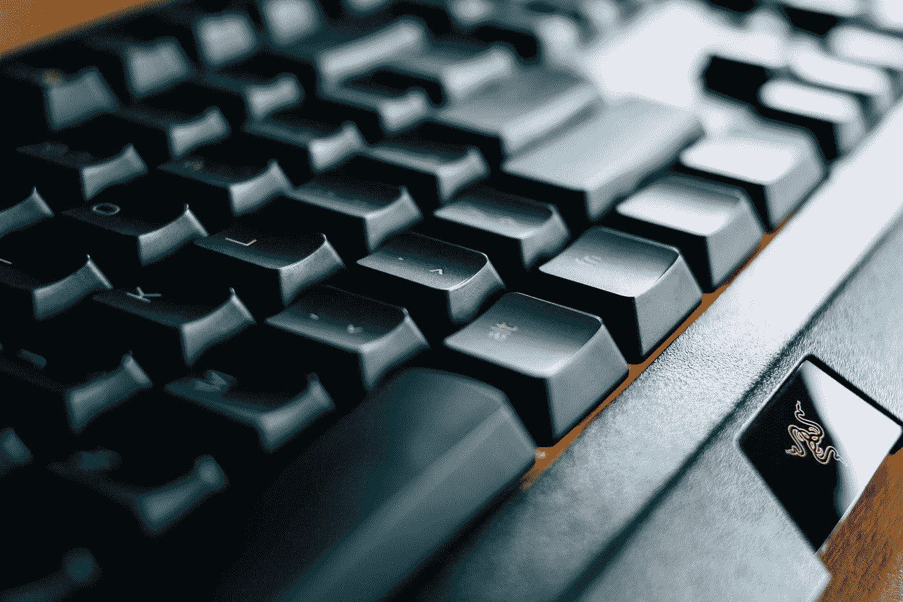
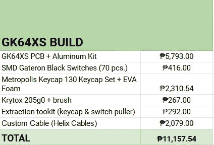
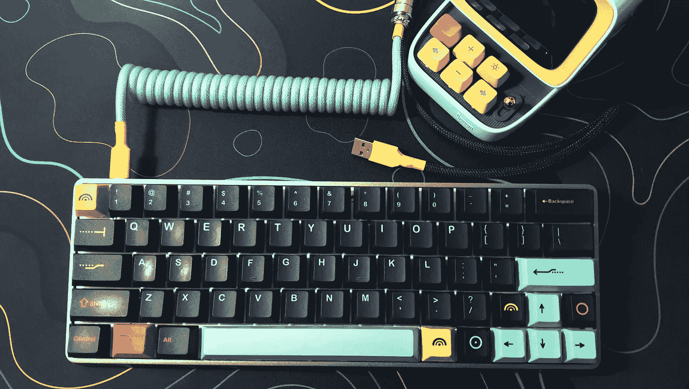

# 为什么定制机械键盘可能不适合你

> 原文：<https://medium.com/geekculture/why-a-custom-mechanical-keyboard-might-not-be-for-you-fce269e19c1b?source=collection_archive---------6----------------------->

## 这是一个有更多步骤的机械键盘。当每个人都在大肆宣传的时候，这就是为什么你不想要一个。

Photo by [Axville](https://unsplash.com/@axville?utm_source=medium&utm_medium=referral) on [Unsplash](https://unsplash.com?utm_source=medium&utm_medium=referral)

# 我对机械键盘的探索始于我上大学的时候。

除了偶尔摆弄一下笔记本电脑，我对电脑外设和硬件了解不多。所以我冒险去了 *YouTube* 网站，发现了大量提供个人电脑构建教程的技术频道。

这是因为我有一门课，我们的期末考试是重新组装电脑。我贪婪地阅读我能找到的所有教程— **主要是因为我想通过考试。但是没过多久我就对内容本身产生了兴趣。**

不出任何人所料，即使通过了测试，我也没有停止看这些视频。最终，我偶然发现了外设，并高度关注它。

当时像我这样一个一文不名的大学生根本没有办法买一台电脑。

Photo by [Dries Augustyns](https://unsplash.com/@driaug?utm_source=medium&utm_medium=referral) on [Unsplash](https://unsplash.com?utm_source=medium&utm_medium=referral)

## 我突然收到了一份礼物，是一台*雷蛇黑寡妇 Chroma V2。*

对于那些想笑的狂热者来说，也是一样。对于非发烧友来说，现在你知道在你的第一次点击冒险中有什么是不能做的了。

我知道这不是我做的最好的决定，但我爸爸提出买它作为生日礼物送给我...我不会拒绝免费的键盘。

在侵略性的游戏字体和令人讨厌的 RGB 灯的时代，这是我认为最好的。我也不知道像 *Ducky* 或 *Royal Kludge 这样卖机械键盘价格更好的不太知名的品牌。*

**有一段时间，我很高兴拥有了*雷蛇黑寡妇色度 V2* 。**

在进入 YouTube 的兔子洞几年后，我发现了残酷的事实:

## 我是个异教徒。

**在疫情期间，我偶然发现了类似** [***Taeha 类型***](https://www.youtube.com/channel/UCMHXMAeKkI6HXlPfLiYvo9g)*[***的开关，点击***](https://www.youtube.com/c/SwitchandClickOfficial) **，以及**[***:3 ildcat***](https://www.youtube.com/c/3ildcat)**。**正是在那里，我发现了**定制机械键盘的世界。***

*我明白了你的键盘可以是你自己的一面镜子。只需稍作调整，你就可以将枯燥的打字体验变成你每天都想做的事情。*

**

*Photo by [Jay Zhang](https://unsplash.com/@jay_zhang?utm_source=medium&utm_medium=referral) on [Unsplash](https://unsplash.com?utm_source=medium&utm_medium=referral)*

# *什么是定制机械键盘？*

***简单来说，就是多台阶的机械键盘。**你购买零件，然后组装设备。类似于组装电脑。主要的区别在于，由于**键盘零件更难获得，这甚至更麻烦。***

*除了让人头疼之外，定制键盘还有它的好处。**您可以决定您的设备到底需要什么。这允许您微调它的外观、感觉和声音，以获得独特的键入体验。***

## ***这里是您打造定制键盘所需的一切。***

**我将只列出该设备的主要部件。这些是什么，有什么作用，我就不深入说了。然而，如果你感兴趣的话，* [*切换和点击的指南*](https://switchandclick.com/how-to-build-a-keyboard/) *可以很好地完成所有这些。**

## *1.PCB 和外壳*

*主要成分。PCB 是你键盘的大脑。它将每次击键记录到计算机中，并决定在计算机中内置什么功能。箱子是将它保持在一起的外壳。购买定制板时，它们通常是捆绑在一起的。*

## *2.按键开关*

*这些是你打字时按的按钮。它们决定了你的键盘发出什么样的声音，打字的感觉如何，以及每个键是如何启动的。*

## *3.键帽*

*这些是放在你的按键开关上面的东西，让它们看起来很漂亮。它们还会影响按键的触感。*

## *4.稳定剂*

*这些是固定较大按键的东西，比如空格键和回车键，以防止它们晃动。这通常与 PCB 和外壳一起提供。*

## *5.工具*

*制作键盘的基本工具是螺丝刀、键帽拔出器、开关拔出器和[焊接工具(如果您的键盘需要的话)。](https://keyboardsexpert.com/hotswap-vs-soldered-keyboards/)*

## *6.电缆*

*将键盘连接到电脑的电缆。这通常也与 PCB 和外壳一起提供。但是如果你觉得特别挑剔，那么你可以定制一件或者自己做一件。*

## *7.临时演员*

*这些包括键盘润滑油、减震泡沫、胶带等。这些都是你可以买到的修改你的板子的小东西。*

*那看起来很多吗？是啊，对我来说绝对是。*

*我花了大约半年的时间四处打听，才找到我需要的东西。幸运的是，随着这项爱好越来越受欢迎，现在有很多关于打造定制键盘的指南。*

*现在我有了一个零件清单，我做了一个小窗口购物，看看有什么可用的。我最初没有购买任何东西的计划，因为它太贵了。*

**

*Photo by [David Veksler](https://unsplash.com/@davidveksler?utm_source=medium&utm_medium=referral) on [Unsplash](https://unsplash.com?utm_source=medium&utm_medium=referral)*

***但是我犯了一个致命的错误。我将所有商品都添加到我的购物车中。***

*没过多久，我就在 *Lazada* 和*Shopee*的一次促销中屈服了。由于赢得了一张工作购物券，我买了所有的东西。*

*至少代金券支付了部分费用。*

## ***这是我买的东西，花了多少钱:***

**

**This is part of my spreadsheet for the build. In USD, the total would be about $210.61 Did I have any money left after this? Absolutely not.**

*我的旧*Razer black widow chroma v2*价格约为₱7,000，而定制键盘价格约为₱11,000.他们的价格不太离谱，但铝板绝对物有所值。它的建造质量和特点本身就说明了一切。这让我相信，Ra zer 的有线和塑料键盘之所以涨价，更多的是因为它们的品牌。*

*尽管我很喜欢我的定制机械键盘，但我意识到它不适合我。*

# *这就是你不应该买定制键盘的原因。*

**

*Photo by [Alexander Mils](https://unsplash.com/@alexandermils?utm_source=medium&utm_medium=referral) on [Unsplash](https://unsplash.com?utm_source=medium&utm_medium=referral)*

## *1.它很贵*

***我买了 *GK64XS 铝合金套件*因为这是我能买到的最便宜但最好的主板，不用等着** [**团购**](https://switchmod.net/pages/what-is-a-group-buy#:~:text=A%20Group%20Buy%20(or%20GB,period%20ends%2C%20production%20will%20begin.) **。广告上说它也有蓝牙兼容性，所以我认为它值这个价钱。***

*事实并非如此。*

*蓝牙是——用雄辩的话来说——简基。它可以工作，但是当你在任何游戏上无线使用键盘时，你肯定会感觉到延迟。有时候按一个键就卡住了……我是从惨痛的教训中学到的。*

*除此之外，我还想要一个可以随身携带的键盘。我没想到这个铝制箱子会这么重。这是我最大的疏忽。是的，钢比羽毛重…在这种情况下，金属比塑料重。*

*我不知道为什么我没有早点意识到。*

**

*Photo by [Sonja Langford](https://unsplash.com/@sonjalangford?utm_source=medium&utm_medium=referral) on [Unsplash](https://unsplash.com?utm_source=medium&utm_medium=referral)*

## *2.这很费时间*

*另一个抱怨是寻找零件和组装电路板的过程。这不是我喜欢的，而且花了很长时间才完成。找到我想要的组件花了几个月的时间。*

*至于装配，我在几个小时内就完成了。我的朋友们想看看它是如何运作的，所以我通过*不和谐*来讲述我的痛苦，这让事情变得可以忍受。**和我一样热爱 DIY 项目，** [**陆兵的每一次切换**](https://www.gloriousgaming.com/blogs/guides-resources/why-you-should-lube-your-keyboard-switches) **都没有激起喜悦的火花。**幸运的是，我决定买一块[热插拔板](https://kono.store/blogs/keyboards/what-is-keyboard-hotswap)，这样我就不必再经历焊接每个开关的过程。*

*制造一个键盘的过程比制造一台个人电脑更令人沮丧，主要是因为它的重复性太强。*

*更糟糕的是，因为你已经建立了董事会，**你会看到它的每一个缺陷。突然间，你将会浪费更多的时间去修复它。**这包括感觉一个稳定器比另一个稳定器润滑得更好，以及在将所有稳定器放在一起后发现板子有点不平。*

*对你的键盘高度敏感让人抓狂。*

**

*Photo by [Jingming Pan](https://unsplash.com/@pokmer?utm_source=medium&utm_medium=referral) on [Unsplash](https://unsplash.com?utm_source=medium&utm_medium=referral)*

## *3.这不实际*

*实际上，你必须要么非常富有，要么对你的键盘的外观、感觉和声音有一种不健康的痴迷，才会考虑购买定制键盘。*

***普通的机械键盘就够了；对于你的时间和金钱来说，定制板不是一个实际的决定。***

*如果不太在意打字体验，一些好的薄膜键盘价格甚至更低。它们不会有和机械键盘一样的感觉和声音，但它们也能很好地服务于自己的目的。*

**

*Photo by [Ken Suarez](https://unsplash.com/@kensuarez?utm_source=medium&utm_medium=referral) on [Unsplash](https://unsplash.com?utm_source=medium&utm_medium=referral)*

## *4.定制键盘和机械键盘之间的差别很小*

*当你从机械键盘切换到定制键盘时，你会注意到的最大区别是它的外观。当你挑选外壳、键帽和线缆时，你就决定了设备的总体审美。*

*定制主板并不是机械键盘带来的惊天动地的变化——除非你决定花钱买你能得到的最好的部件。但是如果你打算买一个**预算定制键盘**，你不会注意到太多，而且**它不值得花这个价钱。***

# *这是我会做的。*

**

*This is my custom keyboard. I think it turned out okay for my first custom build.*

*虽然我仍然很喜欢我的定制键盘，但想到我本可以存更多的钱来获得类似的结果，我就很难过。*

*如果我能以不同的方式做事，我会买一个已经具备我想要的功能的机械键盘。在那里，我会根据自己的喜好修改它。*

*那将是一个更实际的方法。我只需要调整和更换一些部件，而不是用昂贵的部件从头开始建造。*

*尽管构建定制板是一种体验。我不认为我会忘记它，尤其是因为我正在使用相同的设备来打印这篇文章。*

*如果你已经做到了这一步，感谢你的阅读！我真的很感激。因为我住的地方，我不能靠中等收入生活。但是如果你想支持我的做法，你可以在这里滑过[的 ko-fi](https://ko-fi.com/angeliz) 或者让我知道你在评论中或者在[的 twitter](https://twitter.com/_angeliz_r) 上的想法！*