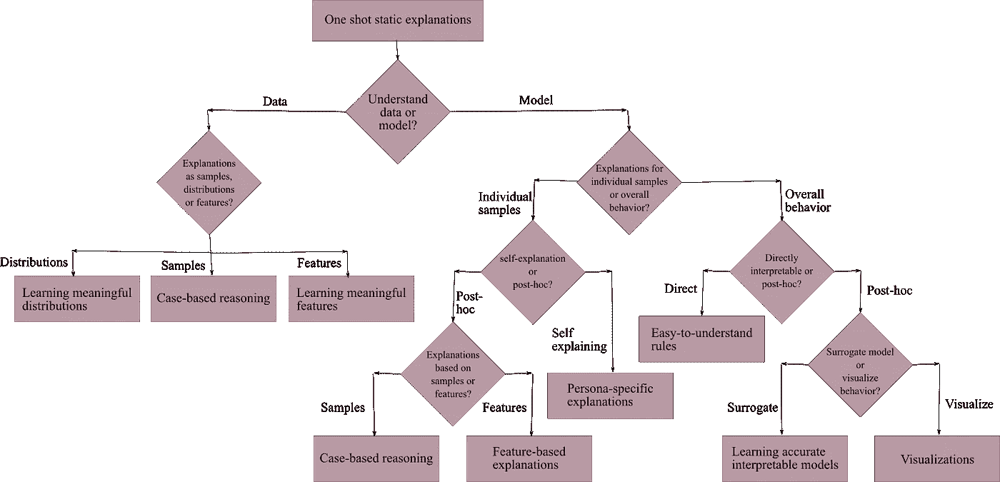
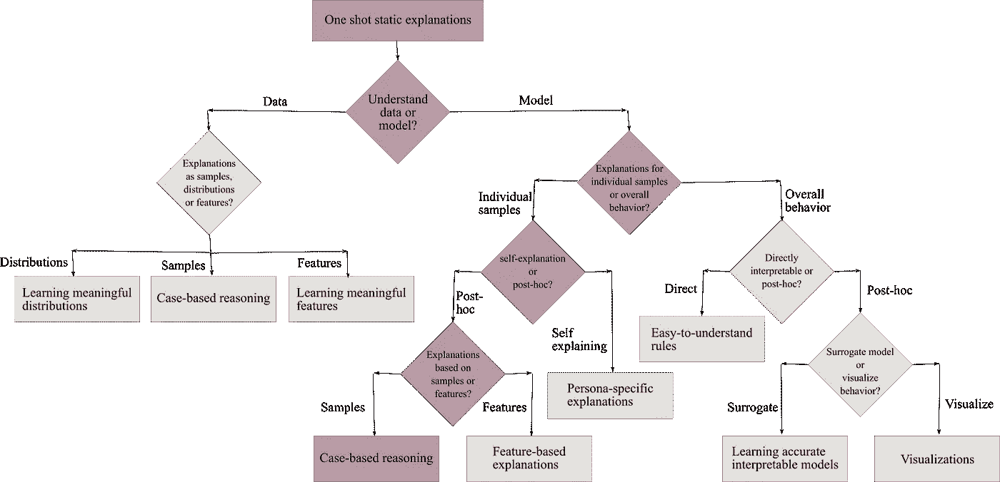
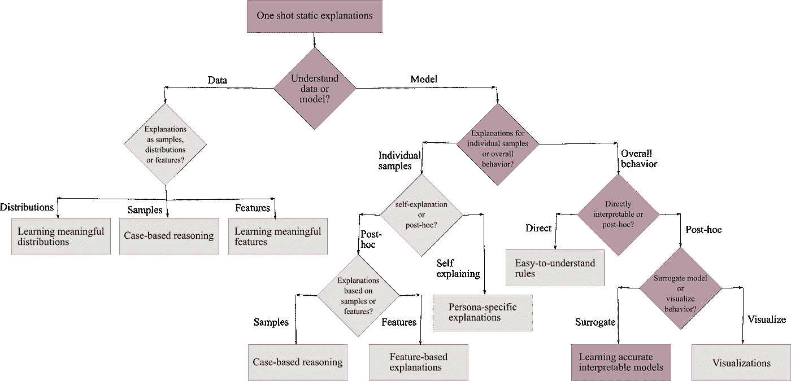

# 为什么人工智能系统欠你一个解释？

> 原文：<https://medium.com/geekculture/why-ai-systems-owe-you-an-explanation-16496ae52efb?source=collection_archive---------34----------------------->

无论你是不是开发人员，你与人工智能模型的互动都需要它的可解释性。

Photo by [**Magda Ehlers**](https://www.pexels.com/@magda-ehlers-pexels?utm_content=attributionCopyText&utm_medium=referral&utm_source=pexels) from [**Pexels**](https://www.pexels.com/photo/food-light-nature-art-4025363/?utm_content=attributionCopyText&utm_medium=referral&utm_source=pexels)

解释给我们的感觉是事物是有秩序的，这让我们感到安慰

已经成为我们日常生活一部分的人工智能系统已经从简单的手工模型发展到复杂的网络。这些网络有时是整体，或者通过元学习来创建其他模型。这种复杂性意味着我们正走向人工智能系统的黑匣子；它们是不透明的系统。但从根本上说，它们是基于相关性和关联性；因此，一个不透明的系统可能会导致有缺陷的关联、调试困难、失去控制、偏差，以及严重偏离模型离线和部署后的执行方式。虽然预测性能仍将是数据科学家的主要关注点，但**可解释的人工智能(XAI)** 或**可解释的机器学习(IML)** 正迅速成为寻求已开发模型的可解释性的相关工具。

我们人类以多种形式与 AI 智能体进行交互。这些可能是你的智能助手、健身训练应用、医疗诊断、导航系统、犯罪控制或财务顾问。这种系统的可解释性是由它们精确和公平地运行的需要驱动的。请记住，根据错误的相关性和有缺陷的数据训练出来的系统会导致偏差。当然， [XAI 可以提供一个复杂系统的内部细节](/geekculture/explaining-a-trained-model-d750c70b60a8)，它还能帮上什么忙呢？通过向人们提供解释，它必须从哲学、认知心理学、人机交互(HCI)和社会科学中吸取教训。因此**通过支持明智的决策、更好的调试、审计和对系统能力的适度信任，XAI 已经成为构建安全、可靠的人工智能系统的主要元素**。

目前对 XAI 的理解假设它主要由机器学习工程师用来对他们构建和部署的模型进行健全性检查。但是**一个实际的 XAI 解决方案应该关注面向用户/业务的可解释性需求以及面向机器学习的属性**。虽然这似乎要求太多，但可解释性是一个和系统的隐私需求一样相关的概念。隐私是一个宽泛的概念，可能意味着[不同用例中的不同需求](/geekculture/where-do-you-stand-in-the-data-privacy-ecosystem-2e499d94a67d)。它可以是关于模型、某些实例、某些特征等的公开。同样，**解释的复杂性是一个可以涵盖不同方面的概念**。

与人工智能系统交互的人被称为消费者，他们有不同类型的角色。例如，试图理解患者的人工智能诊断的医生可能会受益于看到具有相同诊断的已知相似病例；被拒绝的贷款申请人会希望了解他们被拒绝的主要原因，以及可以做些什么来扭转决定；另一方面，监管者希望了解整个系统的行为，以确保其符合法律；开发人员可能希望了解模型在哪些方面更有把握，以此作为改进其性能的手段。

正如你所看到的 **XAI 不能产生一个一刀切的解决方案**。它需要解决消费者对许多可能的解释的观点。

为了更好地理解 XAI 生成的解释在不同的角色中是如何变化的；让我们看看解释生成的流程。生成的解释可以是**静态解释，指的是不响应于来自消费者的反馈而改变的解释。我们也有交互式解释，允许消费者要求不同类型的解释，例如通过对话；但是为了简单起见，让我们坚持静态的一次性解释。**

Image redrawn by author. Original source at end of the story.

现在，这是一条很长的路，有很多术语要走。在我们浏览不同角色的流程之前，我会解释其中的一些。一个可直接解释的模型是一个本质上透明的模型，可以被大多数消费者理解，例如，一个小的决策树，而事后解释涉及一个在模型被训练后向模型解释的辅助方法。还可以有一个自我解释模型，它本身生成局部解释，但不一定是可直接解释的，例如，文本中的基本原理生成。代理模型是第二个，通常是一个可以直接解释的模型，近似于一个更复杂的模型。而模型的可视化可能集中于它的一部分，并且它本身不是一个完全成熟的模型。

让我们来看看对于有特殊需求的消费者来说，流量是如何不同的。

考虑一个个人金融应用程序，其中客户向金融机构(如银行)申请贷款。我们可以假设银行有一个训练有素的人工智能模型，它基于数据驱动的方法和业务规则的组合，输出最终的贷款批准决策。在该流程中工作的一个消费者角色是信贷员，他可能希望验证模型的批准或拒绝建议。另一个对决策背后的推理明显感兴趣的角色是贷款被拒绝的申请人。可能对模型的整体推理感兴趣的第三个角色是数据科学执行官，他希望确保模型所做建议的性能。

第一个消费者，即贷款官员，会对验证模型针对不同贷款申请给出的建议是否合理感兴趣。那么，我们应该对这个角色做出什么样的解释呢？请看下图:

Image redrawn by the author.

假设 Alice 警官希望获得拒绝某人贷款申请的建议的可信度。她将专注于“模型”分支。由于她关注单个申请人，下一个分支将是“个人样本”，然后是“临时”，因为推荐是由已经建立的模型做出的。

被拒绝的不幸的贷款申请人怎么办？Bob，申请人不仅想知道什么对他不利，还想知道他可以做出什么改变来获得更有利的结果。

Image redrawn by the author.

为了给 Bob 一个解释，我们将再次进入“模型”、“个体样本”和“事后”分支。然后，用户可以在“特征”下选择适当的方法，因为 Bob 希望基于他的个人资料得到解释。这些特征可以包括他的 CIBIL 分数、债务属性等等。

银行高管可能不太关心具体的申请人，而更关心模型的整体行为，以及它的建议总体上是否基于稳健的合理因素。

Image redrawn by the author.

在这种情况下，管理人员将遵循“静态”和“模型”分支，然后是“整体行为”，因为他们想要对模型有一个高层次的理解。由于模型已经部署，他们将遵循“事后”分支，并最终选择“代理”来使用他们能够理解的另一个模型获得对原始模型的解释。

对人工智能可解释性的利益相关者的理解可以帮助识别需要更多解释方法的差距，并设计条款来合并它们。

来源:

*   一种解释并不适合所有人:
    人工智能可解释技术的工具包和分类法
*   谷歌云人工智能解说白皮书 r
*   [如何选择一个可解释的方法？
    在
    实践中有条不紊地实施 XAI](https://arxiv.org/abs/2107.04427)