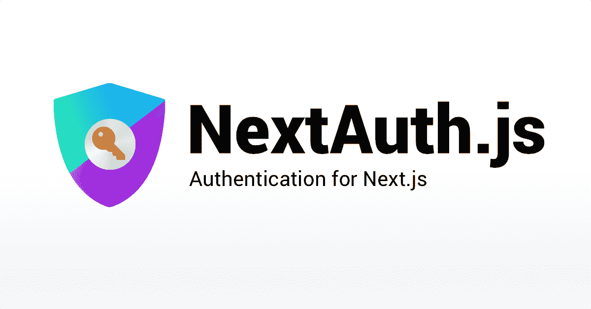
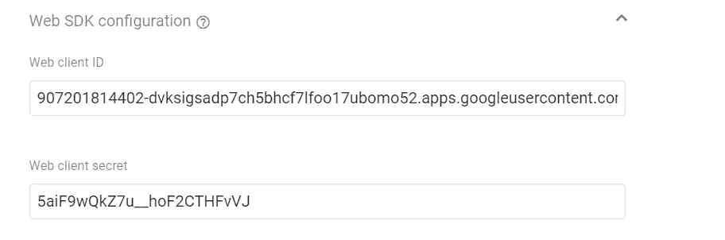
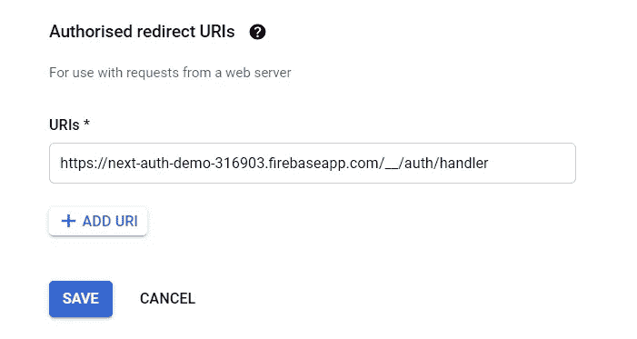
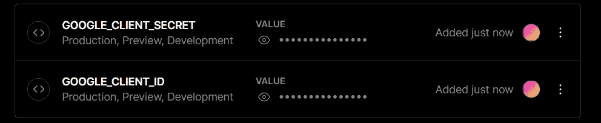
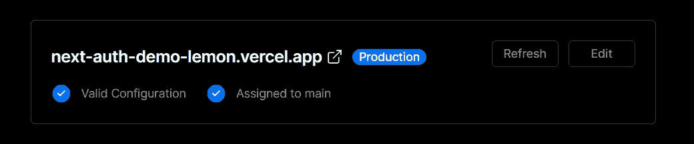
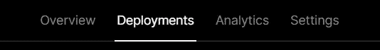
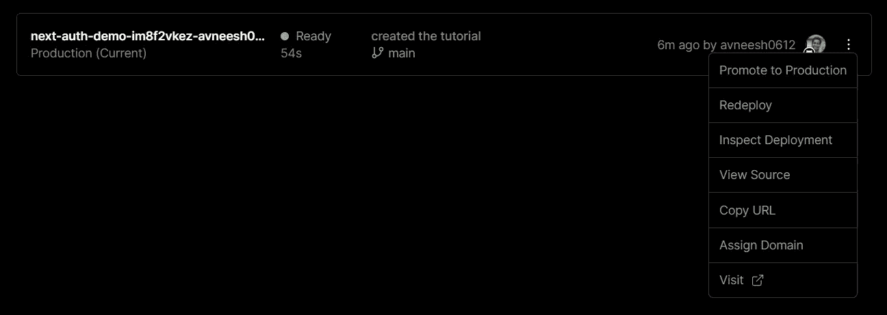
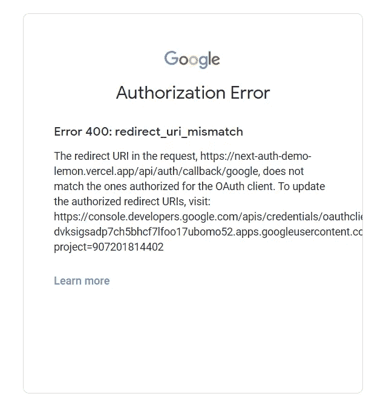

# 为什么以及如何开始下一次授权？

> 原文：<https://medium.com/geekculture/why-and-how-to-get-started-with-next-auth-61740558b45b?source=collection_archive---------4----------------------->

使用 Next.js 的 Google 身份验证



## 为什么您应该选择下一个身份验证？

你可能想知道，如果你已经在使用类似 firebase 的东西，那么为什么还要使用 Next auth 呢？原因如下

*   使用方便
*   为我们提供了许多身份验证提供商
*   使用 serverSideProps，您可以在用户到达页面时立即获得详细信息，而使用 firebase 等工具，您可以在几秒钟后获得用户的详细信息。
*   它非常安全，因为它使用 HTTP POST + CSRF 令牌验证
    JWT 与 JWS / JWE / JWK / JWK

## 设置

我将使用 create-next-app 设置一个新的 next 应用程序。

```
npx create-next-app next-auth-demo
```

清除

我会删除从主页面到页脚的所有内容。

安装下一个-授权

```
npm i next-auth # npm
yarn add next-auth # yarn
```

## 开始使用下一次授权

我们将首先在页面中的 api 文件夹内创建一个名为 auth 的文件夹。

在该文件夹中创建一个名为[…nextauth]的文件。射流研究…

我们将从谷歌认证开始。所以将这段代码添加到您的[…nextauth].js 中。

现在我们将最终像这样配置下一个 auth in _app.js

## 谷歌认证

我们将使用 firebase 为我们创建凭证。我们可以直接使用谷歌云控制台，但我们需要配置额外的东西。

前往[火力基地](https://console.firebase.google.com/u/0/)。创建一个新帐户，然后点击添加项目。

给你的应用取一个名字，然后你可以保留所有的默认设置，点击下一步。

转到边栏中的“认证”标签。单击开始。点击谷歌登录并启用它。现在只需点击保存。

如果您再次点击编辑并打开 Web SDK 配置折叠。你可以看到我们需要的凭证。我在展示我的演示凭证，但你不应该展示你的凭证。



现在，我们将在文件夹的根目录下创建一个名为. env.local 的新文件。在这个文件中，我们将创建两个名为 GOOGLE_CLIENT_ID 和 GOOGLE_CLIENT_SECRET 的环境变量。

现在将客户端 id 和密码复制粘贴到这里。

我们将创建另一个名为 NEXTAUTH_URL 的变量，它将成为我们的应用程序 URL，在开发中它将成为我们的本地主机。

添加变量后，确保重启服务器。

我们将在 index.js 中创建一个登录按钮

现在，如果我们单击“登录”按钮，它将显示类似以下的错误

现在复制错误底部的链接，并将该链接粘贴到一个新的选项卡中。向下滚动，你将能够看到重定向 URI 的。



Redirect URIs

现在点击添加 URI 并添加这个

```
 [http://localhost:3000/api/auth/callback/google](http://localhost:3000/api/auth/callback/google)
```

然后点击保存。如果你尝试登录。您现在可以登录了。

## 获取用户信息

我们将首先在客户机上获取数据，然后看看如何用 serverSideProps 获取数据。

为了在客户端获取用户信息，我们将使用 useSession 钩子。

useSession 钩子给了我们一个 Session 对象，里面有用户的信息。

现在，让我们看看登录后会得到什么

如果用户已经登录，我们希望有一个注销按钮。因此，如果没有用户，我们将有一个登录按钮，如果有用户，我们将有一个退出按钮。

所以像这样创建一个三元运算符

然后从下一个身份验证/客户端导入注销。

## 获取服务器上的用户数据

我们将使用 serverSideProps 创建一个函数，通过会话获取用户详细信息。

我们将从 next-auth/client 导入 getSession，而不是导入 useSession

```
import { getSession, signIn, signOut } from "next-auth/client";
```

它现在将立即获取数据，没有延迟。

## 部署

我将创建一个新的 GitHub 库，并将代码推送到那里。如果你不了解 git 和 GitHub。查看我的 [Git 和 Github 速成班](https://avneeshagarwal.medium.com/git-and-github-crash-course-b44f4885ff66)。

之后去[威瑟尔](https://vercel.com/)

*   注册你的 GitHub
*   点击创建一个新项目
*   导入您创建的存储库
*   单击部署

您的站点现在将被部署，但身份验证将不起作用。

添加环境变量。

*   网站部署后，进入当前应用程序的仪表板，点击设置，然后环境变量。
*   添加 Google client id 和 Google client secret，它们存在于我们的. env.local 文件中。
*   在你添加了这两个之后，它看起来就像这样。



*   我们将添加另一个变量，这是我们的下一个 auth URL，它将是部署的 URL，而不是本地主机。
*   要获取 URL，请单击 domains 并获取最短的链接，然后将其添加到 NEXTAUTH_URL 变量中。这将类似于 https://next-auth-demo-lemon.vercel.app/的



*   最后，转到标题中选项卡上的“部署”选项卡。



*   点击最新版本，并按下重新部署。



## 将 URI 添加到谷歌

重新部署后，尝试再次登录，它会显示一个错误。



*   转到错误底部的 URL。
*   创建一个新的 URI，并将链接粘贴到“请求中的重定向 URI”之后，在我的例子中是 https://next-auth-demo-lemon . vercel . app/API/auth/callback/Google。

我们的认证现在运行良好

祝贺你🥳.您已经使用下一个身份验证创建了您的第一个 Google 登录。如果您想定制登录页面，点击[此处](https://javascript.plainenglish.io/how-to-create-a-custom-sign-in-page-in-next-auth-1612dc17beb7)。如果您想添加 Auth0 认证，请点击此处的。

让我知道，如果你想看到任何其他类型的认证😉。

有用的链接-

[Github 库](https://github.com/avneesh0612/next-auth-demo)

[NextJS docs](https://nextjs.org/docs)

[下一个授权](https://next-auth.js.org/)

[所有社交](https://avneesh-links.vercel.app/)