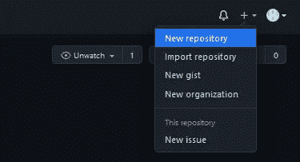
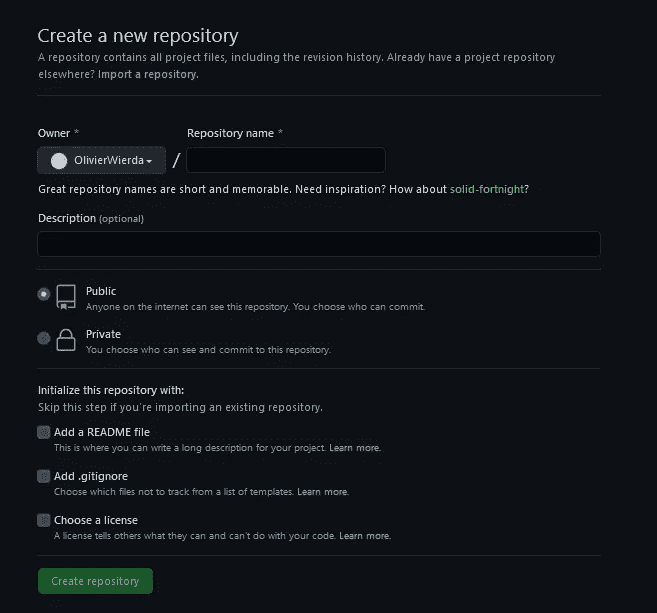
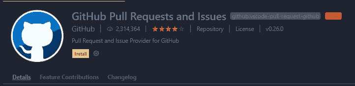
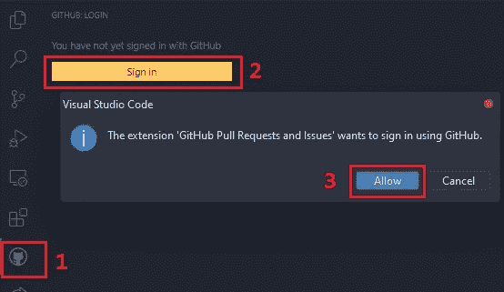
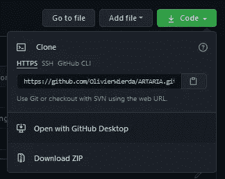
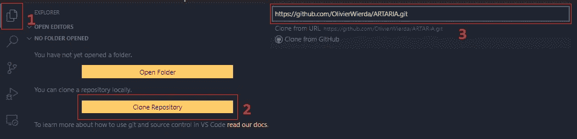
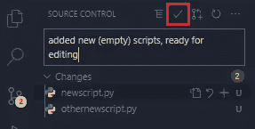
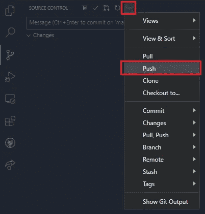

# 作为一名初级程序员，为什么以及如何使用带有 VS 代码的 GitHub

> 原文：<https://medium.com/geekculture/why-and-how-to-use-github-with-vs-code-as-a-beginning-programmer-32d40ec5136f?source=collection_archive---------37----------------------->


Photo by [Richy Great](https://unsplash.com/@richygreat?utm_source=medium&utm_medium=referral) on [Unsplash](https://unsplash.com?utm_source=medium&utm_medium=referral)

# 为什么要用 GitHub 做爱好项目？

在这里，我将非常坦率地说，我只是把编程作为一种爱好，为了好玩，而且我从未以专业身份在这个行业工作过。版本控制是我过去常常手工做的事情，通过在文件名后面加上 _vXX 来对我的文件进行版本控制。

这现在看起来很愚蠢，但是我认为使用版本控制对于初级到中级程序员来说没有任何附加价值。但是随着我的项目慢慢变得越来越复杂，使用 GitHub 的优势变得越来越明显，即使是作为一个业余爱好者开发者。我个人认为有用的一些优点是:

*   在两台设备之间同步项目。当然，你可以使用像 Drive 或 OneDrive 这样的云托管服务，但是在 VS 代码中使用内置的 GitHub 工具会更令人愉快，也更快。
*   您可以使用来自 GitHub Marketplace 的各种不同的工具来增强您的工作流程，并自动化某些费力的任务。
*   你为自己创造了一个良好的积极反馈循环，看到你随着时间的推移所做的承诺会给你很大的成就感，并且是继续你的项目的一个很好的动力。
*   GitHub 的实际版本控制方面，能够在您不断提交到存储库时可视化更改，这对于找到您在此过程中引入的 bug 并修复它们非常有帮助。

# 创建存储库

要开始创建您的第一个存储库，根据您的喜好设置它，添加您的第一段代码，然后用 VS 代码提交和推送它，实际上非常简单，只需要几个步骤。

首先，我们显然需要一个 GitHub 上的帐户，这部分是不言自明的。



Creating a new repo through the browser

然后我们可以开始创建我们的第一个存储库，我建议第一次通过网站来做，感受一下可能的选项，但是也可以从 VS 代码本身创建一个新的存储库。在这里，我们可以设置回购的名称和可选的描述，并且我们可以选择是否希望我们的存储库是公开的。将其设置为公开将允许您免费使用一些很酷的免费增值工具和统计数据，而将其设置为私有将让您放心，您的劣质实践代码不会公开提供给所有人。



The options you can choose when creating a new repo.

您还可以选择添加一个. README 和一个. gitignore 文件，这是我推荐的做法，因为这样可以节省一些时间。许可证就交给你选了！

不过，不要太担心实际的设置，因为您可以在以后更改它们中的每一个。

现在我们已经创建了存储库，让我们通过编辑。gitignore 文件。复制并粘贴模板，用你选择的编程语言，和 VS 代码，这个库 中的 [**，和**](https://github.com/github/gitignore) **[**这个链接**](https://github.com/github/gitignore/blob/master/Global/VisualStudioCode.gitignore) 。这将确保我们的原始回购将保持这种方式，没有任何不必要的编辑器和语言特定的文件开始堵塞项目。**

现在，我们终于可以深入到本指南的 VS 代码部分，实际使用存储库。



First make sure you have the extension installed.

在 VS 代码中打开一个终端，使用以下两个命令输入您的 GitHub 凭证:

```
git config --global user.email your@email.com
git config --global user.name yourusername
```



Signing-in with GitHub through VS Code

而且让我们用 GitHub 扩展认证自己，它会要求打开一个浏览器，然后接受认证，我们会被送回 VS 代码。

现在我们可以克隆我们的库，并在 VS 代码中使用它，为此，从你的库中复制“克隆”HTTPS 链接。



Copying the HTTPS clone link from the browser.

然后用 VS 代码克隆存储库。



And then cloning the repository in VS Code to load it locally.

它会要求你为一个文件夹在哪里故事的本地版本的回购，选择一个合适的位置。此后，将出现一个弹出窗口，显示以下内容:


Opening the local version of the repository.



Adding the first commit!

现在我们已经在本地加载了我们的存储库，我们可以开始进行修改了！在您选择的编程语言中添加一些新文件，您可以在 VS 代码的“源代码控制”标签中看到您的更改。在提交窗口中添加一条合适的消息，让我们进行第一次提交！



Pushing the commits/changes to the repository.

如果我们现在用浏览器查看我们的存储库，您可能期望您的新文件出现在列表中，但是什么也没有改变。为了使我们的更改在整个存储库中生效，而不仅仅是在本地，我们必须首先将我们的提交推送到 repo。请记住，您可以一次提交多个较小的提交，因此建议您在进行每个重大更改时创建一个提交，然后在当天完成后再提交。

# 使用存储库

这些是创建、克隆、提交和推送到存储库的基本步骤。现在，如果我们想在不同的设备上进行回购，这非常简单。只需像以前一样在 VS 代码扩展上进行身份验证并克隆存储库，现在您将拥有另一个本地版本的存储库。进行您想要进行的更改和提交，并将它们推送到存储库。

现在，如果您想继续在您的主设备上工作，我们不需要再次克隆存储库，我们可以使用 VS 代码打开存储库文件夹，并使用“Pull”命令在本地加载我们在另一个设备上所做的所有更改。这样，在两个独立的设备上工作非常容易，没有传统的文件传输和云托管的麻烦。

当然，我们可以用 GitHub 做很多其他的事情，本指南只是作为一个非专业人士开始使用个人存储库的最低要求。我希望这能激励人们以一种简单、省事的方式开始使用 GitHub！