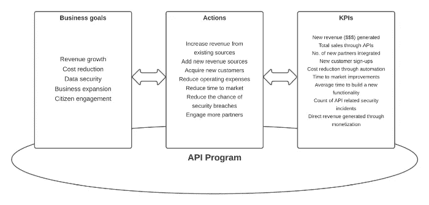

# 为什么企业需要 API 管理？—第一部分

> 原文：<https://medium.com/geekculture/why-api-management-is-required-for-a-business-part-i-835ac490602d?source=collection_archive---------23----------------------->

业务增长和 API 管理有什么关联？

# 介绍

API 是充当业务数据和消费者之间接口的数字连接器。API 允许组织通过创新的想法将数据转化为金钱。API 平台正在成为许多行业 IT 生态系统中不可或缺的一部分，包括金融服务、医疗保健、电信、制造等等。构建 API 平台需要组织的投资。

# 企业领导的常见问题

在大多数情况下，企业领导人最关心的是投资及其回报。他们会将 API 平台视为一种投资，在给定的时间内会带来回报。越快越好。他们会问这样的问题

*   这个项目会给我们公司带来什么？
*   这个项目将如何使我们获得更多的业务？
*   初始成本和经常性成本是什么？(运营支出与资本支出)
*   需要多长时间才能获得项目收益并收回投资？
*   这项业务将如何盈利？

这些问题直接关系到公司的成功，在 API 项目开始时找到这些问题的答案是非常重要的。将 API 平台给组织带来的价值直接映射为商业领袖喜欢看到的货币形式并不是一件容易的事情。但是，如果我们在项目开始时定义一组直接或间接映射到公司业务目标的 API KPIs，这是可能的。

# IT 驱动与业务驱动的 API 程序

许多 API 计划是 IT 驱动的，而不是业务驱动的。当涉及到资金和说服商业领导时，这就产生了问题。这就是为什么有必要定义一组 KPI 来度量 API 的商业价值。确定与业务目标相关的 KPI 需要通过与业务涉众合作来完成。大多数情况下，业务分析师被赋予在这些对话中代表业务方面的责任，但这种方法在大多数情况下不会很好地工作，因为 BAs 不会了解业务范围的全貌。

# IT 驱动的 KPI

这篇文章并没有声称在现有的 API 程序中没有测量 KPI。但是，由现有程序监控的大多数 KPI 都与运行时和操作指标相关，例如

*   申请数量
*   API 数量
*   潜伏
*   每秒事务数
*   用户数量

这些指标帮助 IT 团队保持系统平稳运行，并根据业务需求进行伸缩。但是它没有抓住平台的商业价值。

# 业务驱动的 KPI

这里有一些商业领导人希望看到的商业指标。

*   通过 API 重用节省成本
*   使用 API 的合作伙伴数量
*   通过 API 产生的新收入
*   通过迁移到云节省运营成本

为了度量上述指标，我们应该从 API 平台本身定义一组指标，以便根据这些指标自动生成报告。

# 确定业务目标

我们应该始终通过与业务领导谈论计划来启动 API 项目，并得出需要通过该计划实现的 5 个主要业务目标。这对于每个组织来说可能是不同的，但是这里有 5 个我们可以考虑的通用业务目标。

1.  收入增长
2.  成本降低
3.  数据安全
4.  业务扩张
5.  公民参与

一旦你确定了业务目标，下一步就是制定实现这些目标的具体计划。

# 设定可量化的目标

以下是一些具体的行动项目，可用于实现上述业务目标所设定的目标。

*   从现有来源增加收入
*   增加新的收入来源
*   获得新客户
*   降低运营费用
*   缩短上市时间
*   减少安全漏洞的机会
*   吸引更多合作伙伴

现在，我们已经确定了一套实现业务目标的具体行动。让我们将这些行动项转换成一组可以根据 API 平台进行测量的 KPI。

# 定义 API 的 KPI

API 平台允许用户通过不同的渠道参与平台，如移动、web 和合作伙伴生态系统。同时，API 平台中有不同的组件帮助客户、开发人员和许多其他利益相关者之间的交互。我们定义的 KPI 需要捕捉 API 管理的各个方面，同时与业务目标保持一致。

下面给出了一个 KPI 的示例列表，我们可以根据之前确定的业务目标来定义它。

*   通过 API 获得的新收入(美元美元)
*   通过 API 执行的总销售额
*   通过 API 整合的新合作伙伴数量
*   通过 API 渠道注册新客户
*   通过 API 自动化降低成本
*   使用集成 API 改进上市时间
*   构建新功能的平均时间
*   与 API 相关的安全事件计数
*   通过货币化产生的直接收入

这个列表可以根据用例扩展到更多的 KPI。但是呈现这个列表的想法是为了显示 KPI 的类型，可以定义 KPI 来度量 API 平台的业务性能。

# 更高层次的目标

除了上面提到的 KPI 之外，还可以有更高级别的 KPI 来监控 API 平台的整体性能，例如

*   通过 API 生态系统获得的追加销售收入
*   通过 API 管理提高保留率
*   API 生态系统的总成本(运营支出+资本支出)
*   API 生态系统的盈利能力

一旦基于业务目标定义了 KPI，API 平台应该能够提供必要的工具和机制来以直接或间接的方式度量这些 KPI。

# 使用 API 管理工具衡量 KPI

并非所有的 API 都会对业务产生直接的货币影响。根据影响程度，我们可以将 API 分为三个主要类别。

*   直接(产品)——这些是产生直接商业价值的 API。举例来说，货币化的 API 将直接为企业带来利润。
*   间接(战略)-这些 API 间接贡献收入。例如，销售结帐 API 或合作伙伴交互 API 可以间接帮助增加企业利润。
*   enabler(Platform)——这些 API 支持一整套系统和用户进行交互和集成。例如，为第三方组织构建移动应用程序而公开的 API 是一种促成因素，它会以间接的方式对业务做出贡献，这种方式不容易用金钱来衡量。

下图概述了业务目标、KPI 和行动之间的关系。

Figure: How business goals are correlated to API Management

现在，我们已经确定了 API 的 KPI，以及从不同角度对业务做出贡献的不同类型的 API。让我们尝试与一家假设的公司一起构建一个用例，以及 WSO2 API 集成平台如何基于这些 KPI 帮助提高 ROI。

这就是本教程第一部分的全部内容。我们将在第二部分讨论 API 管理供应商如何帮助我们实现这些目标。

*   [第二部分](https://chanakaudaya.medium.com/why-api-management-is-required-for-a-business-part-ii-a6f5faa3b10f)