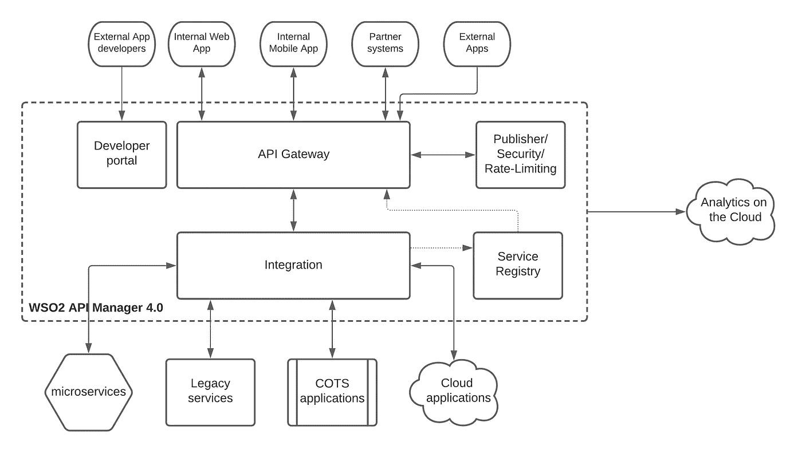

# 为什么企业需要 API 管理？第三部分

> 原文：<https://medium.com/geekculture/why-api-management-is-required-for-a-business-part-iii-3b2d1ee77dea?source=collection_archive---------30----------------------->

如何搭建一个 API 管理平台来迎合你的业务需求？

# 介绍

这是本主题教程的第三部分，我们在第一部分和第二部分中讨论了业务目标、KPI 和一个组织使用 API 管理来发展业务的实例。下面提到了这两篇文章的链接。

*   第一部分
*   [第二部分](https://chanakaudaya.medium.com/why-api-management-is-required-for-a-business-part-ii-a6f5faa3b10f)

在本部分教程中，我们将讨论 API 管理平台的参考架构，以及它如何帮助企业提高 API 计划的投资回报(ROI)。

# WSO2 API 集成平台如何帮助提高投资回报率

让我们简单地看一下带有 WSO2 API 管理的企业平台的解决方案架构。

Figure: WSO2 API Management platform based reference architecture

上图描述了 WSO2 API 管理平台如何帮助组织向不同的利益相关者公开其内部业务应用程序。以下是 WSO2 解决方案中的主要组件，它们有助于满足平台的各种需求。

*   API Gateway——这是通过不同渠道(如移动、web 和合作伙伴应用程序)的所有用户的主要入口点。它执行安全性、速率限制，并通过分析监控流量
*   开发者门户—这允许第三方(如合作伙伴)通过使用通过网关公开的 API 来构建自己的应用程序。这些第三方可以通过开发人员门户与组织合作，以改进 API 并创建创新应用程序来吸引更多客户
*   集成—这是连接在 IT 基础设施上运行的不同业务应用程序的组件，以便创建新的服务和 API 来交付消费者优先的应用程序。
*   服务注册——这是 WSO2 API Manager 4.0 引入的一个新特性，它允许通过 API 网关自动发现集成服务并将其转换为托管 API。它缩短了上市时间，并自动化了开发过程。
*   管理组件——API Publisher 用于设计 API，并使用定义的生命周期和团队来管理它们。API 安全性通过身份验证和授权功能为 API 提供密钥管理和安全性。这可以委托给外部身份提供者，例如 WSO2 Identity Server、Ping 或 Okta 等等。API 流量管理器提供速率限制功能，以防止恶意用户过度使用，并根据特定策略提供公平使用。API Analytics 提供了对 API 的使用模式和趋势的洞察，它是通过 WSO2 Cloud 提供的云服务。

现在是查看之前定义的 KPI 以及 WSO2 平台如何帮助改进这些 KPI 的好时机。

**通过 API 获得的新收入($$$)**

随着通过网站引入在线销售，产生了新的收入流。与此同时，像易贝、亚马逊、沃尔玛这样的第三方组织已经能够通过 API 集成来销售 ABC 公司的产品。*全面的 API 开发者门户*和*用一台服务器支持数千个事务和并发用户的能力*在向新客户扩展业务时变得非常方便。

**通过 API 执行的总销售额**

随着通过 API 销售的扩展，实体商店被用作存储设施，因为大多数人希望直接从网站或通过合作伙伴经销商或其他电子商务平台购买产品。这使得通过 API 的销售大幅增加，并且*节省了以前销售产品所需的大量工时*。

WSO2 API 管理器中可用的 API 分析帮助架构团队测量每个 API 的*性能*，并且在销售高峰期， *WSO2 API 微网关*被部署来处理给定 API 的数量。一旦负载降低，微网关就会在不影响现有部署的情况下退役。

**通过 API 整合的新合作伙伴数量**

一旦发布了 API 以公开产品细节和库存可用性，所有合作伙伴都可以通过开发人员门户看到这些信息，越来越多的合作伙伴通过 API 进行整合。这些合作伙伴可以通过 WSO2 API 管理器分析组件和流量管理器组件以及速率限制和节流策略进行监控和管理。开发人员门户的自助注册功能以及可选的工作流支持使 ABC 公司能够轻松地与合作伙伴合作。一旦 ABC 公司的请求获得批准，合作伙伴可以使用相关信息自行注册并开始使用 API。

**通过 API 自动化降低成本**

有了基于 API 的与合作伙伴的交互，大部分手动、基于纸张的注册流程都被取消了，注册合作伙伴所需的时间也大大缩短了。该项目扩展到了制造流程，所有与原材料供应商、运输、交付和分销流程的人工交互都转移到了基于 API 的系统中，当系统发生变化时，信息会自动传递。

WSO2s 对构建集成 API 供应链的支持帮助 ABC 公司利用 API 实现了物理供应链的自动化。生产延迟是由于缺乏原材料、劳动力、配送延迟造成的，而自动化 API 供应链避免了大多数其他延迟。间接节省了大量的时间和金钱。

**使用集成 API 加快上市时间**

由于新产品信息通过 API 一次发布给所有合作伙伴、经销商和电子商务平台，因此产品通过 API 快速进入市场。随着 WebSockets APIs 的使用，新产品细节通过 WSO2 API 管理器立即发布到消费者渠道。随着 WSO2 API Manager 4.0 中 AsyncAPI 特性的引入，合作伙伴系统可以以异步方式与组织系统集成，而无需查询 API 以获取新的更新。

**构建新功能的平均时间**

通过 WSO2 API 管理器的开发人员门户提供的 API 重用能力，引入新产品和服务以及创建新的 API 变得更加耗时。API 开发人员可以在从头开始创建 API 之前检查现有的 API 并找到匹配的 API。假设所有的服务都是通过一个标准的 REST/JSON 接口公开的，那么一旦编写了初始代码段，构建客户端代码就容易多了。使用这种方法，几天之内就可以引入新的功能。

**API 相关安全事件计数**

随着 API 的流行和销售量的增加，可能会出现一些入侵者和黑客试图通过各种攻击来破坏系统的情况。WSO2 API Manager 提供了一套全面的 API 安全功能，包括 OAuth2、JWT、基本身份验证、基于证书的高级安全功能，如僵尸检测、基于人工智能的 API 保护。这些高级安全功能使 ABC 公司能够保护其企业数据免受攻击，并保持系统可用，不会出现任何系统故障。这可以显著减少与 API 相关的安全事件。

**通过货币化产生的直接收入**

这个 KPI 和 ABC 公司没有直接关系。但它也适用于其他许多组织。WSO2 API Manager 支持 API 货币化这一开箱即用的特性，并允许用户与 Stripe 等现有计费系统集成。通过这些 API 产生的收入可以直接用作 KPI 来衡量计划的成功。

除了以货币形式衡量业务价值的直接和战略级 KPI 之外，还需要在更广泛的平台级别考虑某些 KPI。让我们也考虑一下这些 KPI，以及 WSO2 如何帮助改进这些 KPI。

**通过 API 生态系统获得的追加销售收入**

一旦产品通过在线平台销售，这些平台就会向用户提供各种基于人工智能的建议，以追加销售更多产品，这是传统销售方法不可能实现的。当合作伙伴和第三方在 API 之上构建应用程序时，WSO2 开发人员门户会向用户提供基于人工智能的建议，以使用相关的 API 来帮助构建向上销售产品的平台。

**通过 API 管理提高留存率**

通过与供应商基于 API 的交互，客户可以给出反馈，得到他们的问题的答案，要求保修，而不必浪费他们在实体店的时间。这将显著提高保留率，因为通过 API 和应用程序提供更好的服务比通过物理方式更简单。WSO2 API Developer portal 允许用户通过评论提供反馈、给出评级、与其他人共享以及为 API 生成 SDK，这将简化合作伙伴和其他利益相关者对 API 的使用。

**API 生态系统的总成本(运营支出+资本支出)**

API 生态系统的总成本需要通过考虑各个方面来计算，例如

*   实施成本
*   软件许可成本(订阅)
*   维修费用
*   基础设施成本

WSO2 平台的定价模型是这样设计的，用户只需为部署在生产环境中的服务器运行时付费。这包括 3 个预生产环境、分析运行时(在包括生产在内的所有环境上)，以及免费的峰值保护。根据部署模式的选择，在公共云(SaaS)或私有云的情况下，基础架构和维护成本将作为订阅的一部分。如果部署是内部部署，则基础架构和维护成本需要由 ABC 公司计算。实现成本是另一个关键方面，因为如果有持续的开发工作，它也可能重复出现。WSO2 API 集成平台提供了一个低代码的解决方案来实现用例，从而最大限度地减少开发工作和时间。

**API 生态系统的盈利能力**

所有成本和收益计算的最终结果是得出 API 生态系统的盈利能力。我们在前面几节中讨论的所有业务收益($$$)都被添加到收益方面，而上面提到的 API 生态系统的总成本被添加到成本方面。API 生态系统的盈利能力不是几个月的生产部署就能衡量的。它需要在一段时间内(2-5 年)进行计算，并且需要考虑所有直接和间接的 KPI。

# 摘要

API 平台正在成为任何企业软件系统的重要组成部分。但这是有代价的，商业领袖希望确保他们所做的任何投资都能尽快收回投资。大多数 API 项目都是由 IT 人员驱动的，这使得在项目的早期阶段更难发挥 API 平台的商业价值，并且最终会导致预算问题，因为商业领导者在开始时看不到任何价值。在业务团队的参与下，从一开始就确定业务目标并定义与 API 计划的目标相一致的 KPI，这使得它与业务价值更加相关。这使得业务领导更容易批准预算，因为他们已经知道了背景和 KPI。一旦定义了 API KPIs，就必须有必要的工具来衡量平台的 KPI 指标，并定期审查它们，采取措施来提高 KPI 的性能，从而提高整体 ROI。

**参考资料**:[https://www.gartner.com/doc/reprints?id=1-1Z2HPBN2&CT = 200520&ST = sb](https://www.gartner.com/doc/reprints?id=1-1Z2HPBN2&ct=200520&st=sb)