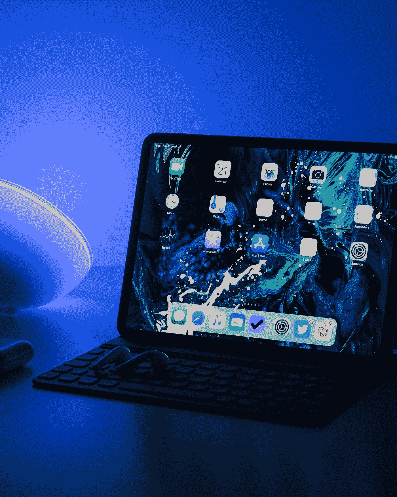

# 为什么苹果应该保持迷你而不是去有机发光二极管显示器

> 原文：<https://medium.com/geekculture/why-apple-should-keep-miniled-rather-than-going-to-oled-displays-a87bcee08d9e?source=collection_archive---------4----------------------->

Photo by [Daniel Korpai](https://unsplash.com/@danielkorpai?utm_source=medium&utm_medium=referral) on [Unsplash](https://unsplash.com?utm_source=medium&utm_medium=referral)

苹果公司以前在所有产品线的设备上都使用液晶显示屏，包括 iPhones。iPhones 最初偏离了这条路线，在 2017 年引入了[有机发光二极管，但直到 2021 年](https://www.engadget.com/2017-11-04-apple-explains-oled-on-iphone-x.html)[ipad 和 MacBooks 才加入](https://www.theverge.com/2021/10/18/22733122/apple-macbook-pro-mini-led-display-120hz-promotion-refresh-rates)这一潮流。但是，他们没有直接选择 OLEDs，而是在两款产品中都使用了迷你 LED 屏幕。尽管有一些不利因素，但这一变化还是受到了欢迎。