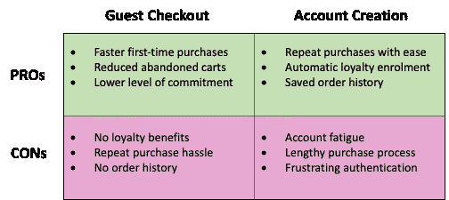

# 为什么这么多顾客选择客人结账？

> 原文：<https://medium.com/geekculture/why-are-so-many-of-your-customers-choosing-guest-checkout-516445f8abec?source=collection_archive---------54----------------------->

## **移动电子商务的兴起意味着太多的顾客选择客人结账，而你错过了重要的收入和营销机会。该怎么办呢？**

Photo by [Sara Kurfeß](https://unsplash.com/@stereophototyp?utm_source=unsplash&utm_medium=referral&utm_content=creditCopyText) on [Unsplash](https://unsplash.com/s/photos/shopping?utm_source=unsplash&utm_medium=referral&utm_content=creditCopyText)

几周前，我与一家大型在线平台企业的产品负责人进行了交谈，他的经历展示了在线零售世界是如何发生变化的。他的企业是一个价值数十亿美元的行业的领导者，在过去的两年里，他们看到了客户选择结账方式的巨大转变。

最初，该企业的流量完全基于桌面，但现在 95%的交易都发生在移动设备上。因此，超过 80%的客户不再注册账户；他们只是作为客人退房。

# 不断增加的客人退房对企业和 consumers‍的影响

对顾客结账的压倒性偏好对零售商和他们的顾客来说都是一个大问题。没有确定的注册客户，你就错过了有价值的数据和营销机会，而你的客户也错过了拥有账户带来的简化购买和忠诚度的好处。

这里总结了每个选项的典型优缺点(从移动客户的角度来看):

# 为什么移动用户更喜欢 checkout‍嘉宾

这就不难理解为什么移动用户不想注册了。尽管零售商试图适应移动设备——通过使网站响应迅速，或提供原生应用程序——大多数平台仍然默认使用电子邮件+密码来注册账户。

对于一个移动用户来说，在一个小屏幕上输入一个长的电子邮件地址并不好玩。耗时太长，太容易出错。然而，真正的杀手是密码和认证步骤。

客户现在知道，出于安全原因，他们应该使用每次都不同的长而强的密码。但到目前为止，大多数人都有“账户疲劳症”——他们已经有太多的密码需要记忆，他们不想再创建一个。

更糟糕的是，必须等待短信或电子邮件，并重新输入 PIN 码来确认他们的身份——这需要太长时间，带来太多不便。不可避免的是，如果有选择的话，大多数移动用户都懒得通过密码这一步，而是选择以客人身份结账——我知道我经常这样做。

这导致了一个没有人满意的结果:零售商错过了营销和客户忠诚度的好处，而客户错过了重复购买的便利性和客户忠诚度的好处。但是只要移动注册过程需要这么多工作，这种模式就不会改变。

# mobile‍一个改变游戏规则的无密码选择

解决办法很简单:利用顾客手中已经有的身份——手机。您现在可以使用手机号码而不是电子邮件地址来识别客户身份，同时使用手机中的 SIM 卡进行安全检查(这是一个比易受攻击的密码更强的“占有因素”)。

其结果是为您的客户带来一种无摩擦、近乎神奇的体验，同时比传统的密码+短信组合更安全。这是一种新的、改变游戏规则的方法，它使用基于 [SIM 卡的认证](https://tru.id/products/instant-phonecheck) n 成为可能，这是一种新技术，它可以无声地验证手机，而不需要短信。

它为客户提供了一个非常简单的一步式流程，他们不再需要求助于客人结账，因为他们可以立即创建一个帐户，而不必键入或记忆详细信息，或者等待代码到来。营销沟通可以通过短信进行(这实际上比电子邮件更有效),稍后，客户还可以添加电子邮件地址，如果他们愿意的话。

对于您的企业来说，这是一个重要的竞争优势——当其他服务仍然要求用户重新输入无尽的个人信息时，无摩擦注册对您的目标移动客户来说是一个有吸引力的卖点。