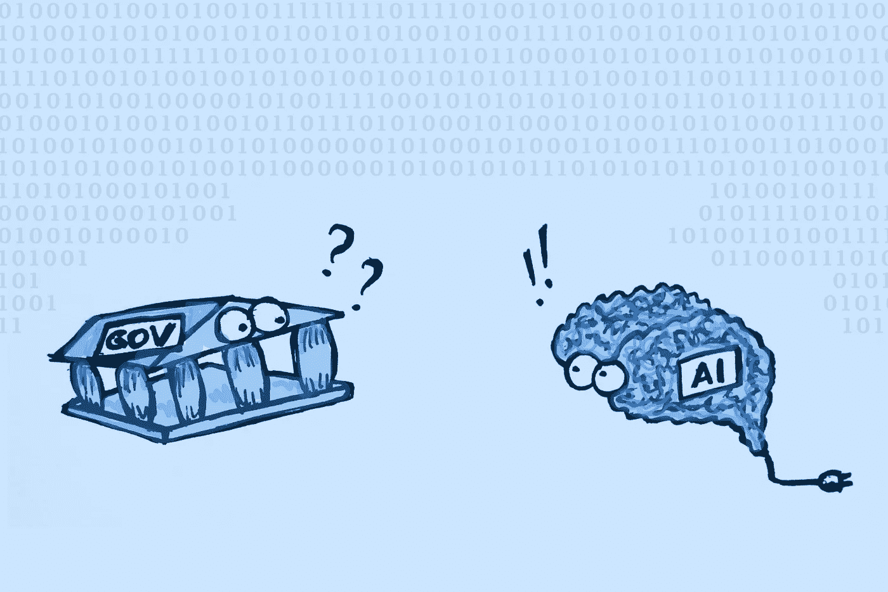

# 为什么政府不更加关注人工智能？

> 原文：<https://medium.com/geekculture/why-arent-governments-paying-more-attention-to-ai-448e17336cd0?source=collection_archive---------15----------------------->

## 世界各国政府不知道他们国家的人工智能程序发展得有多好，但这一知识可能对从政策制定到欺诈检测的一切都至关重要。

Many governments don’t really know what to do with AI. Image by author