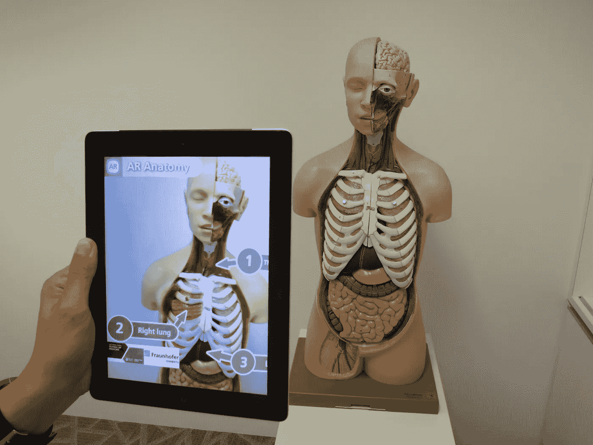

# 为什么增强现实是未来的技术？

> 原文：<https://medium.com/geekculture/why-augmented-reality-is-the-technology-of-future-e3a2a7b3c682?source=collection_archive---------8----------------------->

## 增强现实(AR)为我们带来了什么，以及它将如何改变我们的生活方式。

Studying Anatomy using Augmented Reality (Image Source: Wikimedia Commons)

我想到了这个。你走进你的房子，所有的墙壁和天花板都是金色的，墙上有一台巨大的平板电视，一切都很干净，厨房的柜台都是花岗岩的，一切都很好…