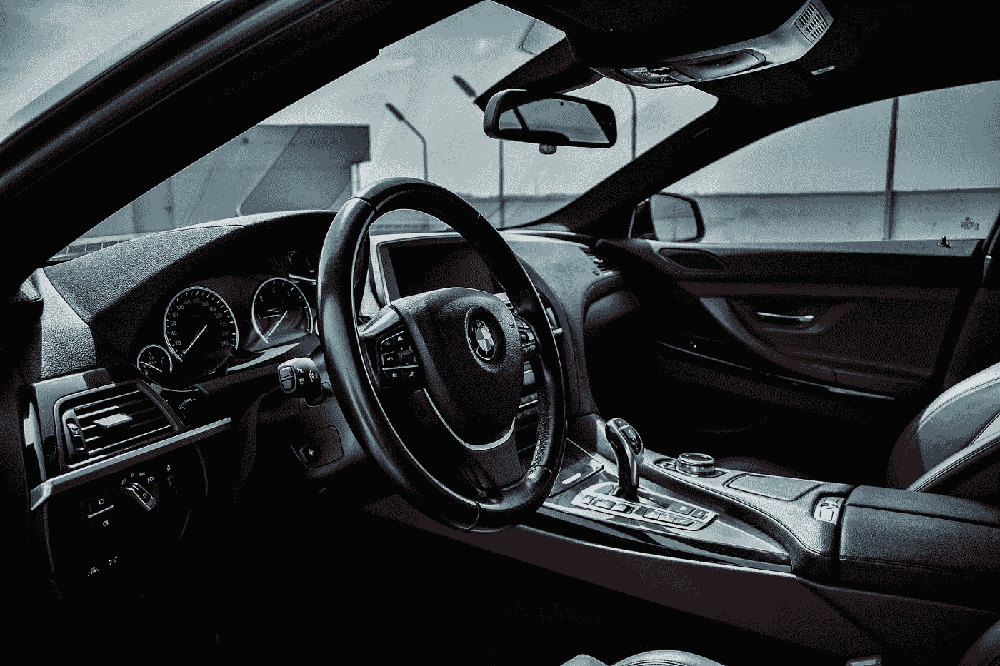

# 为什么汽车将是未来最复杂的数字产品

> 原文：<https://medium.com/geekculture/why-automobile-will-be-the-most-complex-digital-product-in-the-future-b367c5e8a129?source=collection_archive---------19----------------------->

随着数字化转型，消费者行为和分销渠道、价值链和竞争都在发生变化。但就汽车行业而言，数字化针对的是产品本身的核心。迄今为止，发动机是汽车的技术核心。现在，软件正在接管这个位置。为什么？怎么会？我们将在这篇文章中探讨。

Photo by [Ville Kaisla](https://unsplash.com/@villekaisla?utm_source=medium&utm_medium=referral) on [Unsplash](https://unsplash.com?utm_source=medium&utm_medium=referral)

从现在开始，原始设备制造商和一级供应商的竞争力将更多地取决于系统的智能，而不是机器的性能。新的智能传感器和不断增加的连接正在车辆中产生“数据爆发”，需要智能处理并转化为新的服务。

> 与典型的战斗机的 400 万行代码相比，客车的代码最多有 1000 万行，汽车软件的复杂性不断增加。

# 将工程与颠覆性创新的力量相结合

这其中有很多机会，但其中一个是真正的最后通牒。行业领袖警告称，如果传统原始设备制造商失去了与客户和新移动服务提供商的联系，它们可能会沦为单纯的硬件供应商。这也是一个价值创造结构将如何彻底改变的问题。老牌汽车制造商会走黑莓或柯达的老路吗？苹果决定将智能手机生产外包给亚洲的“扩展工作台”，并专注于软件本身，这是否为汽车行业设定了同样适用的标准？或者这个行业有能力重塑自我？

现在哪些伙伴关系有意义？19 世纪以机器为中心的方法会成功调和数字化的法律并超越汽车行业的法律分歧吗？我们能否将基于现有技术增量改进的传统汽车工程的优势与颠覆性创新的力量结合起来？**为了提高效率，传统组织必须如何改变，才能跟上日益复杂和快速的技术变革？**

Photo by [Arteum.ro](https://unsplash.com/@arteum?utm_source=medium&utm_medium=referral) on [Unsplash](https://unsplash.com?utm_source=medium&utm_medium=referral)

# 软件正在成为汽车行业创新的关键中心

信息娱乐和驾驶辅助系统中的新功能像应用程序一样开发。更新车队中复杂软件的能力**“空中下载”(OTA)** 正在成为一个关键的使能因素，与通过 UDS 刷新的传统更新相比，它允许按需更新和新功能，并且周期更短。这是因为竞争差异化，尤其是在电动汽车领域，不再基于传统的汽车硬件，而是基于由先进的电气和电子设备驱动的用户界面和体验元素。**这使得软件成为整个行业最重要的创新驱动力。**ECU 技术的最新改进——升级到高性能计算机(HPC)以实现更少的 ECU 和最高的性能，这也是汽车领域软件发展的一个明显标志。

# 那么下一步是什么？

有一点是肯定的:整个行业比以往任何时候都更加关注“移动体验”和移动即服务(MaaS)。**灵活性、独立性、网络安全、网络化、流动运动、自由和向后化石时代移动性的整体驱动。**那么短期的震荡就可以转化为行业的长期收益。我们不需要绿地方法:我们需要软件和硬件之间的战略对话。

在我的下一篇文章中，我将讨论网络安全在汽车领域的渗透和重要性。