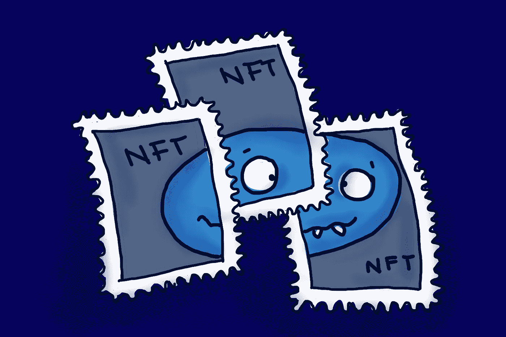

# 为什么区块链技术可能终结大数据时代

> 原文：<https://medium.com/geekculture/why-blockchain-technology-might-put-an-end-to-the-era-of-big-data-65b3f3776106?source=collection_archive---------12----------------------->

## 数据将属于人们，而不是大公司

Blockchain is about assets, not about data.

  T 互联网于 1989 年被发明出来，以方便全世界的数据共享。研究员蒂姆·伯纳斯·李在大型物理研究实验室 CERN 工作时起草了这份报告。(为了全面披露，我自己几年前也在欧洲粒子物理研究所工作过。)