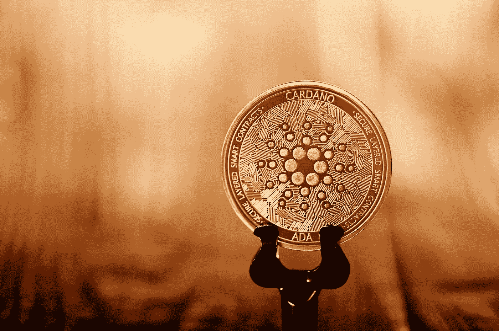
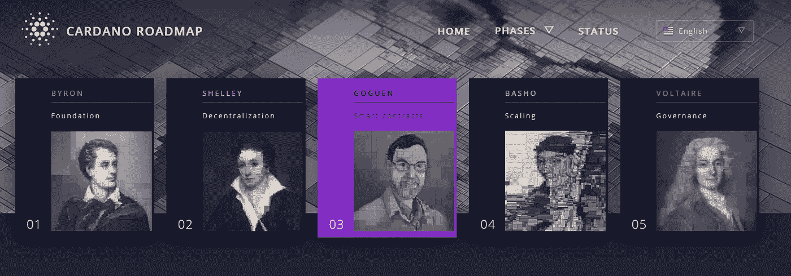

# 为什么 Cardano 成为所有加密货币的前 3 名

> 原文：<https://medium.com/geekculture/why-cardano-reached-top-3-of-all-cryptocurrencies-55e7a615252f?source=collection_archive---------30----------------------->

## 尽管每枚硬币的价格很低

Photo by [Executium](https://unsplash.com/@executium?utm_source=unsplash&utm_medium=referral&utm_content=creditCopyText) on [Unsplash](https://unsplash.com/s/photos/cardano?utm_source=unsplash&utm_medium=referral&utm_content=creditCopyText)

作为 Cardano 的一名投资者，我在投资任何加密货币之前都会对自己做好记录，并且我会与你分享我所知道的。该平台的开发始于 2015 年，后来于 2017 年推出。

硬币阿达卡达诺项目的创始人是查尔斯·霍斯金森，他在决定开始这个项目之前是以太坊的联合创始人。他和他的同事一起设计了卡尔达诺区块链，这个设计从一开始就基于不需要采矿的证据协议。

我们可以清楚地看到，从一开始，这种加密货币就有所不同，它采用了对已知的比特币和以太坊协议的改进，即工作证明(挖掘)。这是最透明的项目之一，体现在社交媒体上，揭示了项目进展的信息。

# 使 ADA 脱颖而出的特性

该项目的硬币 ADA 与其他加密货币相比具有一定的优势，因为它使用了股权证明协议，这意味着建造采矿钻机不需要电力来获得 ADA。硬币奖励给予通过赌注认可加密货币的用户。

## 卡尔达诺是独一无二的

Cardano 是加密领域的一个独特项目，通过路线图的构思和遵循方式。它允许其他项目在智能合同实际实施之前加入区块链，现在智能合同正在启动，基础设施已经到位。它有潜力成为真正的以太坊对手，我们将在未来看到它是否会变得比以太坊更好。Cardano 现在速度更快，可扩展性更强。

## 路线图检查

我们正处于卡尔达诺之旅的中途，在戈根时代，正如你在下面的截图中看到的，截图来自卡尔达诺的官方网站，在[路线图部分](https://roadmap.cardano.org/en/)。是智能合约实施的时代。对于卡尔达诺和这种加密货币的持有者来说，这是一个巨大的进步。

The image is a screenshot taken by the author from the Cardano official website

想想吧！到目前为止，Cardano 甚至没有实施智能合约，就进入了所有加密货币的前 3 名。路线图的所有 5 个步骤中只有前两个步骤已经完成，项目已经就绪 3。这是一项重大成就，你不需要成为专家也能意识到。

# 计算顶级加密货币的头寸

我们来看看这个 top 是怎么算出来的，就明白为什么卡尔达诺是 top 3 了。首先，它的市值比除比特币和以太坊之外的任何加密货币都大。但是，市值到底是多少呢？市值是当前价格和流通硬币供应量的乘积。这是卡尔达诺现在的主要优势。

同样重要并使项目稳固的是网络上的用户数量和交易量。Cardano 成为世界第三大加密货币的另一个原因是，该项目进入了路线图的第三阶段 Goguen(智能合约)，事实上，这是所有 Cardano 粉丝和持有人期待已久的事情。

另一方面，有一个东西在某种程度上防止了 ADA 的突然增加，那就是总硬币的数量，最大供应量是 450 亿代币。这个数字远远大于比特币或以太坊的数字。

如果一些硬币以某种方式被烧毁，这将有助于每枚硬币价格的快速增长。查尔斯·霍金森似乎提到过，未来对此有一些计划。在那之前，增长是稳定的。