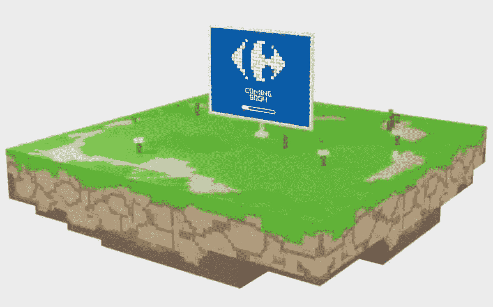

# 为什么家乐福在元宇宙的沙盒里买了一个虚拟地块？

> 原文：<https://medium.com/geekculture/why-carrefour-buys-a-virtual-plot-in-the-metaverse-the-sandbox-sand-64ff9e74c29d?source=collection_archive---------5----------------------->

法国零售巨头**家乐福**正在进入元宇宙，并在沙盒宇宙中购买一块虚拟土地。该公司没有透露任何关于这个项目未来的额外信息，但它确实建议了一种新的用户体验形式。

## 家乐福带着沙盒进入元宇宙