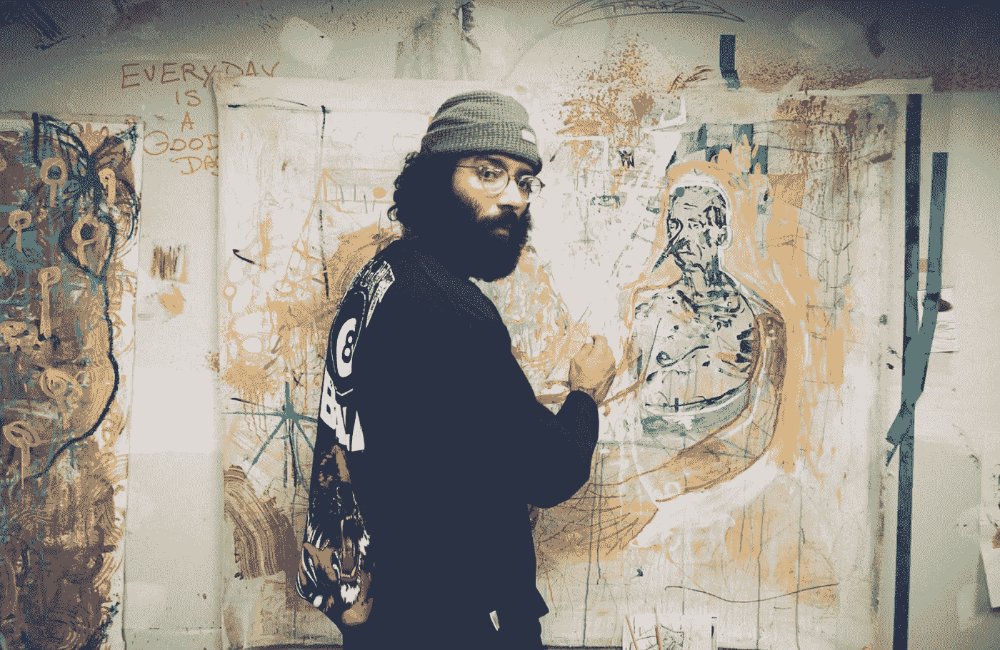

# 为什么 ChatGPT 会对艺术家的未来构成威胁。

> 原文：<https://medium.com/geekculture/why-chatgpt-can-be-dangerous-to-the-future-of-artists-b92cf7f1c60?source=collection_archive---------9----------------------->

识别当今的劳动力颠覆者和人工智能的力量

AI ChatGPT disrupting Artist's Livelihood

人工智能艺术品已经变得很正常，应该会吓到每一个艺术家、专业创意人员和设计师。随着计算能力的提高和创造美丽艺术品所需时间的减少！艺术家可以因为 AI 而灭绝，失去可能的工作机会。