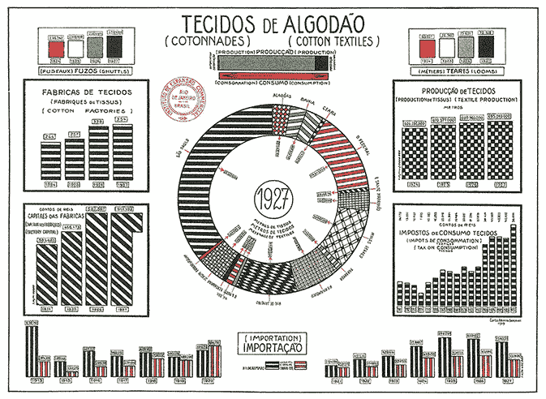
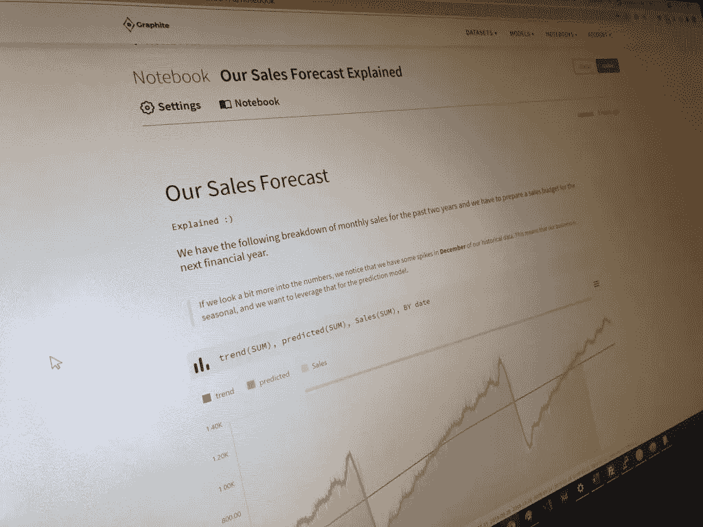

# 为什么仪表板会失败，为什么数据故事是答案

> 原文：<https://medium.com/geekculture/why-dashboards-are-failing-and-why-data-storytelling-is-the-answer-cc71d9bfbb1f?source=collection_archive---------24----------------------->

## 或者如何花更少的时间一遍又一遍地向你的同事解释发生了什么。

仪表板表示主要用于数据分析的数据可视化解决方案。它有助于策划包容性数据分析，使用户能够定制他们希望显示的信息，并提供与其他团队成员共享分析结果的理想方式。

它们具有交互式功能，例如，过滤器可以将图表、图形和报告结合起来，内容创建者可以使用它们来进行概述。然而，像任何其他商业计划一样，它们也有失败和缺点。

Image by Author, Information Dashboard

难怪它们越来越过时，促使企业转向数据叙事。原因如下:

# 反对仪表板的理由

## 它们的设置没有考虑到用户

大多数情况下，他们的设置没有考虑到用户。您会发现它们要么设置复杂，需要 IT 专家、开发人员的帮助，要么需要具有预加载仪表板的报告工具，这些仪表板不能衡量与所有用户相关的指标。

一旦在没有考虑用户的情况下进行设置，这从一开始就具有挑战性，因为某些软件是为有经验的开发人员设计的，这使得 IT 领域之外的任何人进行设置都很复杂。

仪表板是基于一组关于什么是重要的[假设和优先级](https://hbr.org/2017/01/3-ways-data-dashboards-can-mislead-you)开发的。通常，顾问或设计专家在不熟悉公司的情况下定义这些优先级。有时，优先级可能是仪表板软件提供的默认测量。

> **在大多数情况下，企业最终得到的是看似官方的数据，而这些数据并不支持企业的优先事项。**

仪表板的所有功能都必须重要且相关。如果需要包含在仪表板中的信息的选择是在没有业务环境中的输入的情况下发生的，仪表板不太可能最大限度地受益。

## 接口和兼容性问题

数据不是通用的，所以[兼容性和连接性](https://www.yurbi.com/blog/benefits-challenges-business-dashboards/)仍然是仪表板之间的一个挑战。如果仪表板无法与关键的业务系统连接，它提供的信息将会过时、不正确或效率受限。为了弥补这一差距，用户必须手动输入数据，这违背了仪表板的目标。

## 成本和可扩展性

根据提供商的先决条件和企业的规模，仪表板可能会很贵。一些提供商需要为每个访问仪表板的人提供许可证，而其他提供商则根据企业规模收取年费或月费。

虽然这个挑战不是固有的，但研究每个仪表板的成本并确定其投资回报率是找到合适软件的重要一步。

## 报告需要有意义的指标

仪表板应该测量一些重要的东西。因此，它需要理解要显示的适当的度量选择。请记住，宽泛的指标不会提供太多的洞察力。相反，影响更广泛指标的特定指标会。

Chart Junk. Edward Tufte, *The Visual Display of Quantitative Information* (1983, 2001)

## 数据呈现不佳

为了服务于他们的角色并发挥他们的潜力，仪表板应该在有限的空间内显示密集的信息，以一种立即和清晰的方式进行交流。

这需要一种设计，利用和挖掘视觉和大脑的力量，快速感知和处理大量信息。只有当仪表板的视觉设计是开发过程的核心时，这种情况才会发生。

技术无法做到这一点。相反，它需要有设计专长的人。尽管仪表板在许多有用和激动人心的方面是独特的，但很少能有效地呈现数据。

# 数据故事的案例

数据故事讲述获取数据，并将其与叙述相结合，以创建数据故事。这个过程将信息转换成任何人都可以阅读、理解和分享的故事。这些故事典型地呈现了关于在特定的一天你应该知道的关于你的生意的清楚和简明的信息。这就是为什么数据故事提供了一个解决方案。

## 度量成为可操作的见解

数据故事化使企业能够使用重要的指标，将它们转化为可操作的有益见解，同时以故事的形式呈现出来。它检查与基本业务目标一致的关键绩效指标，并将量化信息转换为结果驱动的叙述。

## 增强参与和沟通

通常，公司很难与他们的利益相关者和客户保持长时间的对话。卓越参与和沟通的关键不仅仅局限于将所有数据汇编成一个演示文稿。相反，交流应该以一种易于理解的吸引人的方式进行。

数据故事允许公司收集和检查数据，并以易于理解和引人入胜的视觉和叙事形式呈现见解。通过这种方式，公司可以展示其服务的价值，并与其利益相关者和客户建立持久的关系。

Image by Author: Graphite Note Notebook

## 通过绘图增强流程

数据故事以明确的情节为特色，具有精心构建的引言、结尾和中间部分。数据叙述模板、工具和平台具有[预设格式和主题](https://phrazor.ai/blog/data-storytelling-for-business#:~:text=It%20uses%20the%20power%20of,them%20make%20informed%20business%20decisions.)，可根据输入数据改变可视化和故事，同时确保最有效地表达信息。

企业可以通过考虑数据驱动的报告或故事的主要目标并使其符合其整体组织目标和战略来描绘情节并开发框架。

用相关的 KPI 和可视化填充该图可以帮助企业提高其流程的效率和生产率。

## 开发视觉吸引力

人们的注意力持续减少，这使得开发视觉吸引力来衡量他们的兴趣和影响力变得比以往任何时候都更加重要。数据驱动的故事讲述采用视觉效果，例如，图形和图表，向最终用户传达见解。

叙事和视觉允许客户形象化他们结果背后的故事，这有助于增强客户报告。

## 你花更少的时间向别人解释发生了什么

您可能知道您的度量标准，并且有您获取这些信息的方法。然而，一旦你不得不与他人交流什么才是重要的，事情就会变得一团糟。

> 你发现他们不理解你的仪表板或登录到你的客户关系管理。随后，你最终通过电子邮件或亲自解释信息，而不是花时间在你的工作上。[用数据讲故事](https://graphite-note.com/brains-are-built-for-visuals-but-hearts-turn-on-stories/)，你不用担心解释。此外，你会发现每个人总是在同一页上。

# 结论

仪表板可以为信息过载提供有效的解决方案，但只有在设计得当的情况下。大多数企业现在使用的仪表板都失败了。它们最多只能提供监控业务所需的一小部分洞察力。这也难怪，它们正逐渐失去数据讲故事的意义和铺垫。

通过 [Graphite Note](https://graphite-note.com.) ，我们正在努力将传统分析、预测分析和数据讲述结合到易于使用的 SaaS 环境中。

*原载于*[*https://graphite-note.com*](https://graphite-note.com/why-dashboards-are-failing-and-why-data-storytelling-is-the-answer/)*。*