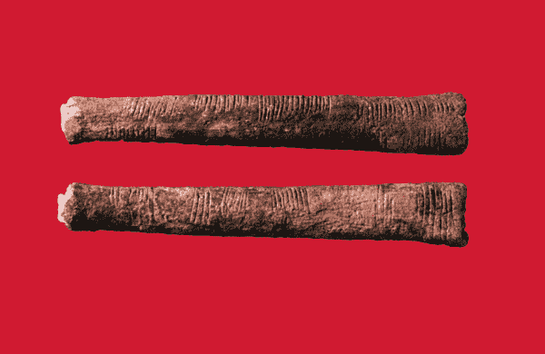

# 为什么数据产品管理与众不同— 3 个重要的经验教训

> 原文：<https://medium.com/geekculture/why-data-product-management-is-different-3-important-lessons-applied-4e88342b0f3f?source=collection_archive---------1----------------------->

## *关于数据的“价值视角”如何向您传授三大经验，并应用于 8 个不同的数据密集型产品示例。*

Picture courtesy of the Mathematical Association of America.

他是地球上发现的最早的计数棒之一。使用 25000 年前的 10 厘米长的骨头…