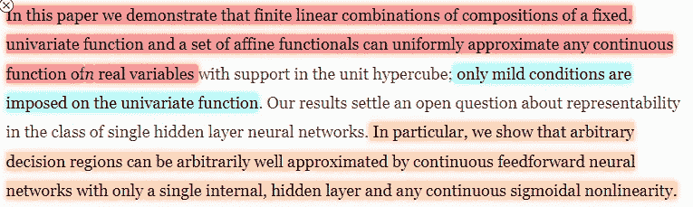
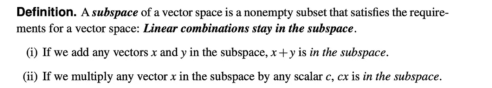
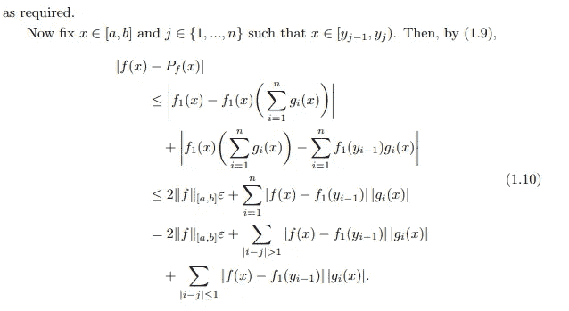
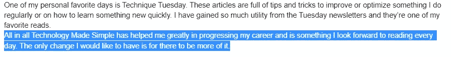
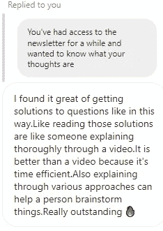

# 为什么深度学习无处不在

> 原文：<https://medium.com/geekculture/why-deep-learning-is-everywhere-e4610cac4361?source=collection_archive---------5----------------------->

## 为什么这么多的数据科学和人工智能都围绕着神经网络？

深度学习无处不在。

但没有多少人能真正解释它是什么。深度学习和机器学习有什么不同？或者为什么神经网络成为人工智能的典型代表，尽管我们有这么多种架构。人工智能研究人员扩大神经网络而不是逻辑回归的数学原因是什么？

今天，我们将讨论这个问题。即使你不喜欢机器学习，这也会帮助你理解我们社会中最重要的领域之一背后的背景。

A preview of what is to come. Don’t worry, I won’t use so many complex words.

# 重要细节

1.  什么是机器学习- 对于那些对这个领域一无所知的人，这里有一个 ELI5 解释-在机器学习中，我们向模型输入大量数据，并让它尝试找出模式。数据的输入被称为“训练”。从更数学的角度来说，在我们的模型训练期间，我们的模型试图找到一个函数来匹配提供给它的数据。
2.  **什么是深度学习——**深度学习是机器学习的一个子集。在其中，我们使用具有许多层的神经网络(基本上是加权图)。然而，有一个问题。简单的神经网络(即使是非常大的网络)仍然产生线性函数。对于大多数机器学习方法来说都是如此。然而，事实证明引入非线性是一个游戏规则的改变者。
3.  **等等……什么是线性？一个图怎么可能是线性的？-** 这里，我用的是线性函数的数学定义。简单地说，如果一个函数满足两个条件，它就是线性的

[Image Source](https://www.chegg.com/homework-help/questions-and-answers/description-subspace-states-linear-combinations-remain-subspace-don-t-understand-example-l-q43785045)

线性作为一个概念非常重要，我将在周一专门就此发表一篇文章。这是一个你会看到在统计学和工程学的所有领域中经常出现的概念。

**4。那么这和深度网络有什么关系——**原来我们可以通过取一个非线性函数 **的组合来近似任意的**连续函数** *。***我强调连续 b/c 很多人误解了这个定理，以为可以近似任何函数。这个错误的假设浪费了大量的时间、精力和风险投资资金。非常大的深度网络之所以可行，是因为它们能够尝试许多非线性函数以及它们的各种组合。

To any of you that are interested in the Mathematical proof, [read this](https://ems.press/content/serial-article-files/1050).

**5。为什么每个人都在使用深度学习-** 我们到处看到它们的原因是人类会被闪亮的新物体吸引。我们很懒。如果给我一个数据分析问题，我可以使用深度学习来获得某种结果，所以人们经常不加思考地求助于它们。由于这是最近的时尚，所以深度学习是否有意义是毫无疑问的。我的机器学习内容的整个精神是强调你可以做很多事情来改善你的数据分析，而不涉及更多的训练数据，更大的深度网络和更多的训练。

这应该是一个合理的很好的概述，为什么深度学习似乎已经接管了人工智能的大部分。如果你是一名决策者，那么了解这一点对理解这个新领域至关重要。如果你是一名开发人员(特别是如果你对数据分析感兴趣)，那么理解通用近似值对于理解为什么到处都可以看到神经网络是至关重要的。

Photo by [Josh Riemer](https://unsplash.com/@joshriemer?utm_source=medium&utm_medium=referral) on [Unsplash](https://unsplash.com?utm_source=medium&utm_medium=referral)

为了更好地理解这个概念(通用函数近似)，请观看下面的视频。作为一个创作者，我知道在不进入杂草的情况下谈论更高层次的深度学习想法有多难。紧急花园穿这针出色。我和他的频道没有任何关系，我只是认为他制作了特别的内容。如果你对更高层次的人工智能感兴趣，把他的频道加入你的列表。

更多这样的文章，请查看我的时事通讯[技术变得简单](https://codinginterviewsmadesimple.substack.com/)。Tech Made Simple 是寻求在技术领域建立惊人职业生涯的人的最佳资源。它将帮助您概念化、构建和优化您的解决方案。**它涵盖了从系统设计、计算机科学概念和 Leetcode 问题解决的技术方面到网络和职业发展的详细指南。通过在一个地方找到您所有的需求，节省您的时间、精力和金钱。 [**使用此处的链接可享受 20%的优惠，优惠期长达一整年**](https://codinginterviewsmadesimple.substack.com/subscribe?coupon=1e0532f2) **。****

我创造了[技术，利用通过指导多人进入顶级科技公司而发现的新技术使](https://codinginterviewsmadesimple.substack.com/)变得简单。时事通讯旨在帮助你成功，避免你在 Leetcode 上浪费时间。**我有一份 100%满意的保单，所以你可以尝试一下，不会有任何风险**。[你可以在这里阅读常见问题并了解更多信息](https://codinginterviewsmadesimple.substack.com/p/faqs-and-about-this-newsletter?r=4tnbw&s=w&utm_campaign=post&utm_medium=web)

如果你也有任何有趣的工作/项目/想法给我，请随时联系我。总是很乐意听你说完。

# 向我伸出手

使用下面的链接查看我的其他内容，了解更多关于辅导的信息，或者只是打个招呼。另外，查看免费的罗宾汉推荐链接。我们都得到一个免费的股票(你不用放任何钱)，对你没有任何风险。因此，不使用它只是失去免费的钱。

为了帮助我了解您[请填写此调查(匿名)](https://forms.gle/7MfQmKhEhyBTMDUD7)

查看我在 Medium 上的其他文章。:[https://rb.gy/zn1aiu](https://rb.gy/oaojch)

我的 YouTube:[https://rb.gy/88iwdd](https://rb.gy/88iwdd)

在 LinkedIn 上联系我。我们来连线:[https://rb.gy/m5ok2y](https://rb.gy/f7ltuj)

我的 insta gram:[https://rb.gy/gmvuy9](https://rb.gy/gmvuy9)

我的推特:[https://twitter.com/Machine01776819](https://twitter.com/Machine01776819)

如果你想在科技领域发展事业:[https://codinginterviewsmadesimple.substack.com/](https://codinginterviewsmadesimple.substack.com/)

获得罗宾汉的免费股票:[https://join.robinhood.com/fnud75](https://join.robinhood.com/fnud75/)