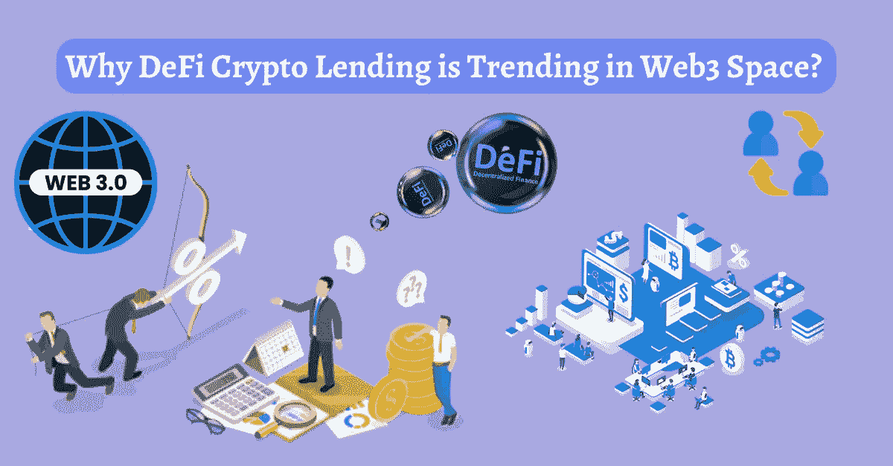
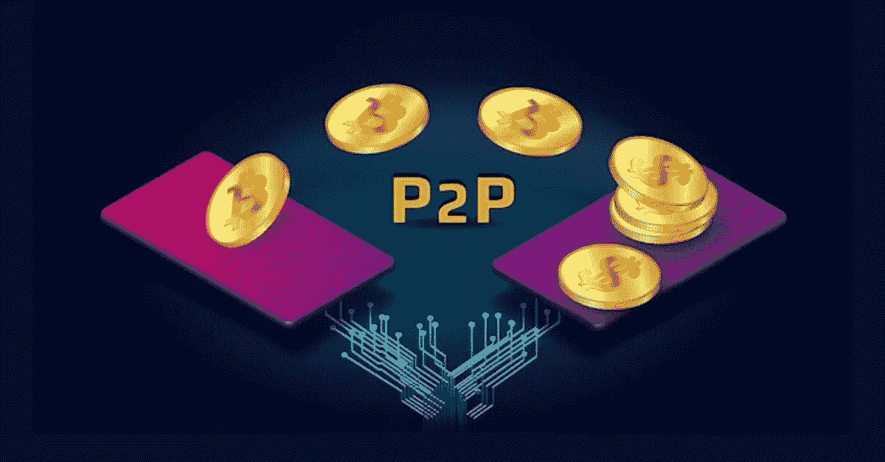

# 为什么 DeFi Crypto Lending 会成为 Web3 领域的趋势？

> 原文：<https://medium.com/geekculture/why-defi-crypto-lending-is-trending-in-web3-space-a0baa5e1a030?source=collection_archive---------15----------------------->

**Why DeFi Crypto Lending is Trending in Web3 Space?**

> Web3 领域每天都在创新，企业也在赚钱。现在，是去中心化金融(DeFi)崛起的时候了，这在 2021 年 NFT 繁荣期间变得非常突出。吸引 DeFi 的主要原因是需要使用加密货币和不可替代的代币进行金融操作，类似于现实世界中的法定货币和财产。
> 
> 分散融资中的流行功能包括**贷款、借款、快速贷款、收益农业、赌注、交换和众筹**。在这里，我们将更多地关注[DeFi crypto lending platform development](https://bit.ly/3w6V8zb)，这是虚拟空间中著名的金融业务之一。

## 更多关于 DeFi 贷款平台的信息

DeFi 贷款平台是在没有中介参与的情况下提供加密贷款(即点对点交易)。在这些平台上，用户可以列出他们持有的用于借贷目的的密码，借款人将把这些密码作为贷款。此类平台还为贷款人提供了赚取利息的机会，这增加了加密钱包中可能闲置的资产的被动收入。DeFi 借贷平台的开发在这十年中一直很受欢迎，这可以通过这些平台锁定的资金的大规模增长来证明——从 2020 年底的近零到 2022 年的 500 亿美元的峰值。广泛使用的 DeFi 借贷平台有[***Aave***](https://bit.ly/3Qu6Col)***、MakerDAO、Compound、Sturdy、Alchemix、Solend 等。***

# DeFi 借贷平台的操作流程

Peer- to Peer

持有加密货币并希望充分利用其持有的✔人向 DeFi lending 平台的流动性池捐款。

✔借款人在满足智能合同中规定的条件后，可以从该平台获得贷款，并提供加密抵押品，该抵押品的价值通常高于贷款金额，以应对加密市场的波动性。

✔:获得贷款后不久，借款人应该开始按照数字贷款合同中提到的利率偿还贷款。该金额被转移给贷方。

✔After 偿还贷款时，抵押资产被归还给借款人。如果没有，可以由出借人取走。

# DeFi 贷款平台开发的显著特点

🌟DeFi lending platform 开发的一个重要特征是集成的 DeFi wallet，它允许用户持有通过借贷获得的资金和利息。这种钱包确保交易干净利落。

🌟**智能合同**在这些平台中发挥着至关重要的作用，因为这里的工作流程取决于这些合同在贷款和还款期间的执行情况。

🌟**流动性池**确保平台上有足够的加密货币可供随时借贷。

🌟先进的**用户端仪表盘**确保所有最终用户都能获得相关信息，并通过流畅的控制完成工作。

🌟这些平台上的风险管理系统有助于贷方在加密或抵押资产价值下降时收回资金。

🌟这些平台还配备了高级安全系统，以保护储存在流动性池中的所有资金免受加密黑客的恶意攻击。

# DeFi 贷款平台的优势

✅高透明度

✅有效定价

✅容易接近

✅快速交易

✅无与伦比的记录

✅审查-免费

✅投资成本低

✅完全自动化的过程

✅完全托管资金

✅保证金交易的特点

## 散发最后的光芒

因此，我们可以说 DeFi 贷款平台开发是 NFT 繁荣后备受推崇的风险选择。这是因为人们现在希望在 DeFi 世界中进行我们真实世界般的金融操作。如果你打算利用这场运动，你可以开发自己的 DeFi 贷款平台。对于任何技术援助，考虑与经验丰富的[DeFi lending platform development company](https://bit.ly/3w6V8zb)合作，该公司可以创建适合您业务目标的平台。