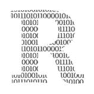

# 为什么不应该衡量开发人员的生产力

> 原文：<https://medium.com/geekculture/why-developer-productivity-shouldnt-be-measured-b48b36ee80b6?source=collection_archive---------5----------------------->

## 不是用小时，不是用钱，不是用完成的项目

Productivity metrics are difficult to handle for many developers.

  R 回忆一下你最后一次滚动浏览你的媒体提要。有多少故事是关于生产力的？

如果你喜欢一般的媒体读者，可能会有相当多的文章属于这一类。不需要大规模的搜索就能发现下一个…