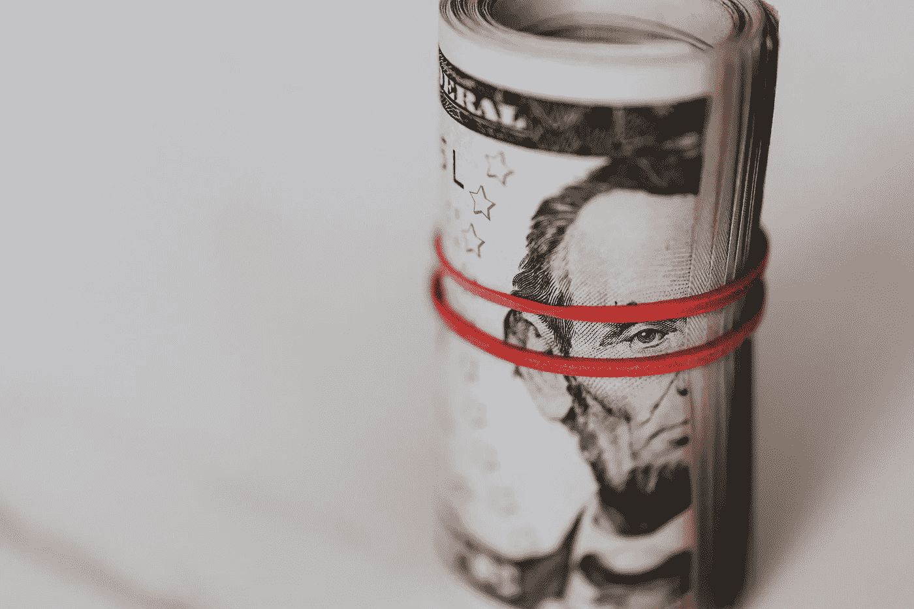

# 为什么 CPI 通胀刚刚创下令人痛苦的 40 年新高？

> 原文：<https://medium.com/geekculture/why-did-cpi-inflation-just-hit-a-painful-40-year-high-ce04201976bc?source=collection_archive---------13----------------------->

## 基本指南

Image courtesy of [Karolina Grabowski](https://www.pexels.com/@karolina-grabowska?utm_content=attributionCopyText&utm_medium=referral&utm_source=pexels)

今天，4 月 12 日，2022 年 3 月美国消费者通胀数据公布。

它们很高——总体数字同比增长 8.5%。3 月份，平均价格环比上涨 1.2%。2 月份，物价上涨 0.8%。换句话说，通货膨胀很高，甚至在 3 月份有所加速。