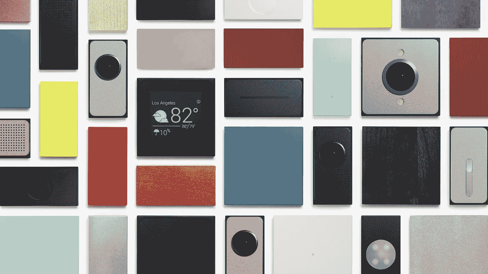

# 谷歌为什么要扼杀 Project ARA？

> 原文：<https://medium.com/geekculture/why-did-google-kill-project-ara-fbe3636880a4?source=collection_archive---------13----------------------->

## 在“有权维修”的时代，模块化智能手机设计是我们可持续发展困境的答案吗？

Source: [Wired](https://www.google.com/url?sa=i&url=https%3A%2F%2Fwww.wired.com%2F2016%2F05%2Fproject-ara-lives-googles-modular-phone-is-ready%2F&psig=AOvVaw1DkaIxeecUm-wbiB6L5og0&ust=1615470857528000&source=images&cd=vfe&ved=0CAMQjB1qFwoTCOjv_Ijwpe8CFQAAAAAdAAAAABAJ)

*项目 ARA* 。由*谷歌 X* (现在简称为 [*X*](https://x.company/) )的一个小型精干团队设计和开发的模块化智能手机有着大胆的愿景。这种基于瓷砖的手机允许用户用新的部件替换旧的部件。想要升级您的…