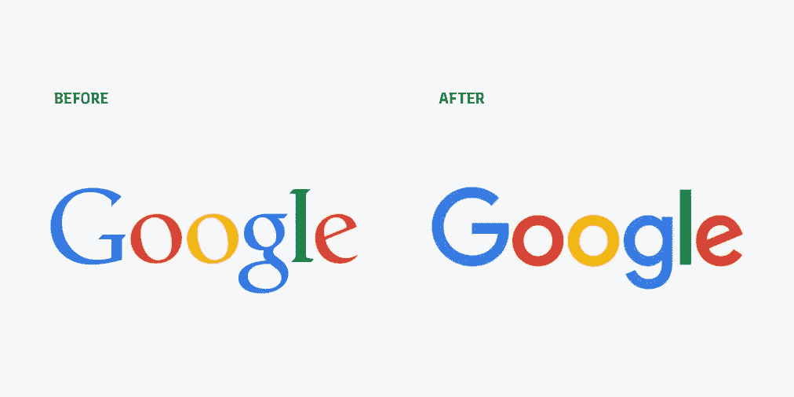
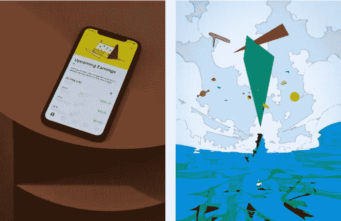
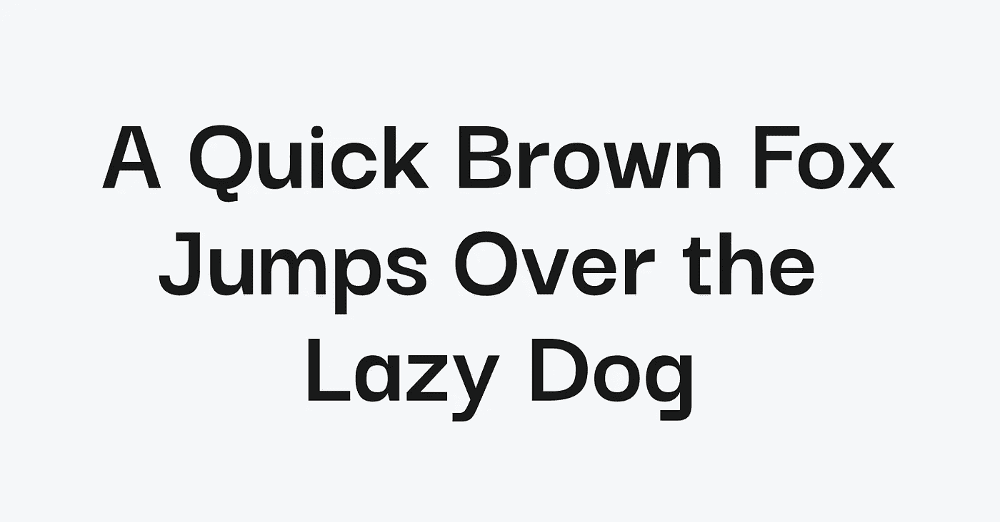

# 为什么所有的技术标志看起来都一样？

> 原文：<https://medium.com/geekculture/why-do-all-tech-logos-look-the-same-aacca178fa2?source=collection_archive---------1----------------------->

之前，我们谈到了在[奢侈时尚品牌中发现的共性。](https://typogram.co/blog/luxury-brand-logos/)这一次，我们将把注意力转向创业公司和科技公司的品牌。找几个科技公司，或者在你周围开始标识和品牌，你会注意到他们有相似的外表。通常，它是一个友好的无衬线的明亮的彩色插图。听起来很熟悉？

在这篇文章中，我们将试图找到解释这一趋势的一些原因。

# 一见钟情

自 2010 年以来，消费者越来越关注数据安全和用户隐私等问题。随着时间的推移，他们对科技公司越来越感到不安和不信任。据[毕马威](https://www.techrepublic.com/article/data-privacy-is-a-growing-concern-for-more-consumers/#:~:text=A%20full%2086%25%20of%20the,even%20trust%20their%20own%20employers.)，

> *整整 86%的受访者表示，他们对数据隐私越来越担忧，而 78%的人对收集的数据量表示担忧。大约 40%的受访消费者不相信公司会合乎道德地使用他们的数据，13%的人甚至不相信他们自己的雇主。*

这种不安不是一夜之间产生的。这是一个长期的问题，随着过去十年中更多关于数据滥用和侵犯隐私的丑闻爆发，这个问题变得更加令人痛苦。许多消费者更不愿意尝试新产品和新技术。我知道我是，我不是一个人。

因此，对于科技公司来说，展示他们的友好和愉快变得至关重要——这是留下好印象和获得用户信任的重要方式。许多科技公司选择人文主义或几何无衬线来传达这些色调，明亮的调色板，欢快的插图和古怪的动画。既然已经有了不信任，那么一见钟情就比以往任何时候都更重要。

这里有一些创业公司和科技公司自己的名言来说明友好和令人愉快的重要性。

谷歌 2015 年品牌重塑标志

> 我们认为我们吸取了谷歌的精华(简单、整洁、丰富多彩、友好)，不仅为今天的谷歌，也为未来的谷歌进行了重塑。–[有线](https://www.wired.co.uk/article/google-new-logo)

Robinhood 介绍了新的插图风格和字体，作为其品牌重塑的一部分，2020

> 一种新的插画风格:愉悦且着眼未来。两种新的字体:胶囊无，一个温暖，高度清晰的无衬线体现简单和精确；和笔尖，一个独特的，欢迎，充满个性的异想天开的衬线。–[罗宾汉博客)](https://blog.robinhood.com/news/2020/8/5/a-visual-identity-that-better-reflects-our-vision)

# 由用户体验定义的品牌

自 2010 年以来，品牌越来越多地围绕用户体验来设计。智能手机的到来引入了一个突破性的想法:一个产品可以存在于多个工作空间，最方便的是在我们的手机上。创业品牌和用户体验现在比以往任何时候都更加紧密地联系在一起。

移动平台是一种完全不同的设备，具有新的交互模式，这使得产品设计变得更加复杂。人们在比桌面小得多的屏幕上使用产品并与品牌互动。当谈到消费者如何体验他们的品牌时，公司必须考虑不同设备上的用户体验。

谷歌重塑品牌，2015 年

> *…无论何时何地，你都希望谷歌能在你需要的时候帮助你，无论是在你的手机、电视、手表、汽车仪表盘上，是的，甚至是桌面上！–*[连线](https://www.wired.co.uk/article/google-new-logo)

2020 年品牌重塑中的罗宾汉

> *我们品牌的一次大胆变革——一个鼓舞人心、富有想象力的新视觉形象——来补充您喜爱的 Robinhood 账户界面。–*[罗宾汉博客](https://blog.robinhood.com/news/2020/8/5/a-visual-identity-that-better-reflects-our-vision)

移动意识使得初创公司和科技公司青睐简单的无衬线文字标志，由于可读性更好，这种方式更加屏幕友好。由于缺少衬线和笔画对比，无衬线字体的字母形状比衬线字体或带有华丽图标的标志更简单。

# 无衬线历史与品牌视觉的平行

最后，无衬线字体的历史与初创公司和科技公司提供的品牌愿景之间有一个有趣的相似之处。

当无衬线字体第一次出现时，与更经典的书法风格的衬线字体相比，人们讨厌它们的外观。他们消除了衬线的华丽，优雅的字母形状，更喜欢直线和更简单的形式。他们被认为是…怪诞的(*记得* [*怪诞的*](https://fontdiscovery.typogram.co/p/designindex?s=w) *无衬线？).*

sans serif 所代表的——简单和简化——符合大多数科技公司的承诺:通过显著改善原始(传统)方法的简化流程，获得更好、更有效的结果。除了用户体验和“友好”的品牌形象之外，这可能是许多机构喜欢使用无衬线字体进行技术品牌重塑的关键原因之一。

# 行业间的交叉授粉

这种趋势有可能来自时尚公司吗？

正如我们在[上一篇文章中提到的，](https://fontdiscovery.typogram.co/p/luxurybrandlogos?s=w)时尚公司也在重塑无衬线品牌。科技公司有没有可能向时尚行业寻求一些关于如何提升品牌形象和给他们一个时尚改造的建议？我觉得很有可能。

*舒华致力于* [*Typogram*](https://typogram.co/) *，一款面向创始人和绝对设计初学者的下一代 logo 设计工具。如果你喜欢这篇文章，请订阅我们的* [*公开发布的*](https://build.typogram.co/) *更新，分享我们的创业之旅！*