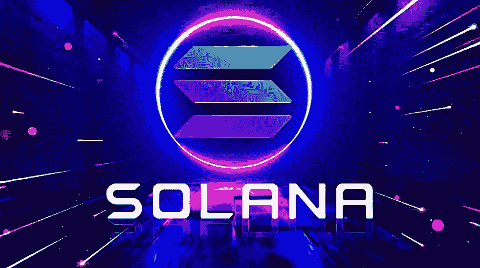

# 为什么商业人士要在 Solana 上创建一个 IDO launchpad？

> 原文：<https://medium.com/geekculture/why-do-business-people-create-an-ido-launchpad-on-solana-3daaa8f039ee?source=collection_archive---------14----------------------->

IDO launchpad on Solana

密码行业近年来一直在蓬勃发展。加密货币市场已经上升到巨大的万亿美元，全球用户近 1.06 亿。cryptos 的巨大成功激起了许多企业家开发自己的密码项目的兴趣。但是，一些加密项目可能缺乏启动资金。这就是 IDO launchpads 发挥作用的地方。随着许多人考虑投资早期阶段的令牌作为被动收入，IDO launchpads 为投资者和 IDO 项目所有者提供了一个双赢的局面。因此，IDO launchpads 在加密领域取得了非凡的成功。特别是，建立在 Solana 基础上的 IDO launchpads 多年来取得了巨大的成功。让我们更深入地了解一下 [**为什么建立在索拉纳**](https://bit.ly/3SkcTE3) 基础上的 IDO launchpads 对企业家来说是一项有利可图的投资。

# **伊多发射台**

IDO Launchpads

IDO 也称为 Initial Dex Offering，是一种筹资机制，允许企业家通过提供早期令牌为他们的加密项目筹集资金。IDOs 的主要优势是项目所有者不需要为投资者提供任何股份或股权，投资者可以从他们投资的代币的价值中受益。[**IDO launch pad 是这些 I do 项目上市的平台**](https://bit.ly/3dN8SZF) 。投资者可以通过阅读白皮书和分析 tokenomics 来了解项目的细节，从而投资 IDO 项目。

## **为什么要在索拉纳上推出 IDO launchpad？**

Why IDO launchpad on Solana?

索拉纳是数字空间中最快的区块链之一。Solana 网络支持高速处理和出色的可扩展性。因此，在索拉纳区块链开发的 IDO launchpads 对高容量投资者和进入者来说是完美的。以下是您选择 Solana 进行 IDO launchpad 开发的一些原因:

*   与其他区块链网络相比，Solana 提供了很高的可扩展性和事务处理速度。Solana 每秒可以处理近 5000 笔交易。
*   与其他区块链相比，索拉纳的交易成本较低，这使得它成为 IDO launchpad 开发的 [**完美区块链。**](https://bit.ly/3SkcTE3)
*   Solana 提供了支持跨链兼容性的互操作性。
*   Solana IDO launchpads 支持在这些 launch pad 上集成新的加密钱包和使用现有的 IDO 钱包。
*   一旦项目开始出售代币，代币就会被立即分配。
*   PoS(proof of stake)使平台用户友好，保证了区块链的安全性，其 PoH(Proof of History)共识算法保证了网络具有高效率和较高的吞吐率。

## 如何让 IDO launchpads on Solana 成为一项有利可图的投资？

How can IDO launchpads on Solana be a profitable investment?

建立在 Solana 基础上的 IDO launchpads 遵循严格的 KYC 法规，只有真实的项目才能在 launchpad 上列出。

*   通过 AMM(自动做市商)，Solana 上的 IDO launchpad 执行自动流动性。
*   基于 Solana 构建的 IDO launchpads 支持多级标记。
*   基于 Solana 构建的 IDO launchpads 拥有众多过滤器，允许用户进行个性化搜索。这些包括价格过滤器、即将推出的项目和趋势。

## **如何开发 IDO launchpad？**

Solana 上 IDO launchpad 的简化路线图

**白皮书:**起草你的白皮书，包含所有与你的项目相关的必要信息。白皮书在项目开发过程中起着至关重要的作用。

**开发:**下一步是开发你的 IDO launchpad。在平台的前端和后端工作。强烈建议您聘请专业的 IDO launchpad 开发团队来指导您完成这个过程。

创造代币:在你决定了代币的特点和价值后，你可以开始创造代币。

**测试:**和一个高效的 QA 团队在你的平台上运行多个测试，以确保平台没有任何 bug 和错误。

**启动和维护:**一旦您测试了您的平台，您就可以启动该平台以供使用。根据用户反馈持续维护和更新平台。

## **在 Solana 上开发 IDO launchpad】**

自成立以来，索拉纳已成为广泛使用的区块链网络之一。你可以在 Solana 上从头开始开发你的 IDO launchpad，也可以选择专业 IDO 开发公司的白标解决方案。当你从头开始创建一个 IDO launchpad 时，你可以在你的平台的每个 nano 细节上工作，但这可能需要更多的时间和金钱。借助白标解决方案，您可以拥有一个完全可定制的预先设计和预先测试的 IDO launchpad，与从头开始构建的 IDO launchpad 相比，它启动所需的时间和资金也更少。

## 总结一下，

IDO launchpads 已经成为筹款的首选，因为它们解决了 ICO 和 IEO 等前辈的问题。因此，随着近年来密码市场的蓬勃发展，[**I do launch pad development**](https://bit.ly/3dN8SZF)已经成为创业者在密码市场取得进展的最佳选择。你可以聘请专业的 IDO launchpad 开发公司来指导你完成这个过程，因为没有专业的帮助，IDO launchpad 开发可能是一个繁琐的过程。