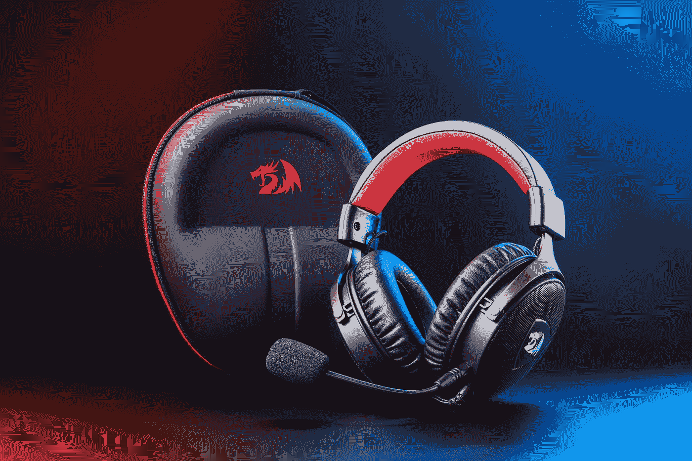
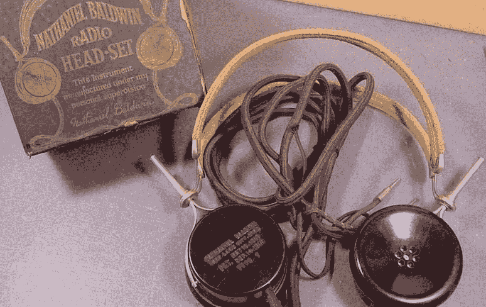
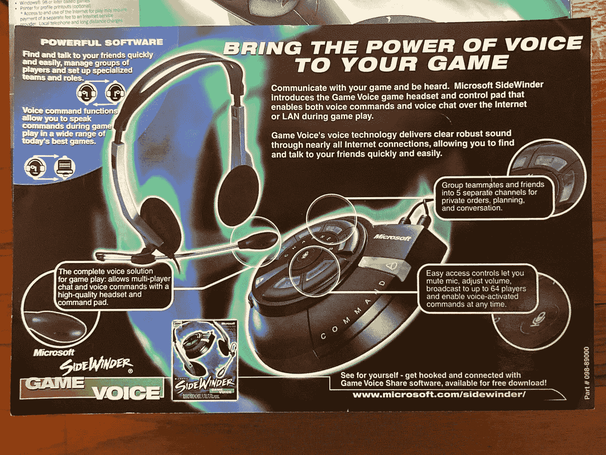
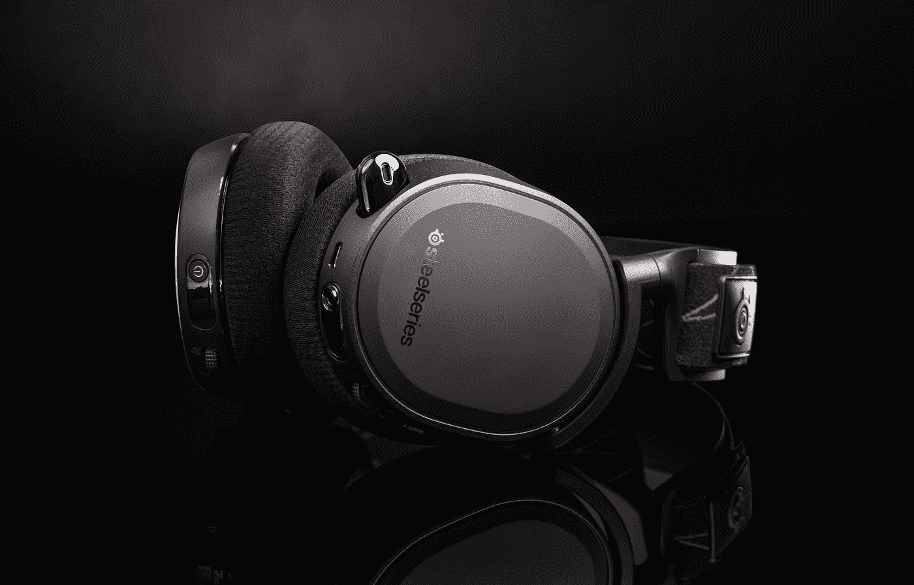

# 为什么游戏耳机会存在？

> 原文：<https://medium.com/geekculture/why-do-gaming-headsets-exist-44618a81cd2f?source=collection_archive---------12----------------------->

## 耳机不再只是受人尊敬的飞行员和宇航员的专利，像你我这样的电视迷也有耳机。这些天，他们来了…彩虹灯？

Photo by [Rebekah Yip](https://unsplash.com/@rebekahyip?utm_source=medium&utm_medium=referral) on [Unsplash](https://unsplash.com?utm_source=medium&utm_medium=referral)

思考游戏耳机的存在不是我今天打算做的事情。但它实际上一直困扰着我。尽管我已经有了一双，但我还是收到了大量关于 Lazada 的推荐。没过多久我就意识到，我们在工作中被提供的耳机是…游戏耳机。

就连我家里的那对易拉罐都是游戏耳机。他们无处不在。

如果几年前你问我，我的电脑需要一副耳机还是一个麦克风，我会说不需要。扬声器工作得很好。然而，如今耳机不再只是受人尊敬的飞行员和宇航员的专利。像你我这样的电视迷也有！

**但更大的问题是，为什么游戏耳机会存在？**

我们可以使用飞行员拥有的任何东西，典型的办公室耳机也存在。取而代之的是，我们有一副滑稽的大耳机，亮着时髦的颜色…每个人似乎都讨厌它。然而:

> [从 2021 年到 2026 年，游戏耳机的市场份额预计将增长 12.8 亿美元。](https://www.technavio.com/report/gaming-headset-market-industry-analysis)

我认为人们只是在否认那些怪异的灯光。

# 为了了解游戏耳机是如何出现的，我们将回到它是如何开始的。

Baldwin’s Radio Head-Set. Photo from [VSystem](https://vsystem.bg/en/blog/invention-of-the-headphones)

第一款现代耳机是*无线电耳机*。它的设计包括一个 h 形头带和两个连接在两边的耳杯。它舒适地放在你的头顶，类似于今天大多数耳机的样子。

[快进到 1961 年，两位前飞行员创立了缤特力。](https://www.techsling.com/a-brief-history-of-headsets/)这是一家以生产耳机为主的公司。**头戴式耳机本质上是耳机和麦克风的组合，构成了一个便携式系统。这项发明在美国宇航局的任务中至关重要。鉴于太空中的后勤工作，宇航员需要一种交流方式。**

直到 20 世纪 90 年代在线多人游戏蓬勃发展，游戏耳机才出现。玩家们第一次可以通过网络面对面交流。**这导致了** [**第一款游戏耳机**](https://news.microsoft.com/2000/08/24/microsoft-sidewinder-game-voice-lets-gamers-do-the-talking-as-they-play/) **的诞生。伊莎贝拉·卡尼娅托和她的朋友们在一场扑克比赛中大喊大叫时想出了这个主意。他们心烦意乱，因为他们无法同时玩《雷神之锤 2》和说话。**

The SideWinder Game Voice. Photo from [Internet Archive](https://archive.org/details/mssidewinderp2/IMAGES%20%5BENG%5D/105.JPG)

他们成立了一家名为 ShadowFactor Software 的公司，并创建了 *BattleCom。这是一个可以让游戏和语音聊天顺利通过一根电话线的程序。*

1999 年，他们被微软收购。

**他们一起创造了*游戏语音*。游戏语音不仅仅是一个软件。它还配备了一个耳机，允许玩家在游戏中相互交谈。**

虽然这款设备在销售时没有使用短语*游戏耳机，但它确实检查了所有符合该类别的盒子。*

*正式创造这个术语的公司是 Steelseries。*

*2004 年，他们推出了*西伯利亚*游戏耳机。他们是第一个添加所有这些类似于今天游戏耳机的铃铛和哨子的人。*

## *由此，现代游戏耳机诞生了。*

**

*Photo by [Brandon Green](https://unsplash.com/@brandgreen?utm_source=medium&utm_medium=referral) on [Unsplash](https://unsplash.com?utm_source=medium&utm_medium=referral)*

*使用游戏耳机，在玩游戏时与队友通话变得前所未有的简单。但是如果你仔细想想，航空业甚至普通的办公室工作人员已经在使用耳机了，它们的工作方式和游戏耳机一样。*

# *那么有什么区别呢？*

**

*Photo by [Austin Distel](https://unsplash.com/@austindistel?utm_source=medium&utm_medium=referral) on [Unsplash](https://unsplash.com?utm_source=medium&utm_medium=referral)*

*从我的经验来看，办公室里使用的“普通”耳机通常简单、紧凑，而且不像游戏耳机那样舒适。但是它们工作得很好。*

*如果你只需要处理电话，普通的耳机就足够了。它通常比游戏耳机便宜。后者通常带有大量的铃铛和哨子(我正在看着你，RGB LEDs！)来说服你这是退而求其次的事情。*

*也许更精通耳机和音频的人会注意到更多的不同。但是对于一个普通人来说，差不多就是这样了。你可以听任何东西，也可以用麦克风说话。太好了！*

# *那么，游戏耳机有什么意义呢？*

**

*Photo by [Fredrick Tendong](https://unsplash.com/@frdx?utm_source=medium&utm_medium=referral) on [Unsplash](https://unsplash.com?utm_source=medium&utm_medium=referral)*

*虽然你可以说游戏耳机可能只是销售更炫更贵设备的营销术语——尽管你不会完全错误——但进一步的研究可以告诉你，游戏耳机具有普通耳机所缺乏的功能。*

*其他功能包括降噪麦克风、无线功能、跨平台兼容性、透气耳罩和可定制照明。*

*游戏耳机——顾名思义——最适合玩游戏。在游戏耳机上听音乐或其他东西将不会像以前那样令人愉快。不幸的是，这款耳机也因麦克风质量不达标而臭名昭著。*

**

*Photo by [Emmanuel Ikwuegbu](https://unsplash.com/@emmages?utm_source=medium&utm_medium=referral) on [Unsplash](https://unsplash.com?utm_source=medium&utm_medium=referral)*

*似乎当你把一副耳机和一个麦克风组成一个单独的包装时，**单个零件就妥协了，以弥补成本。**有些人甚至会说你的体验很差，因为你在这个奇怪的特定套装中获得了更低的声音和麦克风质量，它只适合一种使用情况:游戏。*

***我并不是低估了游戏市场有多大——**[**它是巨大的**](https://www.grandviewresearch.com/industry-analysis/gaming-peripherals-market) **。**尽管游戏耳机得到了很多负面反馈，但我真的很惊讶它仍然有一个完整的市场。*

# *不管人们对游戏耳机怎么说，它们只是方便而已。*

**

*Photo by [Pablo Arroyo](https://unsplash.com/@pablogamedev?utm_source=medium&utm_medium=referral) on [Unsplash](https://unsplash.com?utm_source=medium&utm_medium=referral)*

*听音体验并不是顶级的，麦克风听起来永远不如专用的电容麦克风。*

***但是游戏耳机就是……好用。***

*你会得到一副不错的耳机，也许一个不太好的麦克风被包裹在一个毛绒耳机里，可以连续使用几个小时。*

*这是一个简单的选择。*

*游戏耳机比单独买一副耳机和一个麦克风便宜。它也很容易设置，因为它们中的大多数只需插入计算机，它就会无缝地工作。**我认为在制作这些为游戏而微调的耳机的过程中，人们也发现了它们的其他用途。***

*我相信他们的便利巩固了他们的继续存在。游戏耳机只是那些想要既能工作又舒适，而且不会彻底破产的人的一个简单选择……除非你想让它破产。*

*你知道，为了时髦的灯光。*

*如果你已经做到了这一步，感谢你的阅读！我真的很感激。因为我住的地方，我不能靠中等收入生活。但是如果你想支持我所做的，你可以滑过一个 ko-fi！你也可以在评论中或者在[推特](https://twitter.com/_angeliz_r) **上让我知道你的想法。***