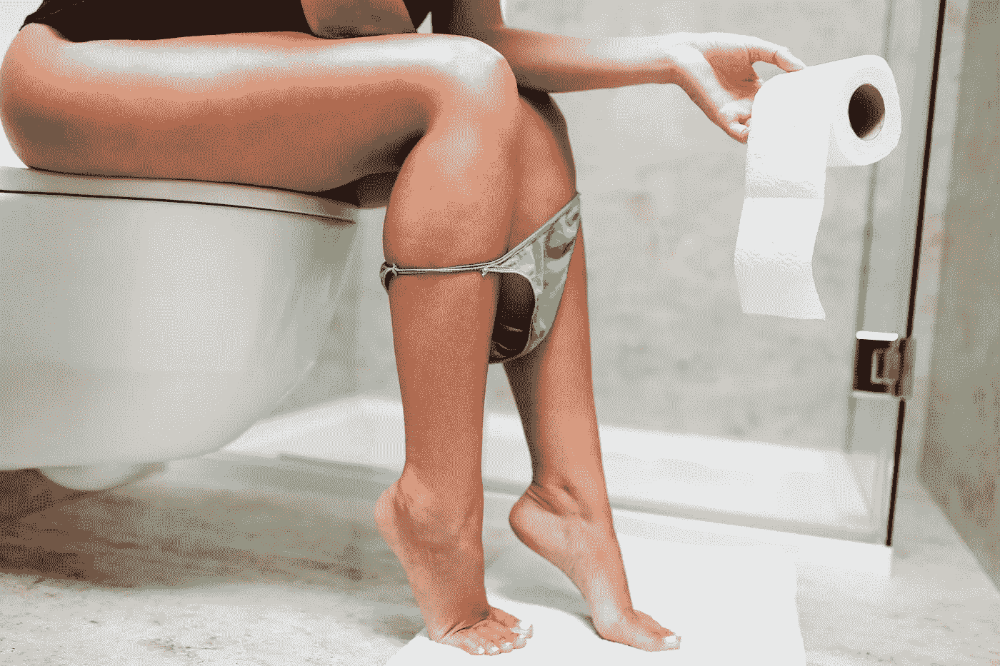

# 为什么我认为 NFT 毫无价值(真的)

> 原文：<https://medium.com/geekculture/why-do-i-think-nfts-are-worthless-for-real-f276b5ea6f47?source=collection_archive---------3----------------------->

NFT 是稀缺的…所以这是一个照片 dookie！为什么我的便便没有任何价值？！

NFT 的价值背后到底是什么？是因为稀缺吗？独特性？吹嘘/炫耀你花了 [$1.3 买了一张石头的照片](https://www.cnbc.com/2021/08/23/people-are-paying-millions-of-dollars-for-digital-pictures-of-rocks.html)的能力？

Getting ready for a new NFT…

是的，我在说。NFT 一文不值。但在你拒绝我之前，让我解释一下。

## 什么是 NFT？