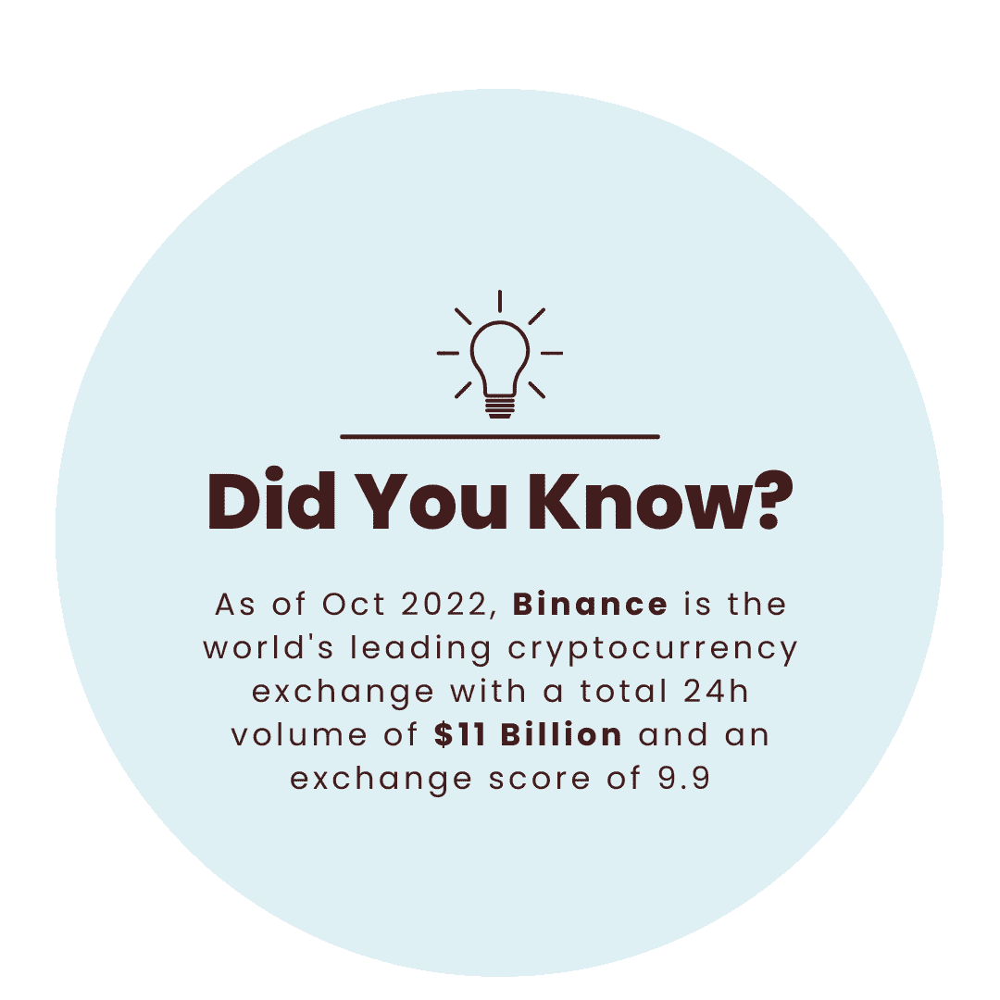

# 为什么人们更喜欢白标加密货币兑换软件？

> 原文：<https://medium.com/geekculture/why-do-people-prefer-white-label-cryptocurrency-exchange-software-4d2c25cdbebc?source=collection_archive---------10----------------------->

密码世界已经对一项十年前才出现的技术产生了巨大的影响。第一种加密货币比特币是由被称为“中本聪”的有趣人物开发的。目标是开发一个无需中间人就能安全运行的点对点电子系统。人们可以根据加密货币获得的广泛接受度得出结论，Satoshi 是成功的。随着加密货币在全球引起轰动，对加密交换的需求变得不可避免。

**加密货币兑换——当务之急**

你不能只从银行或投资公司购买加密货币。一旦你选择了你想要购买的加密货币，你需要在币安等加密货币交易平台上开设一个账户，以便用你的美元(或其他法定货币)交易数字资产。通俗地说，加密货币交易所是一个数字市场，你可以在瞬间买卖加密货币。如果你希望交易加密货币，你需要通过加密货币交易所进行交易，因为目前很少有传统投资公司提供加密货币。

**白标加密货币交易所:发展业务的新途径**

白标解决方案是一家公司开发的产品或服务，由另一家公司以自己的品牌推广。第二家公司在空白(或“白色”)标签上贴上自己的标签，并向其客户转售解决方案，而这些客户并没有意识到第二家公司并不是产品的实际开发者！简而言之，白标解决方案是您可以重新命名并作为自己的产品或服务转售给用户的产品或服务。

同样的概念也适用于**白标加密货币交易所。**这些是由可靠的**白标加密交易所开发公司**开发的加密货币交易所，以便客户可以重塑解决方案的品牌并以自己的品牌销售。但为什么有人会选择白标加密货币交易所呢？你应该问的真正问题是“为什么不呢？”！使用白标解决方案推出自己的加密货币交易所的好处不是一个，而是很多！让我们来看看这些好处。

**白标加密货币交易软件的商业优势**

白标加密货币交换软件不仅价格实惠，而且非常安全，可以立即实施。此外，众所周知，软件的开发时间与其开发成本成正比。由于建立一个白标加密货币交易平台几乎不需要两周时间，与从头开发软件的费用相比，成本相对来说是最低的。

这款**白标加密货币兑换软件**可以轻松定制，以满足您独特的业务需求，并且不需要任何技术知识来监控开发过程。你所要做的就是陈述你的需求，两周后你将拥有自己的白标加密货币交易所。白标加密交易所可以让你更快地进入市场，而不用经历开发如此复杂的平台所带来的巨大学习曲线。它将帮助你避免因反复试验而导致的代价高昂的错误。这样的例子不胜枚举！

**加密货币交易所克隆脚本:它与白标加密交易所有何不同**

如前所述，从头开始开发加密货币交易所可能非常复杂和耗时。这也是其他容易开发和推出加密货币交易所的方式应运而生的原因。加密货币交易所克隆脚本就是这样一种方式。但是什么是克隆脚本呢？

克隆脚本是现有加密货币交易所(如币安)的精确复制品，可以根据您的独特需求进行定制。此外，因为它们是预制的，所以配置和启动加密交换所需的时间和资金是非常经济的！在上下文中，白标加密交换和加密交换克隆脚本可能看起来相似。唯一的区别是，白标加密交易所允许您启动自己的加密货币交易所，而当使用加密货币交易所克隆脚本时，则不能这样做。

**领先的加密交换克隆脚本**

**币安克隆脚本**

币安克隆剧本是币安的预制副本。它具备币安的所有特征，比如快速交易、多种货币兼容以及最低的交易费用。凭借这些与众不同的特点和修改能力，币安克隆脚本使您能够在一个全新的水平上获得财务收益。

**Wazirx 克隆脚本**

WazirX 克隆脚本是 WazirX 加密货币交换平台的精确复制。它支持各种流行的加密货币，包括比特币、以太坊等。这个克隆具有优秀的特性和实时处理数百万事务的潜力。

**Paxful 克隆脚本**

Paxful 克隆脚本是 Paxful exchange 的行业就绪型副本，包括其所有高级特性和内置功能。我们的 Paxful 克隆脚本包括高级交易和支付工具，允许您在几周内建立一个像 Paxful 一样的无缺陷、功能丰富的加密交易所。

**雷米塔诺克隆脚本**

现成的点对点加密交换脚本 Remitano 克隆脚本是 Remitano 加密交换平台的真实副本。这个克隆体拥有 Remitano 平台的所有尖端功能，以及它的高端安全措施。

**本地比特币克隆脚本**

Localbitcoins 克隆脚本是一个现成的加密货币交换脚本，具有类似于 Localbitcoins crypto exchange 的顶级安全功能。它具有 KYC/反洗钱合规性、实时定价跟踪功能以及许多突出的功能。因为系统是分散的，所以安全的交易是必然的。

如果你期待通过使用克隆脚本来启动加密货币交易所，与一家知名的[加密交易所开发公司](https://www.clarisco.com/white-label-crypto-exchange)合作是必不可少的，该公司提供无错误且可靠的加密交易所克隆脚本。在选择一家公司作为你成功的合作伙伴之前，一定要了解这家公司提供的经验和解决方案。

**为什么你应该马上推出一个白标加密交换解决方案？**

任何新公司或加密货币爱好者肯定都遇到过“白标加密货币交易软件”这个术语。这个词最近因其带来的好处而流行起来。白标加密货币兑换软件不仅价格低廉，而且极其安全，可以快速实施。因为构建一个白标加密货币交换软件只需要两周时间，所以与从头开始开发软件的费用相比，成本相对来说是最低的。白标加密交换软件的优势包括:

*   快速启动
*   预算友好的解决方案
*   经过严格测试，没有任何缺陷
*   完全可定制
*   轻松部署
*   附加组件的无缝集成
*   高投资回报
*   省时的

**关闭思路**

凭借白标加密货币交易软件提供的独家优势，难怪企业家和企业都在冲刺推出自己的加密交易所！当你在谷歌上搜索白标加密交换提供商时，你会发现很多这样的提供商。然而，这是一个竞争激烈的行业，许多骗子正在出现，声称是最终的白标加密交换来源。因此，你必须在考虑具体标准(经验、投资组合、演示、评论等)的同时进行市场分析。).经过市场调研，选择最优秀的 [**白标加密货币交易提供商**](https://www.clarisco.com/white-label-crypto-exchange) 构建功能丰富的加密交易平台。