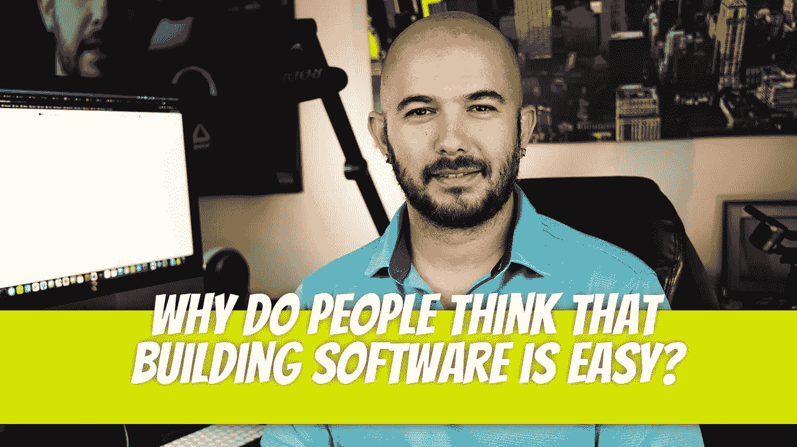

# 为什么大家会觉得构建软件很容易？

> 原文：<https://medium.com/geekculture/why-do-people-think-that-building-software-is-easy-76509d666774?source=collection_archive---------10----------------------->

我做过软件，很多软件。回顾各种项目，共识总是相同的:人们认为构建软件很容易。我在这里告诉你，它不是。

## 这些人是谁？

100%的时候，这些人没有任何软件开发经验。无论是客户…