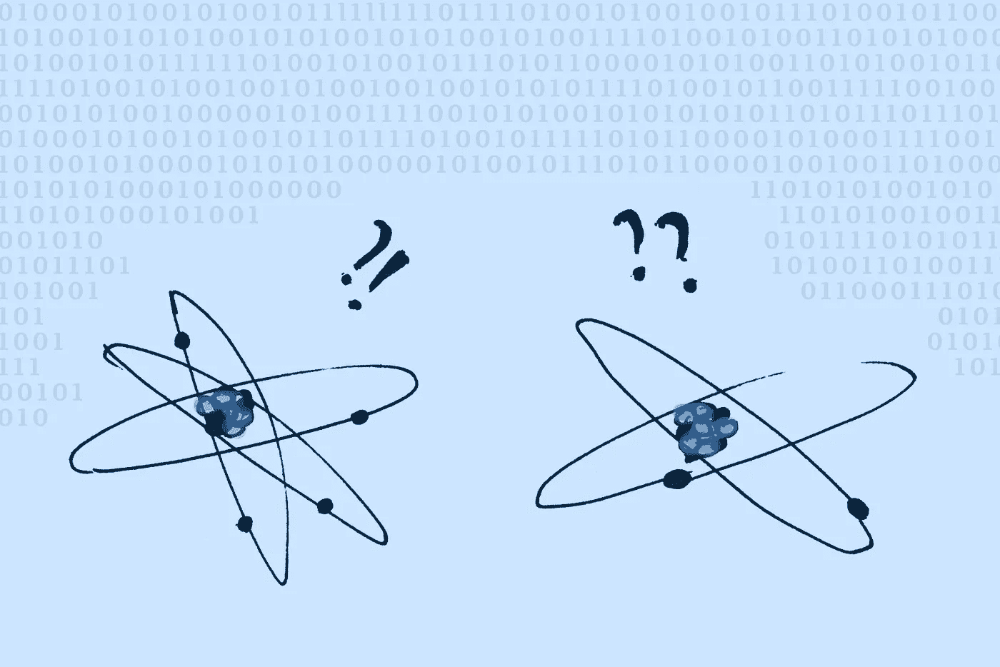

# 为什么量子物体越来越奇怪？

> 原文：<https://medium.com/geekculture/why-do-quantum-objects-keep-getting-weirder-402dd186e621?source=collection_archive---------5----------------------->

## 它们可以同时是粒子和波。研究人员现在终于知道了每种物质的含量。

Quantum objects can be very confusing. Image by author

  B   ack 在 20 世纪 20 年代，[量子力学](https://www.britannica.com/science/quantum-mechanics-physics/Einstein-and-the-photoelectric-effect)，这个支撑着从原子行为到量子计算机工作原理的理论，正在获得主流认可。但是有一个难题…