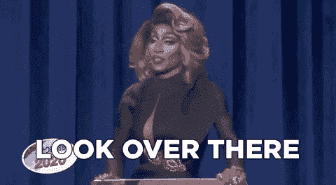

# 我们为什么关心数据？

> 原文：<https://medium.com/geekculture/why-do-we-care-about-data-e0d1c59ca960?source=collection_archive---------32----------------------->

*快速注意:这最初发表在我的 Substack 简讯上，名为* [*野外数据*](https://datainthewild.substack.com/) *，它将探索数据战略的增长领域，重点关注个人和组织如何以及应该如何使用数据等基本问题。它将包含对技术和非技术受众有用且可访问的帖子。* [*点击这里报名*](https://datainthewild.substack.com/) *！*

我们为什么关心数据？

这是一个看似简单但同样具有挑衅性的问题。人们不禁会翻白眼，说[数据是世界上最有价值的资源/新的石油](https://www.economist.com/leaders/2017/05/06/the-worlds-most-valuable-resource-is-no-longer-oil-but-data)，说[数据科学家是 21 世纪最性感的工作](https://hbr.org/2012/10/data-scientist-the-sexiest-job-of-the-21st-century)，或者说人工智能初创公司在 2020 年的融资同比增长了 82%([计算](https://www.musicbusinessworldwide.com/music-startups-saw-funding-levels-sink-by-67-in-2020-report/)，[报道](https://businessfinancing.co.uk/visualising-the-state-of-startup-funding/))。但是我们不应该屈服于这种诱惑。通过这样做，并依靠其他人的预测和推理，我们可能还会得出这样的结论:"T22 马在这里停留[因为]汽车是一种时尚 T23"，电视永远不会流行，因为"T24 人们很快就会厌倦每天晚上盯着一个胶合板箱 T25"，以及"T26 也许五台计算机就有一个世界市场 T27。"

我认为有必要理解我们为什么在更基本的层面上关心数据，以理解它是否值得大肆宣传。在我分享我的答案之前，我鼓励你思考一下为什么企业和个人应该关心数据。

*   努力想出任何东西？这不是你的错。这个领域的许多历史报道都认为数据是理所当然的重要，而不是关注它的绝对数量或向这个领域的人提供的令人眼花缭乱的高额薪酬。
*   你能提供的最好的是模糊的术语，如“学习”或“见解？”再说一次，不是你的错。那些在数据空间中不知道自己在做什么的人*喜欢*过度依赖这些术语来分散别人对他们实际上没有完成任何事情的事实的注意力。

Source: RuPaul’s Drag Race clip on GIPHY

*   有一长串类似“产生推荐”、“优化”和“指导策略”的想法吗？还不错！但是我认为所有这些例子都可以放在一个更大的伞下，作为一个统一的理论。

在数据领域工作了几年后，只有在那段时间问自己(如果和)为什么数据很重要并花了几年时间思考这个问题后，我最终得出了答案，这个答案在很大程度上来自[Cassie Kozyrkov 的这篇文章](https://towardsdatascience.com/introduction-to-decision-intelligence-5d147ddab767):

> 我们关心数据，因为它可以用来改善决策。

[我坚信定义我使用的重要术语](https://jarussingh.medium.com/reasoning-from-first-principles-e5b6d68f03f7?sk=25315dbb3afb42f37c518dcb8dd0d859)、[，所以这里有一个我写的关于决策](https://uxdesign.cc/anatomy-of-a-decision-85a343eaa1db?sk=571199c7f0d396a1822c97fda814e1ce)的快速复习。我花了很多时间苦苦寻找在商业或个人(理解为:非学术)环境中上述情况的可能例外，但一直没能找到。如果你想一想上面最后一个项目符号中的列表，所有三个例子都属于改进决策的范畴——我在项目符号中不太正式地称之为“选择”。为了避免混淆，我想澄清一下，我们通常认为决策是在需要有意识思考的选项中做出选择。我*决定*离开我的朋友和家人，放弃我的世俗财产，剃光头，出家为僧。我选择了火鸡三明治作为午餐。如果机器或算法为我们做出选择，这可能会令人困惑。它决定了，还是仅仅选择了？为了回避意识切线的理论，我将在下面的例子中使用“选择”,但是我知道更广泛的“决定”定义也可以。

*   **产生推荐**:在大型数据集上训练算法推荐引擎，以个性化和改进对用户的推荐。网飞这样做是为了建议你可能想看的其他节目；亚马逊这样做是为了建议购买其他商品；脸书对它认为你最感兴趣的帖子采取这种方式；Stitch Fix 通过这个来决定你想穿什么样的衣服。在这种情况下，部分或完全自动化的模型是*从一个非常大的可能性宇宙中选择*哪些内容或项目推荐给你。
*   **优化**:历史数据可以用来为大量优化决策提供信息，我将其定义为企业和个人面临的对现有系统的增量改进。一些例子是[优步使用的动态定价策略](https://www.uber.com/en-QA/blog/uber-dynamic-pricing/)或 [Vanguard 的投资组合分配模型](https://investor.vanguard.com/investing/how-to-invest/model-portfolio-allocation)。
*   **指导策略**:你可能听说过不同产品的“啊哈时刻”:用户理解产品价值并因此可能继续使用它的时刻。脸书有一个著名的分享，他们的“啊哈时刻”是让新用户在 10 天内注册 7 个好友。他们通过查看历史用户数据并检查哪些行为与他们产品的未来使用最相关，得出了这一结论。这让他们大大简化了他们的决策空间:从长远来看，他们不必头脑风暴、辩论和审查各种可能提高用户保留率的举措，他们可以专注于那些让新用户添加好友的举措。

这个命题还有一个非常重要的结果，即数据和分析的目的是用来改善决策，当我意识到这一点时，我受到了沉重的打击。如果数据对组织和个人的价值是改善决策，那么其他人试图以任何其他方式使用的数据或分析不仅无用，而且会分散注意力。下次有人向领导层提交与决策无关的数据或分析性“见解”或“知识”时，想想这一点。那个人应该为公司浪费的时间和精力付钱，而不是自己付钱。

Source: Kim’s Convenience on GIPHY.

我计划在未来的简讯帖子中探索简单而优雅的想法，即数据的目的是改善 8K 超高清的决策。以下是我计划讨论的其他主题的列表，你可以同时仔细考虑一下:

*   到底什么是决策？组织内部和组织之间存在哪些类型的决策？谁来做，为什么？
*   什么是数据？数据分析在哪些方面适合决策过程，哪些方面不适合？
*   数据分析有多客观？这一结果的自动化程度如何？
*   当一个人不在决策者的角色中时，他如何练习使用数据来做决策？
*   成熟的数据组织有哪些特征？一个人如何建造一个？
*   应该如何组织数据团队，让他们为决策过程做出积极贡献？

如果你们还有兴趣的话，我想回答一些你们可能会有的问题:

## 就篇幅和内容而言，这是我对未来帖子的期望吗？

是啊！我打赌你很忙；我知道我是。我的希望是写一堆一口大小的帖子，花 5 分钟或更少的时间阅读。每个人都应该有一个数据相关的智慧金块，你可以立即开始应用。挑选你感兴趣的，结合他们的力量，你将有一个商业或生活的数据战略剧本！

## 你似乎是[决策情报](https://towardsdatascience.com/introduction-to-decision-intelligence-5d147ddab767)的忠实粉丝，为什么这篇时事通讯不关注那个？

这是一个新兴的领域。我的所有经验都是在使用数据进行决策方面，所以我认为这是一个更好的起点，当然目前对数据策略的兴趣和需求要多于决策策略。如果决策智能在未来几年成为新的数据科学，我不会感到惊讶，有人可能会说它可能只是目前由战略团队拥有的东西的形式化和扩展。无论如何，我计划在这份时事通讯中分享任何相关的决策情报资源。

# 我开始撰写时事通讯，部分原因是为了鼓励围绕数据策略的更多讨论和知识共享。我很乐意得到您的反馈、问题和评论！

*最初发表于*[T5【https://datainthewild.substack.com】](https://datainthewild.substack.com/p/why-do-we-care-about-data)*。当导入到媒体时，我做了一些小的文字和格式编辑。*