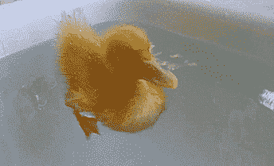
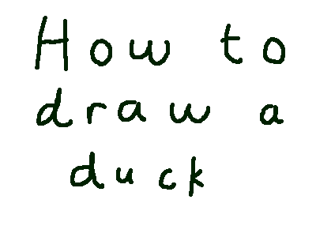
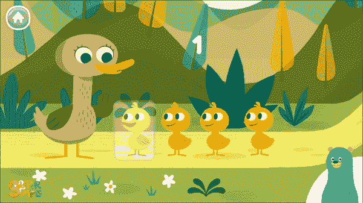
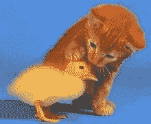

# 为什么我们在 Java 中需要接口？

> 原文：<https://medium.com/geekculture/why-do-we-need-interfaces-in-java-9a95ef57a156?source=collection_archive---------3----------------------->


接口在面向对象编程中起着非常重要的作用。面向对象的程序设计基于对象之间相互作用的思想。这些对象是从作为我们对象蓝图的类中实例化出来的。当我们创建一个类时，我们试图考虑我们想要在代码中重新创建的现实生活中的对象。说我们要一个班鸭。



我们开始考虑鸭子的状态和行为，它们与我们想要在程序中实现的目标相关。(这是四个创始概念之一——*——另外三个是封装、多态和继承)。我们希望我们的鸭子有一个名字，颜色和大小，这些将描述我们的鸭子的状态(其属性或特性)。我们还希望我们的鸭子会游泳、会飞、会吃东西，通过定义负责这些动作的方法，我们定义了鸭子的行为。*

```
***import static** java.lang.System.***out***;

**public class** Duck{

    **private** String **name**;
    **private** String **color**;
    **private int size**;

    **public** Duck(String name, String color, **int** size) {
        **this**.**name** = name;
        **this**.**color** = color;
        **this**.**size** = size;
    }

    **public void** swim() {
        ***out***.println(**"Duck is swimming"**);
    }

    **public void** fly() {
        ***out***.println(**"Duck is flying"**);
    }

    **public void** eat() {
        ***out***.println(**"Duck is eating"**);
    }
}*
```

*现在，我们在鸭子中定义的所有状态和行为都是与鸭子相关的状态和行为——这是一只真正的鸭子应该有的。如果想让我们的鸭子具有被绘制的能力(如果我们想让我们的鸭子有一张图片)——以图片的形式呈现，该怎么办？*

**

*把一个画鸭子的方法放到类 duck 里其实没有什么意义，因为画鸭子不是 Duck 的行为。让我们定义一个接口:*

```
***public interface** Drawable {
    **void** draw();
}*
```

*我们有我们的类 Duck 实现接口 Drawable()。这迫使我们的类 Duck 拥有 draw()方法的具体实现:*

```
***import static** java.lang.System.***out***;

**public class** Duck **implements** Drawable{

    **private** String **name**;
    **private** String **color**;
    **private int size**;

    **public** Duck(String name, String color, **int** size){
        **this**.**name** = name;
        **this**.**color** = color;
        **this**.**size** = size;

    }

    **public void** fly() {
        ***out***.println(**"Duck is flying"**);
    };

    **public void** eat() {
        ***out***.println(**"Duck is eating"**);
    }

    **public void** swim() {

        ***out***.println(**"Duck is swimming"**);
    }
    @Override
    **public void** draw() {
        ***out***.println(**"I drew a duck"**);
    }
}*
```

***！接口的使用允许类拥有逻辑上不属于它们的功能。***

*如果我们希望能够数我们的鸭子呢？*

**

*我们可以有可数的接口。*

```
***public interface** Countable {
    **void** count();
}*
```

*除了 Drawable 接口，Duck 类还可以实现 Countable 接口，因为 Java 允许接口的多种实现。*

```
***public class** Duck **implements** Drawable, Countable{

    **private** String **name**;
    **private** String **color**;
    **private int size**;

    **public** Duck(String name, String color, **int** size){
        **this**.**name** = name;
        **this**.**color** = color;
        **this**.**size** = size;

    }

    **public void** fly() {
        ***out***.println(**"Duck is flying"**);
    };

    **public void** eat() {
        ***out***.println(**"Duck is eating"**);
    }

    **public void** swim() {

        ***out***.println(**"Duck is swimming"**);
    }
    @Override
    **public void** draw() {
        ***out***.println(**"I drew a duck"**);
    }
    @Override
    **public void** count() {
        ***out***.println(**"I have 1 duck"**);
    }*
```

***！！接口的使用允许我们拥有多重继承。***

*抽象是 OOP 的四大支柱之一。抽象就是只暴露关于我们项目的必要信息。接口只有抽象方法，实现这些接口的类需要提供这些方法的具体实现。用户只知道实现接口和方法的类，但是不知道这些方法是如何实现的。*

***！！！接口的使用允许我们实现完全的抽象。***

*现在让我们来看看下面的代码:*

```
***import static** java.lang.System.***out***;
**public class** BabyDuck {

    **public void** swim() {
        ***out***.println(**"I can swim"**);
    }
    **public void** fly() {
        ***out***.println(**"I am learning to fly"**);
    }
} **public class** GrownDuck {

    **public void** swim() {
        ***out***.println(**"I can swim"**);
    }
    **public void** fly() {
        ***out***.println(**"I can fly"**);
    }
}**public class** NewDuck {
    **private** BabyDuck **babyDuck**;

    **public** NewDuck(BabyDuck babyDuck) {
        **this**.**babyDuck** = babyDuck;
    }
    **public void** move() {
        **babyDuck**.fly();
        **babyDuck**.swim();
    }

    **public static void** main(String[] args) {
        BabyDuck hatchling = **new** BabyDuck();
        NewDuck myDuck = **new** NewDuck(hatchling);
        myDuck.move();
    }
}*
```

*输出:*

*我在学习飞行，我会游泳*

*我们可以看到我们的类 NewDuck 依赖于类 BabyDuck，如果我们想要 GrownDuck，我们必须返回并重写我们的类。这种类的相互依赖是紧密耦合的一个例子，应该避免。如果您有许多相互依赖的类，紧密耦合会使代码维护成为一项麻烦的任务。*

*让我们使用接口来避免类相互依赖的情况。首先，我们定义包含所需行为的抽象方法的接口，然后我们设计包含这些方法的具体实现的类。这种方法被称为接口编码。*

*查看以下代码:*

```
***public interface** Movable {
    **void** swim();
    **void** fly();
} **public class** BabyDuck  **implements** Movable{

    **public void** swim() {
        ***out***.println(**"I can swim"**);
    }

    **public void** fly() {
        ***out***.println(**"I am learning to fly"**);
    }
}**public class** GrownDuck  **implements** Movable{

    **public void** swim() {
        ***out***.println(**"I can swim"**);
    }
    **public void** fly() {
        ***out***.println(**"I can fly"**);
    }
} **public class** NewDuck {
    **private** Movable **babyDuck**;

    **public** NewDuck(Movable babyDuck) {
        **this**.**babyDuck** = babyDuck;
    }
    **public void** move() {
        **babyDuck**.fly();
        **babyDuck**.swim();
    }

    **public static void** main(String[] args) {
        Movable hatchling = **new** GrownDuck();
        NewDuck myDuck = **new** NewDuck(hatchling);
        myDuck.move();
    }
}*
```

*输出:*

*我会飞，我会游泳*

***！！！！接口的使用允许我们避免紧密耦合。***

*来总结一下本帖标题所贴问题的答案。*

*我们需要界面:*

***让类拥有不属于它们的行为。***

***对多重继承进行建模。***

***达到完全的抽象。***

***联轴器松动。***

*快乐编码，我的朋友们！*

**

*这里的所有代码:*

*[](https://github.com/forfireonly/MediumArticlesJava) [## forfireonly/MediumArticlesJava

### 在 GitHub 上创建一个帐户，为 forfireonly/MediumArticlesJava 开发做贡献。

github.com](https://github.com/forfireonly/MediumArticlesJava)*