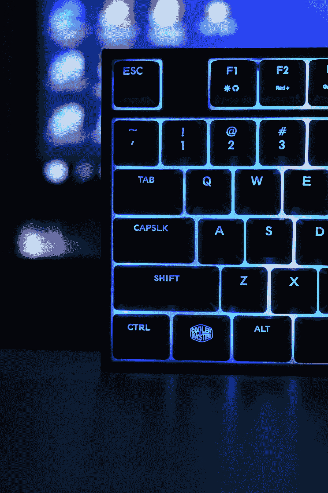

# 为什么我们还在用 Qwerty 键盘？

> 原文：<https://medium.com/geekculture/why-do-we-still-use-qwerty-keyboard-d3a492787f68?source=collection_archive---------7----------------------->

## 你有没有想过为什么你的键盘以字母“QWERTY”开头

Photo by [Balkouras Nicos](https://unsplash.com/es/@ba1kouras?utm_source=medium&utm_medium=referral) on [Unsplash](https://unsplash.com?utm_source=medium&utm_medium=referral)

最近，我在用一个在线单词速度计算器练习我的打字速度，当我尽可能快地打字时，我只是想知道为什么所有的键盘布局都是 QWERTY 式的。