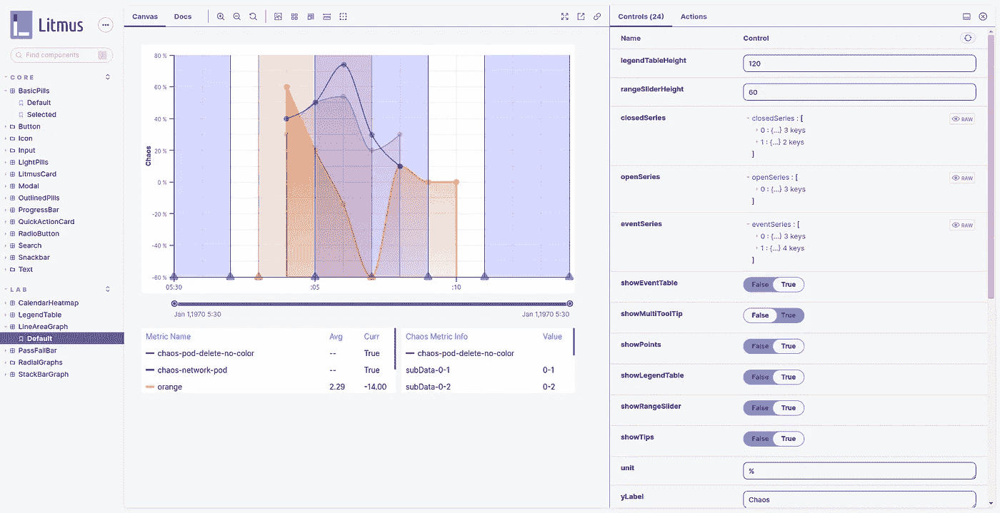

# 为什么需要组件库？

> 原文：<https://medium.com/geekculture/why-do-you-need-a-component-library-73e262370f8e?source=collection_archive---------31----------------------->

## 石蕊的故事-UI

# 这篇文章是写给谁的？

只有当您正在开始一个企业项目，或者如果您打算在项目的未来某个时候进行企业化，创建一个组件库才有意义。如果该项目是一个爱好项目，停止阅读本文，维护一个组件库将是一个不必要的麻烦。话虽如此，让我们深入了解一下你到底为什么需要它，你应该在项目生命周期的什么时候考虑它，以及我个人在我所从事的项目中获得了什么好处。

# 为什么我要做一个通用组件库？

区别在于，你将创建一个对你的产品集合通用的组件库，而不需要尝试创建另一种材料——UI。其实我做的库是在 material-UI 上面的。你可能会认为这很荒谬，如果我使用 material-UI，为什么要在它上面创建另一个库。正如我所说的，它只适用于你的产品，主要思想是限制和一致性。让我用我和 LitmusChaos 的经历来解释一下。

# 组件/UI 库为您的企业带来的好处

## 不要重复自己的话

当一个企业有一系列产品，用户希望它们看起来、行为和功能都相似时，UI 一致性就很重要。在这种情况下，拥有一个库是至关重要的，因为不仅不需要重复代码，而且修改和修复 bug 变得更加容易。在某些更高级的用例中，如果您的产品系列都有自己的身份，您可以有一个可覆盖的中心主题，并在不同的品牌颜色上标记组件。
在大范围内，这是一个显而易见的问题，但即使在小范围内，如果你刚刚开始，当你的小产品进入企业时，投资雇佣一个有良好组件设计意识的人也是值得的，而不是烧钱重新编写代码。LitmusChaos 可能会走另一条路，如果我们的产品没有足够的灵活性来适应，可能不会有这么多的采用者。幸运的是，我们很快就意识到了这一点，开始时只是一个小小的内部努力，结果却节省了后来重新编写代码的大量工作。
我工作的公司 [ChaosNative](https://chaosnative.com/) ，他们是开源 LitmusChaos 的创始人，在为 LitmusChaos 提供服务(可维护性)和在此基础上创建他们自己的产品(可定制性)的同时，一次又一次地从这种方法中获利。

## 一致性和控制

这是 UI 库的一个被低估的优势，特别是对于远程团队。当多人一起工作时，尤其是在开源环境中，跟踪 UI 中的变化变得极其困难。我们已经面对了重复的组件，不必要的库，人们改变现有的组件来适应他们的用例，并且破坏了一些其他的东西，并且经常是未测试的代码。当我们开始开发 [Litmus-UI](https://github.com/litmuschaos/litmus-ui) 时，所有这些问题都得到了缓解，主要原因是版本控制。组件、外部库和主题中的任何变化都必须写得很好，遵循项目指南，更容易审查，并且不要加上不必要的业务逻辑或完全不相关的后端更改。我们增加了测试组件的严格规则，并使用[故事书](https://ui.litmuschaos.io/)来预览组件，并在新版本发布前测试它的所有方面。

## 敏捷之路

我听到的反对维护 UI 库的常见论点是，团队是敏捷的，需要快速行动，因此不能被开发通用组件和发布周期的缓慢步伐所拖累。我完全不同意这一点，因为根据我的经验，我们的敏捷团队在改变之后变得更加敏捷。让我来解释一下在转向使用 UI 库之后我注意到的变化。

*   开发人员开始更快地编码，因为他们确信没有重复的组件，并且每个人都从一个地方使用所有的组件。
*   当我们谈论生产力时，对经过良好测试的代码的信心大有帮助。
*   访问已经构建的组件变得更加容易，因为开发人员不必挖掘文件和文件夹名称，也不必查看接口来确定组件使用了什么属性；故事书里有的都有。
*   我们的库越大，你就能越快地建立原型。这是我们使用 LitmusChaos 的 material-UI 的原因之一，但是使用 Litmus-UI，这个过程甚至更快，并且构建 UI 变成了以各种方式组合组件，因为你不必担心一致性。

# 留下想法

你能感受到好处的唯一方法是你去尝试它。把它作为你公司的一个内部项目开始，我唯一的建议是，如果你刚开始，在这个时代用打字稿写它是必须的。如果你喜欢 LitmusChaos 项目和 [Litmus-UI](https://ui.litmuschaos.io/) 和 [contribute](https://github.com/litmuschaos/litmus-ui) ，请查看。毕竟是开源的。

如果你想知道更多关于我的信息，你可以在推特上找到我或者查看我的 T2 网站。

直到下一篇文章，再见❤.