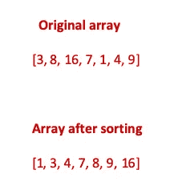

# 为什么需要学习算法？

> 原文：<https://medium.com/geekculture/why-do-you-need-to-learn-algorithms-cf749d341321?source=collection_archive---------6----------------------->

*听到“算法”这个词你会怎么想？这是一个在我们的现代世界中无法避免的词，但很少有人真正知道它的意思。*

*事实上，这是一个相当模糊的术语，通常，它指的是以解决问题为主要目标的一系列行动。你知道如何烤蛋糕，如何过马路，或者如何在 Barnes & Noble 找到你要找的书吗？那些是算法。但是在编程领域，我们谈论的是一种不同的算法。为什么学习它们并知道如何使用它们很重要？也许我们只是在浪费时间，可以学习一个新的框架，而不是花几个小时试图理解所有这些复杂的东西？*

*让我们看看。*

[https://xkcd.com/1831/](https://xkcd.com/1831/)

纵观计算机科学的历史，人们已经认识到算法和数据结构是编程的重要组成部分，是解决实际问题所必需的，这是每个开发人员都必须知道的。

例如，考虑一个排序算法——你为一家杂货店编写一些软件，在那里商品必须按价格或有效期排序，或者编写一个应用程序，帮助用户找到一家发廊，要求你按距离或用户评级对发廊进行排序。当然，知道选择哪种排序算法以及如何实现它会很有帮助([维基百科](https://en.wikipedia.org/wiki/Sorting_algorithm)给了我们 44 种排序算法，而这只是冰山一角。)

## 算法有助于找到问题的最有效的解决方案

假设你想去你最喜欢的餐馆买些食物。有三种不同的路线可以选择:使用沿着高速公路的人行道(这是一条很长的路，很危险)，穿过后巷(快速但仍然很危险)或乘坐公共汽车(快速而安全，但你必须付费)。这个问题甚至可能有一个不同的解决方案，也许你可以把你的车，或者只是订单交付。你必须找到最有效的方法来获取食物。

所以，让我们把这个带入编程世界。开发人员必须找到最有效的解决方案:他们必须考虑程序运行的速度、程序的内存使用情况、实现解决方案的难易程度，甚至他们的公司要花多少钱才能获得软件的最终版本。

例如，您需要对一个由 *n* 个数字组成的数组进行升序排序。

这个看起来好简单啊！首先，查看整个数组，找到最小的数字，并将其与数组的第一个元素交换。第二步:从数组的第二个元素开始再次检查数字，挑选最小的一个并与数组中的第二个元素交换，依此类推——您将重复这个过程 *n* 次。这是选择排序。当然，你可以对数字进行排序，但这需要很长时间，如果数组包含几十亿个数字，你的程序将运行很长时间。为了理解在这种情况下哪种算法最有效，我们需要知道其他排序算法是如何工作的。

这是另一个例子。你学会了写代码，现在你是一个 Ruby 向导，但你对算法一无所知。你已经创建了一个视频托管网站(你希望下一个 YouTube)。你的项目非常成功，但是现在有 10，000 人同时登录，一切都开始崩溃了。您的服务器无法同时处理这么多请求，开始出现故障。用户抱怨视频上传时间太长。好了，现在你必须想出一个解决方案，并实现你能找到的最有效的压缩算法。要做到这一点，你需要知道算法是如何工作的。

了解幕后发生的事情有助于你理解为什么解决方案 *x* 比解决方案 *y* 更好。一旦你掌握了最基本的算法，你将能够编写自己的算法或者将它们结合起来解决更复杂的问题。

## 算法帮助你找工作

最大的科技公司，如谷歌、脸书和亚马逊，进行单独的面试，专门关注数据结构和算法。这些公司正在寻找一个能够使用最有效的算法快速设计东西以节省公司资源(计算能力、服务器、资金等)的人。).在面试这些公司时，你可能会听到这样一个问题:

你不仅要找到问题的解决方案，还要解释为什么选择算法 A 而不是算法 b。

开发人员的主要任务是分析和解决问题，而代码只是实现最终目标的工具。如果不是因为其独特和开创性的算法使用，谷歌搜索不会如此高效。当时其他搜索引擎只是简单地寻找关键词，而谷歌意识到真正重要的是上下文、用法和互联性。不是它看起来像什么，而是它实际上意味着什么。

## 算法有助于训练你的大脑

一旦你真正开始理解算法的逻辑结构，你可能会发现你不仅仅是在工作中使用它们。它们就像是你大脑的一双好跑鞋。

史蒂夫·乔布斯说过，

> 每个人都应该学会给电脑编程，因为它教会你如何思考

几乎你日常生活的每一个部分都可以通过开发一个逻辑结构来优化和改善，以节省你的时间并获得更好的结果，无论是找到最佳的工作路线，在最短的时间内获得最佳的停车位，尽可能快速和便宜地购买食品杂货，还是以最优惠的价格购买机票，算法都是强大的工具，可以教你如何表达自己的想法并解决似乎无法解决的问题。

有很多很棒的网站，你可以在那里练习你的算法求解技巧。我推荐你去看看这些网站:

[Codewars](https://www.codewars.com/dashboard) ， [LeetCode，](https://leetcode.com/) [Project Euler](https://projecteuler.net/) ， [HackerRank](https://www.hackerrank.com/dashboard)