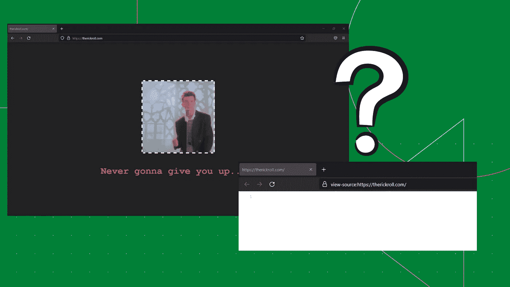
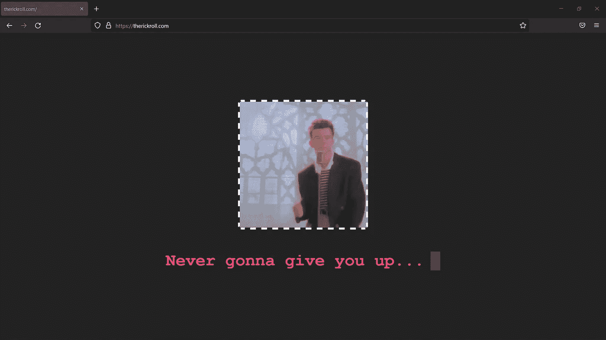
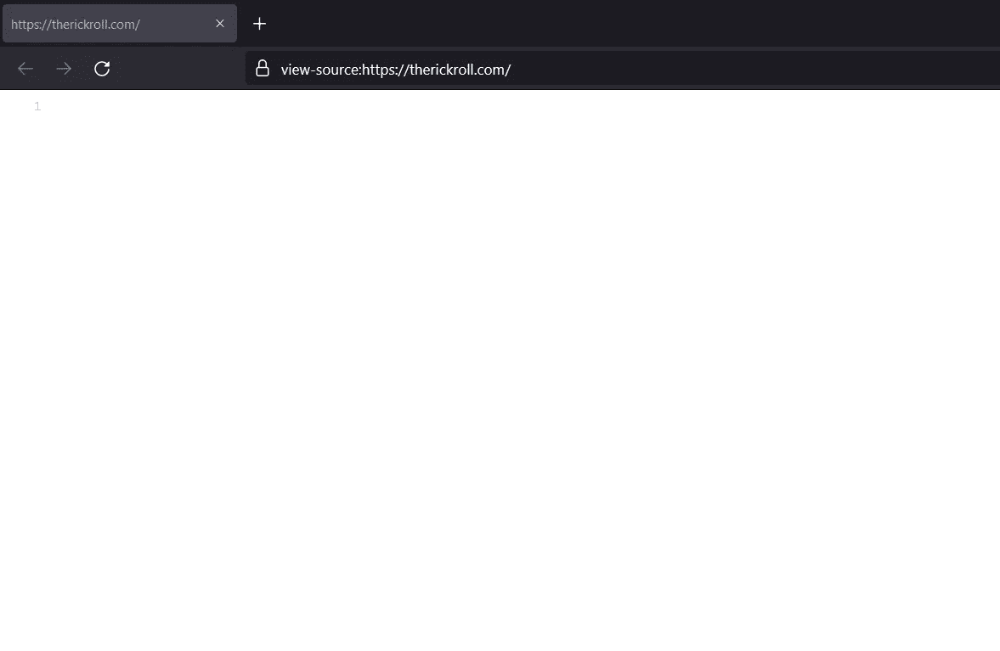
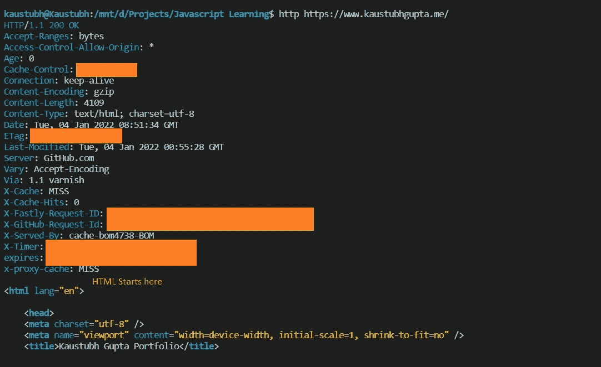
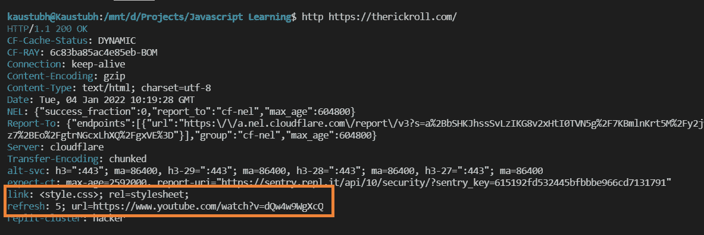

# 为什么这个网站显示没有源代码？

> 原文：<https://medium.com/geekculture/why-does-this-website-show-no-source-code-a8bd5892d754?source=collection_archive---------4----------------------->

## 解释为什么 therickroll.com 不显示任何源代码

Image by Author, Made in Canva

# 介绍

你是一个伟大的网络开发者。您创建了一个拥有所有最新集成的最好看的网站之一。你为公众发布了网站，现在有人想要复制你创建的相同的前端界面。

今天的网站不仅仅是简单的文本、图形和多媒体。它们已经转变为网络应用。这些应用程序可以做比简单浏览更多的事情。说到这个问题，这个人看着源代码，可能/可能不知道你的策略和代码，这取决于它是如何设计的。

但是你有没有想过完全隐藏代码是可能的？这里的“完全”是指不仅源代码隐藏在 GitHub 或 Gitlab 等托管平台上，而且在任何浏览器中查看“查看-源代码”选项卡时，都没有任何返回？空白屏幕。有可能做到吗？

从技术上来说，在撰写本文时，还没有“官方”的方法来隐藏 view-source 选项卡中的整个源代码。但是，有一个惊人的解决方法可以隐藏这个标签中的代码！

## 假设

在我开始主要内容之前，我想让你知道一些事情，以便我们达成共识:

1.  这里的所有解释都适用于 Firefox 浏览器，而不是 Chrome 浏览器，原因将在本文的下一部分讨论。
2.  浏览器的“view-source”选项卡选项将显示为空，但是 dev tools 将显示自动 HTML，每个浏览器都会注入 HTML，并且它可能会公开解决方法。(您将在文章的前面看到这一点)

但是，尽管有这些假设，我还是想讨论一下这个变通办法，因为它会为您提供网站如何在后台工作的更多细节。

# therickroll.com

这个网站是文章的中心。如果你在 Firefox 中访问这个网站，它会显示:

The [therickroll.com](https://therickroll.com/) website screenshot

网站内容不多。它有一个 GIF 和一个闪烁的光标下面的文本。假设，如果你想复制这个网站，那么你一定在想源代码应该有图像和文本元素，对吗？现在，在 Firefox 中查看该网站的源代码。

Source code page for [therickroll.com](https://therickroll.com/)

嗯，源代码是空的！此外，如果你在这个网站停留超过 5 秒钟，它会将你重定向到著名的 rickroll YouTube 视频。奇怪吧？你的下一个想法是，如果源代码是空的，所有这些东西是如何工作的？让我们揭开魔法的面纱！

# 头球的魔力

从一开始，我们就被告知网站是由互联网上的一个中心位置(服务器)提供的网页的集合。这种内容服务是通过诸如 HTTP 之类的互联网协议来控制的。我们被介绍的网页没有提到 HTTP 响应和标题元数据或者与这些网站相关的配置文件。

每当一个网站由服务器提供服务时，它都会得到一个 HTTP 响应以及 HTML、CSS 和其他相关文件。这个 HTTP 响应有头元数据，后面是实际网站内容(HTML)的主体。在 Linux 中使用“http”命令可以很容易地在 UI 中查看这个响应。请看下面我的投资组合网站( [kaustubhgupta.me](https://www.kaustubhgupta.me/) )的例子:

HTTP response returned for my portfolio website

从上面的输出中，我们可以看到在 HTTP 响应中返回了许多元数据信息，在这些元数据之后，主体具有网页的实际 HTML。这就是我们在浏览器的“查看源代码”标签选项中看到的 HTML。

> 如果我们以某种方式在这个 HTTP 头响应中包含我们的网站代码会怎么样？这样，网站将被渲染，代码将不会出现在查看源代码标签！

这正是在 therickroll.com 所做的！创建者使用 HTTP 响应的“Link”头来附加 CSS 样式表。这个 CSS 文件能够呈现网站的当前版本。在抽象层次上，CSS 文件完成了以下工作:

1.  head 元素被制成一个块，以便在屏幕上可见。GIF 是使用 CSS 的“背景图像”属性附加在这里的。
2.  为了在屏幕上添加文本，使用了 CSS 的“content”属性。此属性在 body 元素“before”中使用。
3.  HTML 元素 CSS 呈现网页背景色。

在你放弃“没有 HTML 源代码”的评论之前，你需要理解这一点。浏览器自动为每个网页注入 HTML、head 和 body 元素，不管我们是否在网页中指定了这些元素，这就是为什么 CSS 在这种情况下工作。

## Qs 1:为什么这种技术在 Chrome 浏览器中不起作用？

简单地说，Chrome 不支持“链接”标题，这就是为什么当有人在 Chrome 中点击这个网站时，他们得到的是一个空版本的网站。

## Qs 2:网站如何在 5 秒后重定向到 rickroll YouTube 视频？

创建者使用了一个“刷新”头，它接收超时和重定向链接。所以 5 秒后网站自动重定向到 rickroll 这首歌的 YouTube 链接！

下面是**T3 的 HTTP 响应 therickroll . com:**

HTTP response for therickroll.com

***这就是 therickroll.com 网站如何在隐藏代码的同时显示内容的全部解释！***

# 信用

这篇文章完全基于这个 YouTube 视频，本网站的所有研究和实施的所有功劳都属于这个 YouTube 频道！

# 结论

这篇文章的目的不是误导任何人。因为，如果您打开开发工具并将鼠标悬停在自动生成的 HTML 标签上，您可以很容易地看到 CSS hack。从这篇文章中，我想提出“代码隐藏”的想法，以便在将来，你可以恶作剧你不太懂技术的朋友，玩这些头文件！

> 如果你想阅读/探索我的每一篇文章，那就去我的[主文章列表](/@kaustubhgupta1828/all-my-articles-under-one-hood-f1ab2e5eac89)吧，每当我在任何平台上发表一篇新文章，它就会更新！

*对于* ***任何疑惑、疑问，或者潜在的机会*** *，您都可以通过*联系我

 [## Kaustubh Gupta -数据科学 NLP 分析师实习生-浪子| LinkedIn

### 你好，我是一名对数据分析感兴趣的 Python 开发人员，正在成为一名数据工程师的路上…

www.linkedin.com](https://www.linkedin.com/in/kaustubh-gupta/)