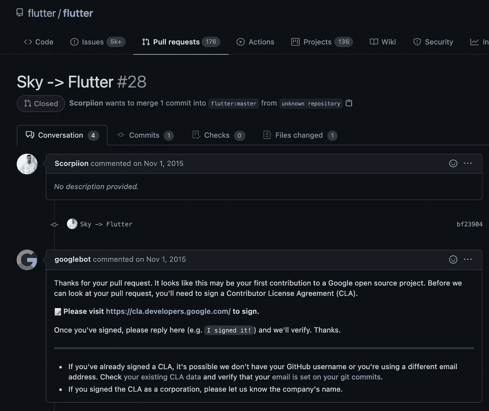
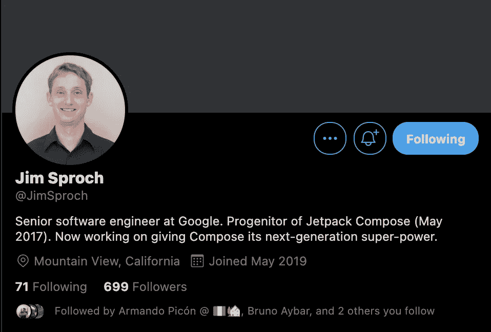

# 为什么 Flutter 使用 Dart 而不是另一种“更好”的语言？

> 原文：<https://medium.com/geekculture/why-doesflutter-use-dart-and-not-another-better-language-c900aaaf3f5c?source=collection_archive---------3----------------------->

"如果你想用波兰语阅读这篇文章，请阅读[这篇文章](https://bulldogjob.pl/news/1660-dlaczego-flutter-wybral-darta-a-nie-jakis-lepszy-jezyk)"

 [## dlaczego Flutter wybrasdarta，一个 nie jakiś " lepszy " ję zyk

### Dlaczego Flutter korzysta z Darta，a nie jakiegoś " lepszego " ję zyka？Pytanie 到 pojavia sibardzo czsto na grupkach…

bulldogjob.pl](https://bulldogjob.pl/news/1660-dlaczego-flutter-wybral-darta-a-nie-jakis-lepszy-jezyk) 

这个问题经常出现在 Dart 和 Flutter 的许多组中(在许多语言中，不仅仅是英语中)，几乎所有的评论都将 Dart 与 Kotlin 和 TypeScript 进行比较。

让我们回顾一下历史。Flutter 于 2017 年 5 月在谷歌 I/O 期间发布。在同一活动中，Kotlin 被作为 Android 应用开发的官方语言展示。但一件事是发布，另一件事是开发的开始。

# 开始

2014 年以`Sky`的名字开始开发 Flutter，同年 10 月更名为…等着吧… Flutter！！🥳🎉

这可以通过 GitHub 存储库中的问题得到验证:

 [## 天空->由天蝎拉动的颤动请求#28 颤动/颤动

### 引用日期:2020 年 12 月 11 日引用日期:2021 年 1 月 7 日将此建议添加到可作为…

github.com](https://github.com/flutter/flutter/pull/28) 

Screenshot of the issue that renames Sky to Flutter

# 分析候选语言

好吧，让我们想象我们在 2014 年。满足以下要求的备选方案不多:

1.  控制语言的发展，创造更好的框架 API。
2.  避免类似`Google vs Oracle`的法律冲突。
3.  编译必须尽可能高效。

**科特林**3 岁，但还没有接触到移动世界。尽管它在当时并不流行，但编译器只为 JVM 生成了字节码。

C# 非常流行，但不够开放，而且受微软控制。这可能会产生与 Java 相同的冲突。

那时，Golang 开始在世界上流行起来，谷歌正在试验 MobileX，这是一个用 Go 编写移动应用程序的包。但是它的语法对移动应用程序来说不够友好，不像对服务器那样友好。

**TypeScript**2 岁，受微软控制。此外，直到今天(2021 年)还没有有效的二进制编译器，尽管人们试图创建一个 WASM 编译器。

Dart 并不流行，被认为是一个孤儿，但它有一个 Dart VM 的编译器，而且谷歌拥有对这种语言的所有控制权。

那么，我们可以推断最佳选择是 Dart，其次是 Kotlin。

# Kotlin 更受欢迎，是 Android 的官方语言

现在，Kotlin 已经有了像 Kotlin 多平台(KMM)和 Kotlin 本地这样的工具来避开 JVM。为什么科特林没有重写《颤振》？

在这个问题之前，我们必须记住，有一个名为 Jetpack Compose 的框架处于测试阶段，自 2017 年 5 月以来一直在开发中。

Screenshot from twitter about Jim Sproch profile, progenitor of Jetpack Compose on May 2017.

Jetpack Compose (JC)正在重新定义创建 Android 移动应用的方式，其概念与 Flutter 非常相似，但与 Kotlin 辩证兼容。

目前 JC 只在 Android 上工作，而 Flutter 可以在很多平台上工作(移动、网络和桌面)，因为 Flutter 比 JC 大 3 岁。

两者都是不错的选择，但 Flutter 更成熟。

# 结论

在回顾了一些历史之后，飞镖是在受孕的那一刻飘起的最佳选择。这个“问题”不是一个真正的问题，只是缺乏关于重要细节的知识，无法给出意见。Dart 是 2014 年创造 Flutter 最好的，也可能是唯一的选择。因此，我认为这是一个技术决定，而不是谷歌的突发奇想。