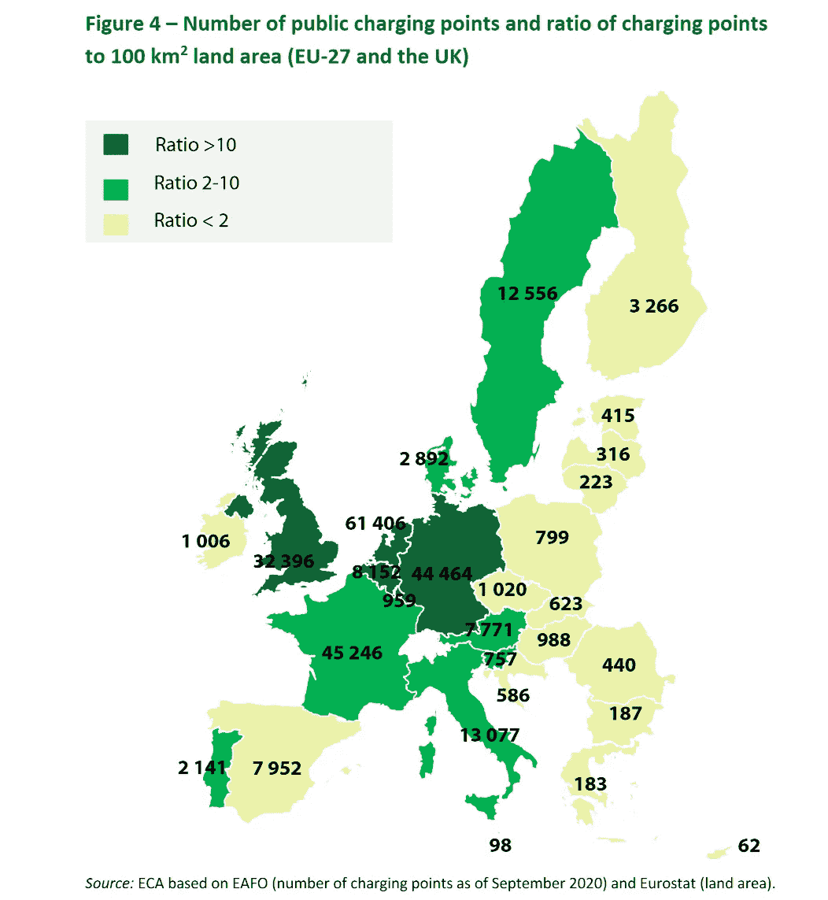

# 为什么电动车是欧洲未来的交通工具？

> 原文：<https://medium.com/geekculture/why-electric-vehicles-are-the-future-mobility-in-europe-c94042fd07b5?source=collection_archive---------4----------------------->

## 面临一些挑战

Photo by [Tom Radetzki](https://unsplash.com/@tomradetzki?utm_source=medium&utm_medium=referral) on [Unsplash](https://unsplash.com?utm_source=medium&utm_medium=referral)

随着欧盟绿色协议的提出，汽车制造商正准备向零排放汽车过渡。欧洲委员会的目标是:

*   到 2030 年，汽车排放减少 55%
*   到 2030 年，货车排放减少 50%
*   到 2035 年，汽车和货车的排放量为零

沃尔沃、雷诺等汽车制造商已经宣布，甚至在 2035 年之前，将在欧洲把所有汽车都换成电动汽车。

# 电动汽车服务

除了电动汽车，电动汽车还将提供一系列适应我们日常出行的服务。如今(以及未来)嵌入电动汽车的技术有助于增加一些增值服务。

## 汽车共享

汽车的**所有权**是我们今天生活的转变之一。越来越多的人在使用“T4”的现收现付模式。汽车用户只是支付使用费，而不是购买汽车。

对于电动汽车而言，该模式始于几年前，客户可以在大都市(如巴黎)拼车，并在今天继续扩展，短期和中期租赁电动汽车很容易实现。

## 插电充电

即插即用是一种嵌入现代电动汽车和充电站的技术解决方案，它允许汽车和充电站之间相互识别，并且**开始充电过程**，而不需要 RFID 或信用卡。

背后的技术是一个突破，这是其他功能的第一步，如双向充电、无线充电等。它还将允许市场上汽车和充电站之间的互操作性。

CharIN explains Plug and Charge

## 双向充电–V2X

通过双向电力传输(BPT)或**车辆到一切(V2X)** ，也称为 **V2G** (车辆到电网)，汽车将能够为外部设备甚至电网充电。通过 V2X 技术，汽车可以为另一辆汽车充电，为专业人士提供外部电气设备，为电网供电……汽车也是能源的来源。

CharIN explains Smart Charging — Vehicle to Grid (V2G)

# 电动汽车挑战

## 充电点

如今充电点的部署存在很大的缺陷。大多数充电点都部署在城市和高速公路上，这造成了一种不安全感，并限制了电动汽车在城市或短途旅行中的使用。

Source: [https://www.eca.europa.eu/Lists/ECADocuments/SR21_05/SR_Electrical_charging_infrastructure_EN.pdf](https://www.eca.europa.eu/Lists/ECADocuments/SR21_05/SR_Electrical_charging_infrastructure_EN.pdf)

## 电池容量和充电速度

首先，今天的电池容量被限制在 400/600 公里 WLTP 的范围内。这实际上小于这些计算的限制，尤其是如果你在高速公路上驾驶。事实上，WLTP 计算考虑了多种驾驶情况，包括市区、郊区和高速公路驾驶。根据您的实际使用情况，实际电池续航时间可能会有所不同。

对于充电速度，去年有了很大的进步。一些最新的电动汽车可以充电超过 150 千瓦，超级充电器在高速公路和城市中越来越多。

**来源**

[https://www . ECA . Europa . eu/Lists/ECA documents/SR21 _ 05/SR _ Electrical _ charging _ infra structure _ en . pdf](https://www.eca.europa.eu/Lists/ECADocuments/SR21_05/SR_Electrical_charging_infrastructure_EN.pdf)

 [## 实现欧洲绿色交易

### 气候变化是我们时代最大的挑战。这是一个建立新经济模式的机会。的…

欧盟](https://ec.europa.eu/info/strategy/priorities-2019-2024/european-green-deal/delivering-european-green-deal_en)