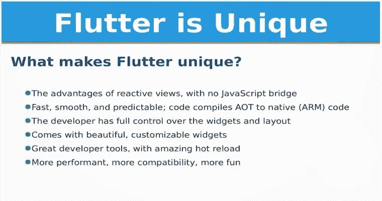
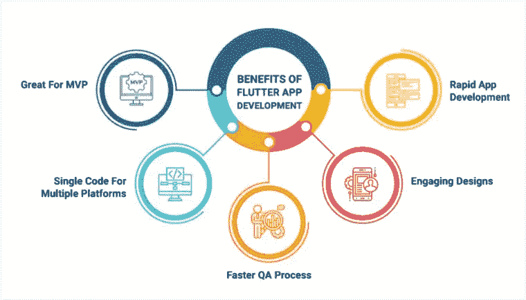

# 为什么 Flutter 是跨平台移动应用开发的未来

> 原文：<https://medium.com/geekculture/why-flutter-is-the-future-508a848a2ba2?source=collection_archive---------2----------------------->

Flutter is the Future

谷歌广告、阿里巴巴、Reflectly 和 Birch Finance 之间有一些相似之处。

> 它们都是使用 Flutter 构建的。据 Flutter 社区称，超过 10 万个应用程序已经被发送到数亿台设备上。

Flutter 的成名是什么？真的是跨平台移动 app 开发的未来吗？

让我们来谈谈 Flutter 的哪些方面让它如此特别，以及它如何让您的开发人员受益。

# 什么是颤振？

Flutter 是谷歌为不同平台开发应用程序的开源软件，它从单一代码库开始，允许创建 iOS、Android、Windows、Mac、Linux、web 和谷歌 Fuchsia 应用程序。UI toolkit 是用 C、C++和 Dart 编写的，它可以帮助您创建出色的本地应用程序。

## 是什么让 Flutter 独一无二？

Flutter 的一个关键方面是它提供跨平台的应用程序，因为它使用相同的代码库为每个操作系统创建应用程序。

另外，Android 和 iOS 上的 UI 完全一样。因此，当你雇佣 Flutter 开发者时，他们不必为每个平台设计不同的版本。Flutter 框架将确保屏幕上的一切看起来都是一致的。

除此之外，Flutter 还有一些额外的好处，比如来自第三方编辑器的支持，快速的加载时间，以及更快地将产品推向市场。我们将在稍后的演示中讨论这些优势。

# 为什么说 Flutter 是跨平台移动 App 开发的未来？

据预测，Flutter 将在未来几年成为事实上的应用程序开发解决方案，因为它具有以下特点。

## 1.简单的设置和非常详细的文档

由于 Flutter 是谷歌的产品，它是该公司的设计师和他们的材料设计平台的无缝集成。Flutter app 开发变得更加容易，即使是新手。这个框架附带了完整的文档来帮助人们入门。文档是详细的，应该为开发人员在开发过程中可能遇到的任何问题提供答案。

## 2.最低的代码要求

鉴于我们所谈论的，Flutter 允许您使用相同的代码来创建可以在任何平台上运行的应用程序，从而减少您需要在应用程序开发上投资的时间和精力。此外，它还利用了 Dart 语言，这种语言旨在使使用变得简单和无缝。Dart 使用类似 C 的语法，可以使用即时编译器编译成 JavaScript 代码。

## 3.自定义 UI 小部件

小部件是 Flutter 的重要组成部分。这些可定制的内置 UI 组件是应用程序整个图形界面的基础。如果你使用 Flutter，你将获得开发移动应用所需的所有软件工具。

Flutter 也有自己的渲染引擎，你可以用它来绘制小部件。小部件、手势和动画可以在 Dart 中完成。两个关键的移动应用程序设计小部件是材料设计小部件(Android)和 Cupertino (iOS)。

## 4.更快的发展

有了单一的代码库，你就能在短时间内构建一个跨平台的应用。除此之外，Flutter 还提供了热重新加载功能，允许你修改源代码，并且在不需要重新编译源代码或者重新启动的情况下，查看应用程序的变化。这减少了完成应用程序开发所需的时间。

Flutter 的负载需求很小，所以你可以使用同一个框架开发两个不同的原生移动应用。因此，您不需要在测试中投入大量的时间和精力。

如果你是一名应用程序开发人员、企业家或小型企业，并希望快速创建一个移动应用程序，Flutter 是一个非常好的框架。

## 5.更快上市

鉴于商业领域竞争异常激烈，你越快将产品推向市场，成功的机会就越大。在这方面，更快的上市时间可以帮助您在竞争对手之前接触到目标客户，快速获得反馈，并根据要求升级您的产品。

用 [Flutter app development](https://www.alcax.com/services/flutter-app-development/) 构建一个应用将会更省时、更便宜，这意味着你可以更快地将你的应用推向市场。因此，你将能够比你的竞争对手更有优势，你将有潜力卖出更多的应用。

## 6.减少开发成本

开发一个移动应用程序的成本不容忽视。一个普通的移动应用程序大约需要 3 万美元。如果涉及某些规格，这可能高达 100，000 美元。

初创公司和小企业不像大公司那样有这么大的预算。此外，开发成本并不总是停留在财务方面。考虑团队建设、服务器、营销等潜在成本。

Flutter 降低了开发成本。共享代码库意味着你不需要找一个 Android 开发者和一个 Flutter 开发者。为了让它变得简单，你可以雇佣 Flutter 开发者【去掉高亮】，创建跨平台的应用。测试也很少，所以即使你预算很低，你也可以创建一个跨平台的应用程序。

## 7.性能提升

移动应用程序开发人员通常更喜欢 Flutter 而不是其他框架，因为它的性能令人印象深刻。为了更好地理解这种性能，让我们比较一下 Flutter 和它的竞争对手 React Native。

React Native 依赖于一些关键的构建模块，这些模块涉及在另一个线程中运行 JavaScript。因此，需要一个桥来维护本机模块之间的通信。这一过程既耗时又耗费资源。

然而，Flutter 从零开始构建一切。它将应用程序逻辑和 UI 模块转换为机器代码，使应用程序运行得更快、更高效。Flutter 应用通常比使用 React Native 构建的应用以及为特定平台构建的原生应用更快。

对于这些客户来说，方便和效率优先于任何其他因素；因此，Flutter 可能会成为未来应用开发者的首选。

## 8.火基集成

使用 Flutter 的优势之一是它与 Firebase 的连接。这是谷歌开发的一个用于开发网络和移动应用的 BaaS 平台。和许多其他工具一样，开发人员可以使用 Firebase 从他们的服务中获益，如数据库、分析、崩溃报告和消息传递。Firebase 与 Flutter 集成得非常好，这意味着使用 Flutter 的开发人员也可以使用这些工具。

## 9.MVP 的理想选择

MVP 是最便宜的产品，可以满足客户的基本需求。它旨在为开发最终产品的更昂贵的阶段节省资金。

越来越多的软件开发公司正在采用敏捷方法。对于那些希望更快地将产品推向市场的人，以及那些需要更快地从投资者和股东那里获得资金的人来说，创建最小可行产品(MVP)是至关重要的。Flutter 是 MVP 的绝佳选择，因为构建一个简单的应用程序需要更少的时间和精力。

# Flutter 如何让开发者受益？

在上一节中，我们讨论了 Flutter 如何成为移动应用开发者的未来之路。但是除了金钱上的收益，Flutter 对开发者来说是有益的。这是有原因的。

*   **最大程度的社区支持:** Flutter 拥有庞大的社区支持，Github 追随者超过 2.5 万人。此外，谷歌是 Flutter 的大玩家，所以如果你雇佣使用 Flutter 的开发人员，那么这些开发人员遇到的查询会得到及时处理。
*   **高级 UI 的理想选择:** 如果你想让开发者开发一个高级 UI，Flutter 是一个很好的选择。它使用 Skia，一个处理所有 UI 渲染的内部图形引擎。开发人员发现在使用设计框架时，创建视觉上吸引人的 UI 元素要容易得多。
*   **卓越的开发者体验:** 如果你希望你的企业创造出改变世界的产品，你需要为你的开发者提供卓越的体验。颤动是如何做到的。它具有一个尖端的 IDE，可以无缝地解决面向开发人员的错误。
*   **开源包:** 快速开发移动应用对你的开发者来说是一个挑战。另一方面，Flutter 会让它变得简单一点。Google Flutter SDK 附带了大量免费的开源软件包，使开发人员更容易快速构建新的应用程序。而且，Flutter 本身是一个开源项目，所以来自世界各地的开发者都可以对库进行自己的添加。
*   **与现有应用的集成:** 如果你有一个用原生语言编写的现有应用，现在你想在 Flutter 中运行它，你会要求你的开发者从头开始吗？在 Flutter 中，你不需要担心这些。Flutter 有一个快速的入职流程，你不需要重写任何代码。

## 包扎

专家认为，在不久的将来，Flutter 将成为主导的移动应用程序，因为它具有重大的商业利益。这就是为什么企业现在可以快速将他们的产品推向市场，节省成本，并使他们更容易在更多的设备上同时使用。

对于开发者来说，Flutter 更有用，更容易使用，允许更快的应用开发。Flutter 的吸引力很大一部分在于其广泛而富有爱心的社区，这些社区往往会纠正任何问题。

那么，你最喜欢用 Flutter 的原因是什么？

当然，如果你试图用 flutter 制作跨平台的移动应用，我可以提供帮助:)只需雇佣我作为 Flutter 开发者。