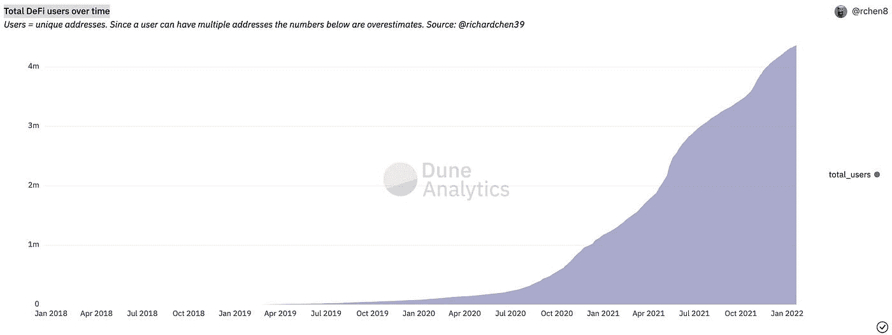
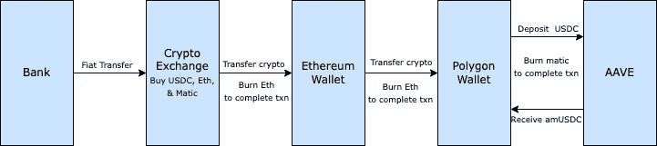
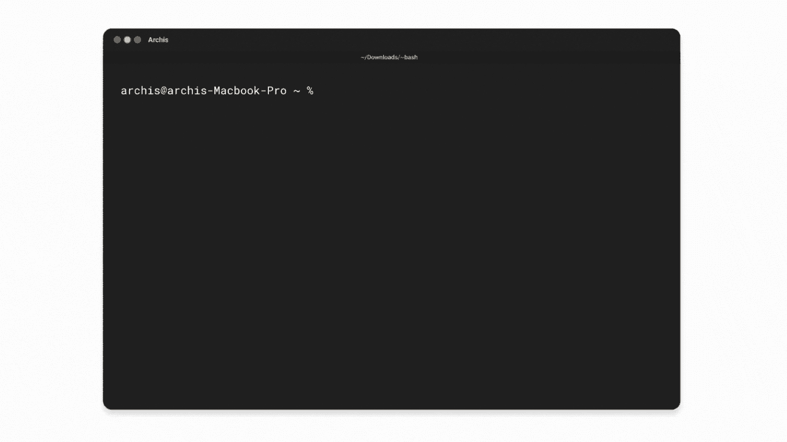
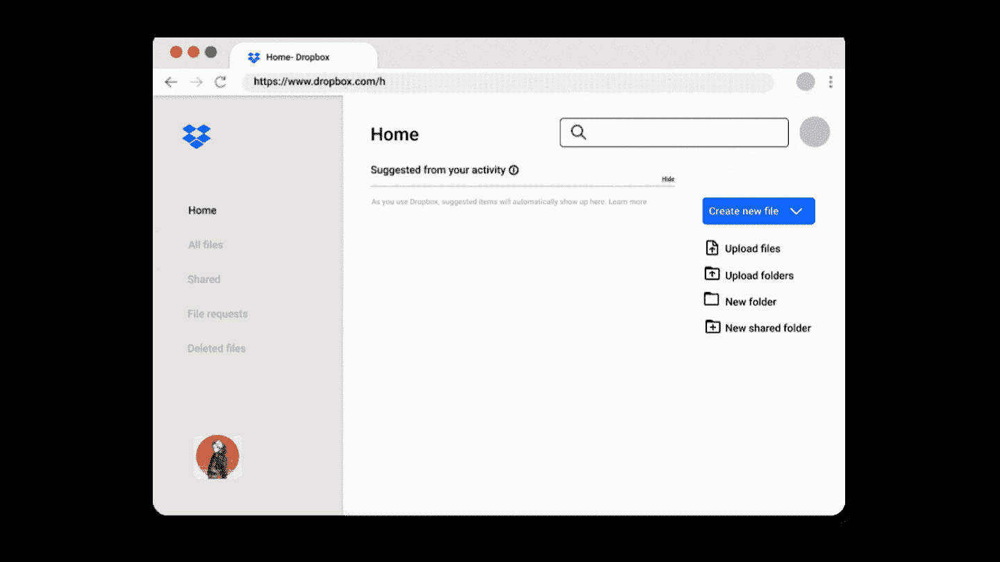

# 为什么伟大的用户体验躲避 DeFi？

> 原文：<https://medium.com/geekculture/why-great-user-experience-eludes-defi-fde11974d2c6?source=collection_archive---------12----------------------->

# DeFi —我们在哪里

达摩实验室最近宣布被 NFT 市场 [Opensea](https://opensea.io/) 收购。达摩一开始是一个 DeFi(分散金融)贷款协议，但后来转向了 DeFi 钱包。 [Dharma](https://www.dharma.io/) 和 [Argent](https://argent.xyz/) 都成立于 2017 年，是消费者 DeFi 的 OGs，致力于让 DeFi 更容易获得。自 2017 年由制造商 DAO 推出 DAI 以来，DeFi 已经走过了漫长的道路。如今，价值超过 2500 亿美元的加密资产被锁定在跨越多个区块链网络的多个 DeFi 协议中。然而，考虑到它的潜力，它的采用仍然很低调，仅限于高级用户。

以太坊生态系统中的 DeFi 用户总数估计为 400 万或更少。这是基于独特的钱包互动的数量。因为一个用户可以有多个钱包，所以实际数目可能会更低。与 2021 年 7 月的 2.2 亿加密用户总数相比，400 万相形见绌。

虽然 crypto/web3 在过去几年中被大量采用，但现实情况是，分散式生态系统中的用户体验仍有许多工作要做。可能没有什么比 DeFi 生态系统中最受欢迎和最广泛使用的浏览器钱包的用户评分为 3.6 更好的说明了这一点。DeFi 上的出色用户体验仍然与我们无缘。

# DeFi 体验

首次安装加密钱包的用户需要记下一个 12 或 24 个单词的短语，以便能够访问他们的资金。如果您丢失了您的私钥，您将无法恢复加密。资产自行保管有多重好处。但这种 UX 本身就足够令人生畏，以至于即使是处于技术能力高端的人也更喜欢托管钱包和 CeFi 产品，而不是分散式产品。

用户面临的第二个 UX 挑战是，他们需要理解使用产品的底层原语。你应该知道你想在哪个区块链网络上建立你的资产。您需要知道如何将资产从一个链连接到另一个链。你需要知道汽油费和你需要支付这些汽油费的本地令牌。

一旦你过了这一关，用户应该有足够的知识来理解不同协议之间的风险和差异。 [DeFiLlama](https://defillama.com/) 目前列出了近 770 个协议，这些协议拥有 100 万美元的 TVL ( *为说明复杂性而选择的任意数字*)。

让我们以一个用户为例，他有兴趣利用 DeFi 中的高收益机会，通过在 Aave 等借贷协议上进行稳定的硬币存款。

1.  用户首先需要决定选择哪种稳定币。Aave 目前支持 9 个 stablecoins。一旦用户瞄准了这一点，他们需要在他们的钱包里获得稳定的点数。
2.  Aave 在以太坊、多边形和雪崩等多个区块链上可用。用户必须根据安全性、该网络上协议的可用流动性以及燃气费来决定网络。
3.  发布后，用户需要找到一个入口解决方案或跨链桥来移动网络上的稳定点。用户还需要获取所选区块链网络的本地令牌。例如 Eth，如果用户希望在以太坊上进行存款。
4.  然后用钱包用 Aave 完成存款。
5.  但它不会就此停止，因为当你用 Aave 完成存款时，Aave 会向你的钱包发出一个令牌，你需要自己添加。

A typical workflow to deposit USDC on Aave Polygon

这可能是 DeFi 中最简单的用例之一。交换代币、参与流动性池、下注等。要复杂得多。这种差距的存在是因为当用户心中有一个特定的目标时，他们可以访问的工具要求他们在一个非常精细的技术水平上操作。

# 了解原因

很大一部分可以归结为技术本身还是很新的。大多数 DeFi 协议都是在最近几年出现的。对新技术的最初关注通常是开发基础设施和功能，而不是可用性和乐趣。

第二个原因是，当基础技术变化如此之快时，UX 很难跟上它的步伐。支持基础设施，如交叉链桥、备用 L1 链和以太坊的 L2 扩展解决方案(如 Polygon)都是最近出现的现象。面向消费者的层，在这种情况下是钱包，在支持 DeFi 必须提供的功能的同时保持一致和简单的体验。

但除此之外，考虑到已完成的工作量和有待完成的工作量，从事加密工作的人数仍然很低。以太坊生态系统上的月活跃开发者数量在 7000 左右。相比之下，全球 Java 开发人员的数量超过了 1000 万。在 Web3 和 DeFi 工作的 UX 设计师的数量会少得多。

# 前方是什么

与 DeFi 协议相比，当前 DeFi 的复杂性可能解释了 CeFi 平台(如 [BlockFi](https://blockfi.com/) )相对更高的主流采用率。然而，这种采用带有不透明性，并继承了传统金融的所有缺点。

> “我不喜欢有些产品过于简化，以至于你不知道黑匣子背后发生了什么，而另一些产品则非常复杂，你需要非常专业的技术才能使用它们。”
> —CeFi&DeFi 产品的加密用户

尽管如此，2020-21 年是加密生态系统的转折点。数百万人购买了他们的第一种加密货币。数百名开发者、作者和创作者以不同的身份加入了这场运动。基础技术也已经达到了可以开发更多消费者友好型产品的程度。

为了了解下一代消费者定义应用程序可能会是什么样子，我们可以用文档共享如何随着时间的推移而演变来做类比。

Sending Files over SFTP

几十年前，当我们坐在宿舍里想要与小组作业伙伴共享文件时，我们会在终端上启动 sftp 并键入命令来实现这一目的。慢慢地，随着时间的推移，像 [Filezilla](https://filezilla-project.org/) 这样的漂亮工具出现了，它们允许你使用一个可视界面完成文件传输所需的所有原始动作。

Drop and Share

几年过去了， [Dropbox](https://dropbox.com/) 推出了，让它变得简单到只需将文件放入一个文件夹，就可以在不同设备和用户账户之间同步文件。最终，今天文档本身转移到了云端。我们使用谷歌文档或概念创建文档，并在几秒钟内与我们的合作者分享。用户不必考虑应用程序正在使用什么底层原语。

我们很可能会看到 DeFi 的类似演变，因为客户端应用程序将开始使自我监护和 DeFi 变得更容易访问和更简单。一个巨大的市场正在形成。市场会拉它应得的产品。

> 在一个伟大的市场——一个有很多真正潜在客户的市场——市场*将产品从创业公司中拿出来*。
> —马克**安德森**，[唯一重要的事情](https://pmarchive.com/guide_to_startups_part4.html)

*我是*[*Brew*](https://www.brew.money)*的联合创始人，我们的目标是让 Defi 为每个人所用，让他们能够“* ***成为自己的银行”*** *。*

 [## Brew |从存款中赚取高达 10%的收益

### 一种更明智的储蓄、消费和增值方式。

www.brew.money](https://www.brew.money)