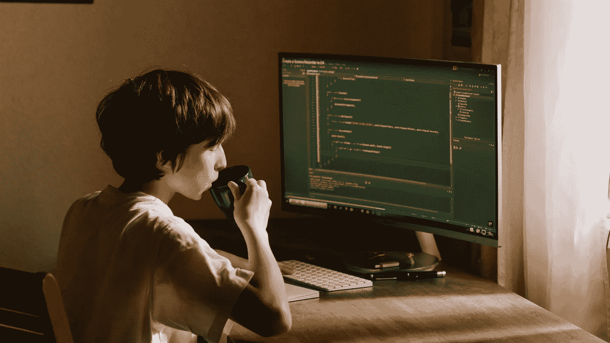

# 为什么电影里的黑客不用 Grep

> 原文：<https://medium.com/geekculture/why-hackers-in-the-movies-dont-use-grep-cf96c57368f0?source=collection_archive---------21----------------------->

## 来自尼德维尔的报道

## 一些黑客比喻尤其令人讨厌

A more realistic look at a hacker. Photo by [cottonbro](https://www.pexels.com/@cottonbro?utm_content=attributionCopyText&utm_medium=referral&utm_source=pexels) from [Pexels](https://www.pexels.com/photo/boy-in-white-t-shirt-sitting-on-chair-in-front-of-computer-4709285/?utm_content=attributionCopyText&utm_medium=referral&utm_source=pexels)

打字速度快到可以融化键盘是一个黑客的比喻，但这并没有惹恼我。我从来没有学会正确地“触摸打字”,当参加凯利临时学校的技能考试时，那位女士看着试卷，翻了翻白眼，说“轻点打字”。另一方面…