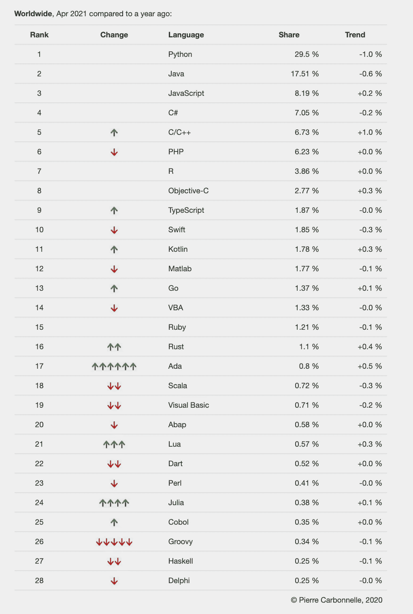

# 为什么是哈斯克尔？

> 原文：<https://medium.com/geekculture/why-haskell-a9117c42da12?source=collection_archive---------2----------------------->

## 我对函数式编程的介绍

好久没写博客了！我度过了一个美好的假期，但我知道每个人都渴望知道我的下一个项目是什么。是哈斯克尔！这周我一直在学习函数式编程和 Haskell 的基础知识。但是 Sara，你为什么要离开面向对象编程呢？为什么是哈斯克尔？

这个问题问得好。下图根据 PYPL 编程语言流行指数对编程语言进行了排名。这是通过分析在谷歌上搜索特定语言的教程的频率来确定的。哈斯克尔在哪？哦，它排在第 27 位，接近底部，显示出在过去一年中受欢迎程度的下降。

source: [https://pypl.github.io/PYPL.html](https://pypl.github.io/PYPL.html)

所以，再问一次，为什么是哈斯克尔？函数式编程在过去几年里越来越受欢迎，Java 和 Python 等语言甚至采用了函数式编程的一些概念。其次，对我来说更重要的是，它增加了一些新工具。如果我想学习另一种 OOP 语言，它将主要包括学习新的语法。然而，通过决定学习一种新的编程范式，我将使我的技能更加多样化，并学习一种全新的解决问题的方法。我知道这比我下一步想学 Java 更有挑战性(特别是考虑到我的 C#经验)，但是希望努力会有回报。

# 函数式编程

首先，我必须熟悉函数式编程的概念。我知道什么是函数；我们都这样做，我们一直在使用它们，甚至在 OOP 中也是如此。但是，这就是不同之处。在 OOP 中，我们试图构建尽可能接近真实世界的对象。您有一组函数可以用来添加、修改对象并使对象相互交互。在函数式编程中，**而不是** **构建新对象，我们** **构建新函数**。

**函数式编程是使用纯函数的编程。它不使用共享状态或可变变量。这不会导致副作用，因为对于相同的输入，我们会期望相同的输出。纯函数不修改变量，但是可以返回新的变量。FP 的更多特征是:**

*   通过使用表达式和声明而不是语句的执行来关注结果，而不是过程
*   使用条件表达式和递归(无循环)
*   值输出不依赖于局部或全局状态，只依赖于传递给函数的参数

## 为什么要使用函数式编程？

函数式编程的使用越来越多。它非常适合大型数据库、并行编程和机器学习。函数式编程带来了稳定的基础设施，这些基础设施可靠、容错且不易出错。以下是公司开始转向 FP 的一些原因:

*   使用不变性和没有副作用会导致更少的错误、代码安全性和更高的可靠性
*   纯函数更容易测试和调试，尤其是单元测试
*   允许并行处理和并发性，这有利于数据分析和大型数据集
*   代码通常更短、更清晰，因此易于维护并提供更好的模块化

# 哈斯克尔是什么？

Haskell 是一种纯粹的函数式编程语言。通用，静态类型。Haskell 中的程序总是被写成没有副作用的数学函数。它主要用于研究和学术界。然而，它也在许多公司中使用。它在航空航天、国防、网络创业、社交媒体和硬件设计等一系列领域都有应用。最近，它在金融科技公司中变得很受欢迎(因为它的安全性)。

[点击此处查看行业应用示例。](https://wiki.haskell.org/Haskell_in_industry)

## 为什么要用 Haskell？

除了函数式编程的好处，Haskell 还有自己的好处，可以提高安全性和稳定性，并允许构建容错程序。哈斯克尔的优势包括:

*   默认情况下，它使用惰性求值，这意味着只有在需要的时候才会求值。这可以导致更快的程序。
*   它包括自动内存管理，以确保内存安全，避免内存泄漏和溢出(这是 C 或 C++等语言中的常见问题)。
*   它是静态类型的，这为代码增加了一层额外的安全性。这在开发过程中可能会花费更多的时间，但会使调试更容易。
*   它有助于编写干净、更可靠的代码，从而缩短开发时间，提高可伸缩性，并简化重构。

阅读更多信息:

*   [Haskell 相比其他函数式编程语言有什么优势？](https://www.quora.com/What-are-the-advantages-of-Haskell-over-other-functional-programming-languages)
*   [Haskell 与其他函数式语言有何不同？](https://www.quora.com/How-is-Haskell-different-from-other-functional-languages)

## 为什么不是更多的哈斯克尔？

我花了很多时间谈论 Haskell 和函数式编程。好吧，如果它真的很棒，为什么它在受欢迎度排行榜上如此之低？这有几个原因。首先，Haskell 仍然主要用于学术和研究领域。有公司使用它(见上面的列表)，但是，即使他们也很难找到有经验的好候选人。它可能相当复杂，所以没有多少新程序员会尝试学习它。最后，这是一个适合度的问题。大多数公司的大部分代码仍然使用“传统”语言，如 C++、Java、Python 或 Ruby。将现有代码与 Haskell 集成将是一项巨大且几乎不可能完成的任务。

# 结论

我很高兴能继续在哈斯克尔的旅程。主要的好处是有机会拓展我的思维。Haskell 和函数式编程将让我有机会以一种我以前不能的方式解决问题。这不是一种特定的新语言，而是一种新的思维方式。

# 参考

*   [为什么金融科技公司使用 Haskell](https://serokell.io/blog/functional-programming-in-fintech)
*   [什么是 Haskell，谁应该使用它？47 度| T3](https://www.47deg.com/blog/what-is-haskell/)
*   Quora: [尽管 Haskell 是一种流行的函数式编程，但为什么它没有在软件行业中使用](https://www.quora.com/Why-is-Haskell-not-used-in-the-software-industry-even-though-it-is-a-popular-functional-programming-language)
*   [什么是 Haskell？Haskell 函数式编程语言的概貌](https://www.ionos.com/digitalguide/websites/web-development/what-is-haskell/)
*   堆栈溢出:[Haskell 在现实世界中是用来做什么的？](https://stackoverflow.com/questions/1604790/what-is-haskell-used-for-in-the-real-world)
*   [为什么开发者会爱上函数式编程](https://towardsdatascience.com/why-developers-are-falling-in-love-with-functional-programming-13514df4048e)
*   [什么是函数式编程？带示例的教程](https://www.guru99.com/functional-programming-tutorial.html)
*   [Haskell 教程:函数式编程入门](https://www.educative.io/blog/haskell-tutorial)