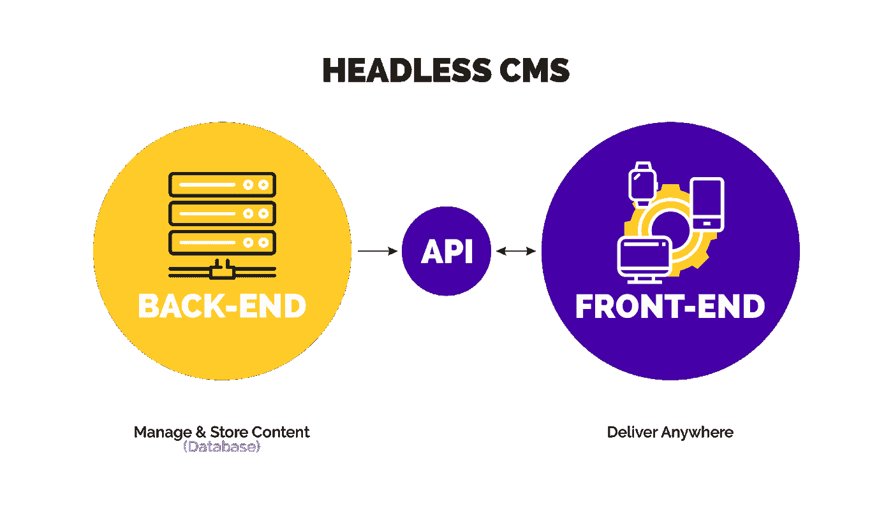
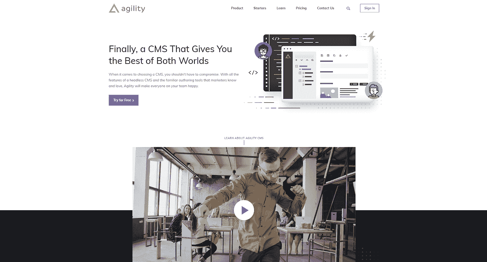
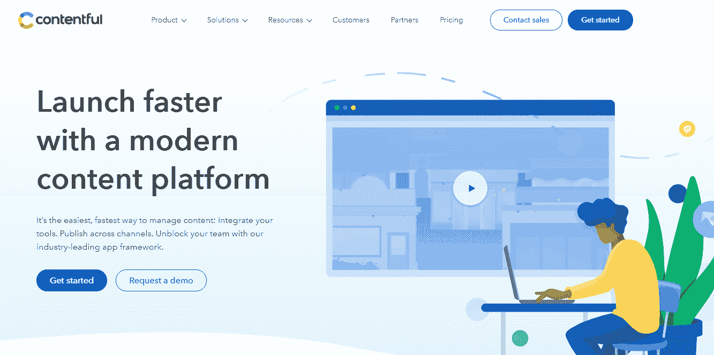
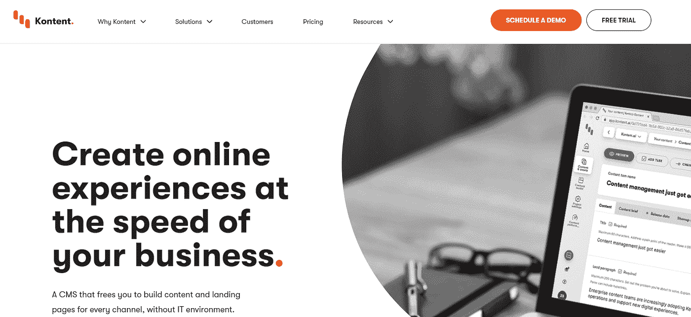

# 为什么 Headless CMS 需要页面管理

> 原文：<https://medium.com/geekculture/why-headless-cms-needs-page-management-1f0efa412e93?source=collection_archive---------14----------------------->

内容管理系统最重要的特性之一是它允许非开发人员更新资料。我相信我们都同意，我们不希望我们的工程师把时间花在创建内容上(或者复制粘贴)。

大多数无头 CMS 避免“页面管理”他们说，因为内容和表现是分离的，“页面”无法管理，因为它们只是为一个单一的输出——你的网站——而设计的。虽然这是正确的，但它忽略了一个事实，即你的网站是在线材料的主要来源，这需要一个特定的实例。

然而，编辑在使用 Headless CMS 时需要帮助的最常见的活动之一是生成页面、排列站点地图和重新排序页面上的组件。然而，情况并不一定如此。

headless CMS 的主要优点是，它允许您以更加灵活和高效的方式跨各种数字站点维护复杂的内容架构。

这种模式是人们使用 headless CMS 向移动应用程序、网站、智能手表、AR/VR 和其他设备交付内容的主要原因。

另一方面，大多数无头系统拒绝“页面管理”的想法，声称将信息从其表示中分离出来排除了对“页面”的管理，因为它们只对相关网站的单一输出有意义。虽然这是正确的，但它忽略了一个事实，即你的网站是在线信息的主要来源，因此需要一个特定的场景。

# 什么是无头 CMS？

[无头 CMS](https://agilitycms.com/resouraces/guide/what-is-a-headless-cmshttps://agilitycms.com/resources/guide/top-10-reasons-why-you-should-choose-a-headless-cms-over-a-traditional-cms?utm_source=unikornsblog)有几种类型。一些人称自己为 API 优先，另一些称自己为内容优先，还有其他几种 headless 趋势的变体。然而，无头 CMSs 的工作方式有一个缺陷。

他们中的大多数可以管理内容存储和交付，这使得 headless 如此吸引人。这些平台承认通过传统网站以外的渠道发布信息的重要性。由于能够连接到 API 并将它们分发到任何前端，这是可行的。然而，无头 CMS 并不迎合创建这些内容的人——编辑和营销人员。

与典型的 CMS 相反，一个无头的内容管理系统完全脱离了表示层或前端，它被称为“头”同时，后端是您的内容存储库和内容管理系统，也称为“主体”

当您将内容存储库的“主体”从其显示层的“头部”移除时，您就有了一个无头 CMS。无头 CMS 与典型 CMS 的区别在于其内容优先的方法，这种方法包括以任何首选方式访问和显示材料的完整 API。

一个 headless CMS 允许你通过 RESTful API 创建你的内容，并把它发送到你需要的任何地方，而不仅仅是模板化的网站或应用程序。

因为纯粹的无头 CMS 不创建任何前端代码，所以它也被称为“内容即服务”(CaaS)。

这种方法为特定设备的最终用户带来了最佳的数字体验。不管核心/后端 CMS 如何，前端开发者可以继续为任何渠道创造新的特性。

# 没有页面管理的无头 CMS

开发人员通常在网站创建之初就预先确定网站上的所有页面和路径，以便他们随后可以构建内容类型来反映它们。

但是未来的页面呢？我不是说在这里添加新的博客文章或文章(它们是列表项，而不是页面)，而是说在网站上添加真正的新页面，可能嵌套在其他页面下。登陆点、新的业务线等等呢？

第二个问题是，当我们有大量的页面希望添加到我们的网站时。如果我们必须开发一种新的内容类型来表达它，我们将有许多内容种类要指定。一些 CMS 系统会限制可用内容类型的数量，当达到特定阈值时会超额收费。这本身就是一个限制，但更大的问题是谁在执行这项工作:开发人员。

当我们提前预定义页面时，开发人员必须承担实际编码这些路线的工作。

然后，他们必须将这些路由映射到先前建立的内容类别。这不仅很费力，而且也意味着每次我们想创建一个新页面时，我们都必须寻求开发者的帮助。

有一个更简单的方法。

# 什么是页面管理？

一个 headless CMS 本质上是一个内容仓库，它存储了跨多个渠道使用的材料。

这对今天的营销人员来说是不够的，并且限制了组织的整体潜力。

虽然简单的内容定义对于大多数开发人员和架构师来说是一个有用的起点，但是它们不能有效地扩展。

这就是为什么内置页面管理现在如此流行的原因。

页面管理使编辑人员能够通过利用可重用的构件(称为模块)来生成和管理内容。

使用这些构件，编辑可以管理他们站点的页面树，调整 SEO，定义内容连接和页面功能。

开发人员还可以控制编辑可以添加哪些模块、添加到哪里以及做什么。

页面管理也涉及到页面模板。开发人员构建模板来限制可能在您的网站上显示的信息类型，为编辑人员提供更改模板的能力，同时保持一致的输出。每个页面模板都包含内容区域，编辑人员可以在其中拖放组件。

# 为什么无头 CMS 需要页面管理？

无头 CMS 的一个主要好处是，它使公司能够建立一个跨越不同数字平台和设备的现代内容架构。无头 CMS 允许内容团队编写一次，然后在任何地方发布，将内容发送到客户使用的每个平台和设备。

然而，尽管无头 CMSs 为您提供了强大的功能，但一些供应商声称，无头架构所特有的内容和表示的分离使得页面管理的概念过时了。

网站几乎是每个企业的支柱，应该特别关注内容的架构。

其中，避免重复内容是一个明显的优势，因为它增加了可靠性并减少了管理负担(您不必处理多个渠道的重复内容)。

让我们回顾一下一个典型营销团队的内容编辑的一天:

*   *我需要专门为媒体创建一个新的登录页面。它将有相同的内容布局作为主页，但只是不同的内容。*
*   *我需要能够设置每个网页的搜索引擎优化属性，如元标签和元描述。*
*   *在主页上，我们希望 YouTube 视频位于主富文本下方，但在新闻页面上，我们希望 YouTube 视频位于主富文本上方。*
*   *我们的 CEO 不喜欢它，我们可以再次在主页的主富文本区域上方显示 YouTube 视频吗？*

上面的例子表明，编辑的要求是很难预见的。这不是他们的错；游戏就是这样。管理物料时会发生一些变化。

因为你的数字解决方案不使用页面管理会使编辑变得不灵活，开发人员花费大部分时间接受订单，调整现有代码以适应内容需求，并希望他们做其他事情！不应要求开发人员参与内容修改。

那么，这一切到底意味着什么呢？

*   没有开发人员，编辑不能自己创建/管理页面
*   编辑不能控制每个页面上的组件
*   开发人员会感到厌烦或精疲力竭
*   需要更多的开发资源/费用
*   网站的生产力受到影响

这是谁的错？给你个提示，不是编辑，也不是开发者……是**架构**！

# 带页面管理的无头 CMS 的好处

使用页面管理，您可以通过利用可重复使用的构建模块(即模块和页面模板)为编辑人员提供开发和管理您的数字解决方案页面的能力。

内容编辑可能会使用页面管理来控制您站点的页面树、页面级 SEO 特征以及每个页面上的内容和功能。

作为开发人员和架构师，您可以完全控制向编辑器显示哪些页面模板、模块可以放在页面的什么位置以及模块可以完成什么任务。

总结一下页面管理的优势:

*   授权的编辑人员可以在没有开发人员的情况下完成更多工作
*   更快乐的开发人员，他们可以专注于新功能和增强功能，减少响应新内容需求的时间
*   提高生产率
*   所需的资源/费用更少

# 页面管理的要素

在检查无头 CMS 供应商时，以下是您应该考虑的一些因素。然而，在本文中，我们将使用 Agility CMS 作为参考，因为它们确实对页面管理提供了强大的支持。

开发时要考虑三件事，有；

页面模板、模块定义、数字频道和网站地图。我们来看看这三个要素。

*   **页面模板:**模板允许开发者确定一个名称和一组模块，内容编辑可以在其中添加内容。开发人员还可以编写代码，将该模板呈现为 HTML 文档。
*   **模块:**模块是从标题到更复杂的 UI 元素(如滑动图像转盘)的可重用字段。简而言之，模块是构建复杂网站的基石。
*   **数字频道和网站地图:**网站地图是开发者用来呈现网站的内容结构。在 Agility CMS 中，网站定义了一个或多个网站地图，每个网站都在其频道中，从而实现多站点管理和对每个数字财产的精细控制。

这三件事是潜在的页面管理无头 CMS 的基础。

在下一节中，我们将看看 Agility CMS 如何处理页面。

# 哪些无头 CMS 有页面管理？

根据 [G2 人群无头 CMS 网格](https://www.g2.com/categories/headless-cms#grid)，这个空间有 3 个领袖。让我们回顾一下他们的页面管理选项。

**敏捷 CMS**

[Agility CMS](http://www.agilitycms.com/?utm_source=unikornsblog) 是这一领域的先锋。自 2003 年以来，Agility 从一开始就有页面管理，这不是最近才添加的特性。

使用 Agility CMS，您可以定义三件事情来简化页面创建和编辑:

*   **页面模板:**模板允许开发者确定一个名称和一组模块，内容编辑可以在其中添加内容。开发人员还可以编写代码，将该模板呈现为 HTML 文档。
*   **模块:**模块是可重用的字段集合，可以从标题到更复杂的 UI 元素，比如滑动图像转盘。简而言之，模块是构建复杂网站的基石。
*   **数字频道和网站地图:**网站地图是开发者用来呈现网站的内容结构。在 Agility CMS 中，网站定义了一个或多个网站地图，每个网站都在其频道中，从而实现多站点管理和对每个数字财产的精细控制。
*   URL 管理:创建重定向，测试它们，并在 CMS 中进行批量编辑
*   **SEO 字段:**定义元关键字和 met 描述，页面名称，并决定页面是否需要显示在 CMS 的网站地图中。

Agility CMS 的主要特点是，开发人员现在只需要编写几个页面模板和模块，而不是单独编码和路由每个页面。这些模板可以在整个网站上重用，大大减少了开发人员从一开始就需要做的工作量。

# Agility CMS 的页面管理成本

页面管理作为默认功能包含在所有 Agility CMS 定价包中，包括一个免费的开发人员计划。它是免费的，你不需要额外付费来使用它。

Agility CMS [付费计划以 490 美元的价格开始](https://agilitycms.com/pricing)的商务 Pan。

# 满足的

Compose 是 Contentful 的一个全新应用程序，它允许你在几个步骤中建立和发布网页。

Compose 是 Contentful web 应用程序的简化版本，它是专门为不想在 Contentful 的更多技术方面浪费时间的编辑和作者设计的。与 web 应用程序不同，Compose 不需要内容建模知识。相反，编辑人员可以从预定义的内容组件和媒体组合页面，而不需要额外的工程资源。

撰写体验不同于在页面管理中使用 Contentful，它具有以下特征:

*   撰写用于快速创建网页。
*   页面和字段是预定义的，不需要额外设置。
*   页面构建块的层次结构显示在单个编辑视图中。
*   只需一次点击，所有条目即可发布。

# 内容丰富的页面管理成本

对于团队用户来说，以 **$1，995/月**，可以将[添加到](https://www.contentful.com/contentful-apps/#:~:text=For%20Team%20users%2C%20Compose%20%2B%20Launch,operations%20of%20your%20normal%20spaces.)您组织内的所有空间。这些应用程序可以免费试用 10 天，这将创建一个测试空间，允许您在不影响您正常空间的内容或操作的情况下测试 Compose + Launch。

令人满意的团队计划起价 **$499。**

# Kontent

最近，Kontent 提供了 Web Spotlight 作为他们的页面管理功能。

Web Spotlight 将上下文网站管理与无头 CMS 的灵活性和多渠道支持相结合。

Web Spotlight 使创建页面、添加内容和重新排列组件变得容易，无需开发人员的任何帮助。完成后，将页面添加到导航中，以便所有访问者都能找到它。有了这个功能，你就可以在你的网站页面上更新内容。修改可以在几秒钟内完成，而不用担心一旦发布后一切会是什么样子。

**包含 Kentico 内容的页面管理成本**

Web Spotlight 不是免费的，您可以添加到每月 499 美元的计划中。Kentico 计划的商务起价为**1249 美元**，高级起价为**2499 美元**。

# 结论

无头 CMS 是内容管理的未来，它明显地从传统的 CMS 转向基于 Jamstack API 的设计。

无头 CMS 不再是开发者的专利。

企业团队和营销专家都需要无头 CMS 系统，它在解放开发人员的时间的同时增强了内容制作者的能力。

这就是页面管理的切入点。

内容编辑可以使用页面管理，以他们认为合适的任何方式在站点地图上构建和移动页面，以及向网站添加模块和更新这些模块的属性。

不管一个无头的 CMS 供应商包看起来有多复杂，知道页面管理是否是他们认真对待的功能是很重要的，特别是如果你希望你的网站的页面和内容是动态组织的。

页面管理在所有三个 Headless CMS leaders、Agility CMS、Contentful 和 Kontent 中都可用。Agility CMS 将它作为一个标准功能包含在所有计划中，即使是免费的。Contentful 和 Kontent 提供的页面管理插件每月售价 499 美元。

# 资源

*   [如何使用 Agility CMS 设计内容优先策略](https://agilitycms.com/resources/guide/how-to-design-a-content-first-strategy-using-agility-cms) — Agility CMS
*   [结构化内容管理系统的无头项目策略](https://www.smashingmagazine.com/2018/11/structured-content-done-right/)—Knut melvr
*   [为什么你作为一个开发者应该使用 CMS](https://agilitycms.com/resources/posts/why-you-as-a-developer-should-be-using-a-cms)
*   [无头商务解释:定义、用例、障碍|敏捷 CMS](https://agilitycms.com/resources/posts/headless-commerce-explained-definitions-use-cases-and-roadblocks)
*   [API vs . SDK:有什么区别？|敏捷 CMS](https://agilitycms.com/resources/posts/apis-vs-sdks-what-s-the-difference)
*   [2021 年最值得关注的静态网站发电机](https://agilitycms.com/resources/posts/static-site-generators)
*   [https://agility CMS . com/resources/posts/what-s-the-difference-that-headless-CMS-and-static-site-generator/](https://agilitycms.com/resources/posts/what-s-the-difference-between-headless-cms-and-static-site-generator/)
*   什么是 Netlify？作为一名编辑，你为什么要关心它？|敏捷 CMS
*   [什么是无头 CMS？|敏捷 CMS](https://agilitycms.com/resources/guide/what-is-a-headless-cms)
*   [无头 CMS 相对于传统 CMS 的优势|敏捷 CMS](https://agilitycms.com/resources/guide/top-10-reasons-why-you-should-choose-a-headless-cms-over-a-traditional-cms)
*   [内容架构:组织和管理你的内容和团队的关键](https://agilitycms.com/resources/posts/content-architecture)
*   WordPress 及其替代品:Headless CMS | Agility CMS
*   开源 CMS 与专有 CMS:你能拥有二者的优势吗？|敏捷 CMS
*   选择 React CMS:寻找什么？|敏捷 CMS
*   [掌控您的内容架构:内容建模](https://agilitycms.com/resources/posts/content-modelling)
*   [DXP vs 无头 CMS:现代 DXP 建筑](https://agilitycms.com/resources/posts/the-benefits-of-a-hybrid-dxp)
*   Jamstack 开发:[2021 年你需要了解的 10 个 JAMstack 先驱](https://agilitycms.com/resources/posts/top-jamstack-pioneers)