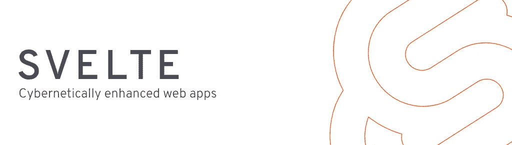

# 为什么我选择苗条的 JS

> 原文：<https://medium.com/geekculture/why-i-chose-svelte-49dd6bc9231c?source=collection_archive---------13----------------------->



我已经多年没有完全沉浸在*“前端”*领域了，因为我职业生涯的大部分时间都倾向于服务器端、后端和基础设施角色。我一直*【拖延】*的一个挥之不去的痛点。但是我知道如果我想让 [Feed Army](https://feed.army/) 以任何方式成功，它需要一个非常锐利的 UI。当然，最大的障碍是我最后一次尝试*【新】*前端开发一点也不愉快。老实说，他们糟透了。

一切似乎(在我看来)如此不必要的复杂？巴贝尔，鲍尔，咕噜，吞咽，Npm，Npx，包裹，卷起，网络包，纱…有人更疯狂吗？？？

所以对于你，读者，来帮助了解我的历史——当我最后一次在 FE 世界时，jQuery 是你所需要的，Twitter Bootstrap 是你的 CSS 基础(Zurb Foundation 还是一个东西吗？)和 Gulp 或 Bower 来连接和缩小您的 JS 文件。所以，当我为 [Feed Army](https://feed.army/) 写我的第一行 JS 时，大概是这样的:

```
// Namespace Feed Army Javascript
var FA = {};FA.adomain = (function () {
  // afunc logs things
  function afunc() {
    console.log("things…");
  } /**
  * Public methods
  */
  return {
    afunc: afunc,
  };
})();// And then calling code
FA.adomain.afunc(); // "things…"
```

你可以把上面的 JS 放到任何一个浏览器控制台中，然后它就工作了。自己试试，`FA.adomain.afunc()`会 console.log“事情……”。这是我开始的地方。清晰、简洁、易于理解的原生 JS，我在几年前就已经熟悉了。

现在我所需要的就是向我的 Go 后端服务发出一些 API 请求…看起来很简单…以前只是一些`$.ajax(`调用...但是我听说还有另外一个很好的 HTTP 客户端包叫做 Axios....

我花了大半个下午的时间试图让上面的 JS 与所需的 Axios 客户端很好地配合。最终，“只是”从我的后端服务得到一个响应，我最终使用了`var xhr = new XMLHttpRequest();`这就是我的挫败感。

# 哪匹马最好？

我清楚地知道当时最流行的前端框架。我把可用的选项减少到 x3。 [VueJS](https://vuejs.org/) 、 [Angular](https://angular.io/) 和 [Aurelia](https://aurelia.io/) 。

你可能会惊讶地发现 React 甚至不在候选名单中。但这是因为我不能问心无愧地从一家我如此鄙视的公司中随意选择一个供应商包。

因此，只有 x3 可供选择，我最喜欢的当然是 [VueJS](https://vuejs.org/) 。

学习任何语言的新概念和新框架都不是一件简单的事情。需要一致的努力来确保模式和概念成为第二天性。如果您认为您可以简单地复制/粘贴代码示例，那么您将会有糟糕的未来体验。因此，当我在 Vue 的文档中介绍自己时，抛开专门的时间来研究代码示例和演练，我仍然无法摆脱脑海中那个唠叨的声音，*“为什么这一切看起来仍然如此迟钝和复杂？”*

大约在这个时候，我开始寻找一个替代方案。

公平地说，这对我来说并不新鲜。当我开始觉得有些事情似乎不太对劲时，无论是在代码中还是在生活中，我通常会检查一下，看看是否有更好的替代方案。这和我在 Github 上使用 [Gitlab](https://gitlab.com/kylehqcom) 的原因是一样的，或者当我觉得 jQuery 变得太大时，我转而使用 [Bonzo](https://github.com/ded/bonzo) 和[Qwery](https://github.com/ded/qwery)Dustin Diaz 的原因也是一样的。有时没有更好的选择，但我至少确信我已经检查过了。

# 一个启示

老实说，我真的不记得我是如何开始发现[苗条](https://svelte.dev)的？我以前从未听说过苗条，也不是同事推荐的。然而，我当然记得当我开始浏览苗条教程时的感觉。就像见到老朋友一样！ *HTML* ，S*script*和 S *tyle* ，这些年你过得怎么样！

我完成的教程越多，读的博客文章越多，学到的核心概念越多，感觉就越好。

反应式组件，使用限定范围的 css 样式、内置动画和应用程序逻辑进行渲染，应用程序逻辑从编译过的、缩小过的本机 JS 运行，没有**依赖性。这似乎好得令人难以置信。然而它不是！**

# 有遗憾吗？

没有。

一年多来，我一直在开发和生产中愉快地断断续续地使用 Svelte now。当然，我会尽可能分享一些怪癖和问题。但在很大程度上，苗条是一种绝对的快乐。有趣的是，几个月后，著名的围棋开发者@MatRyer 发表了这篇博客文章【pace.dev/blog/2020/02/26/tech-stack-at-pace.html，披露了在 [pace.dev](https://pace.dev) 使用的技术栈。

当我读到他们也决定要苗条时，我差点从椅子上摔下来，因为我也感受到了 VueJS 的痛苦。一种安慰是，我知道我自己的技术决策也在半个地球之外得到反映。

如果你还没有，抽出一个小时的时间，亲自尝试一下苗条身材。你甚至不需要安装，因为你可以直接在 [REPL](https://svelte.dev/repl) 中编码。

*原载于*[*https://www.kylehq.com*](https://www.kylehq.com/2021/06/why-i-chose-svelte/)*。*